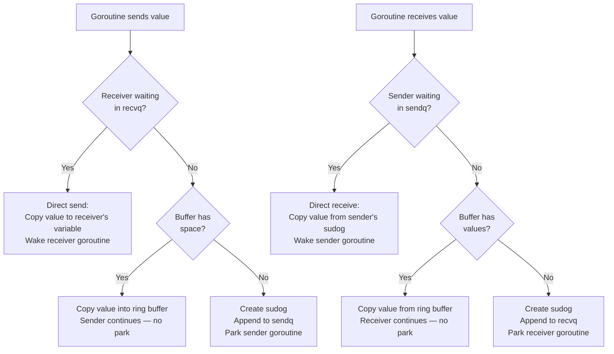
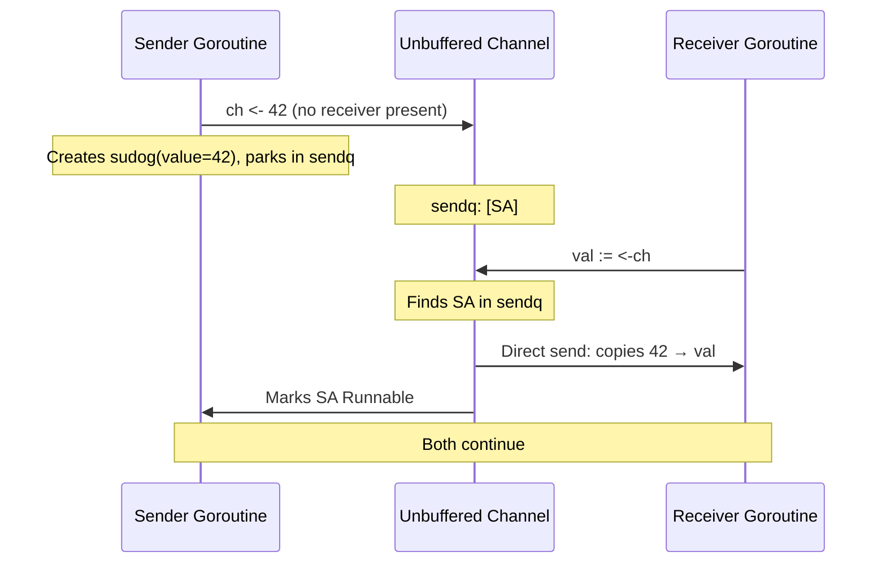
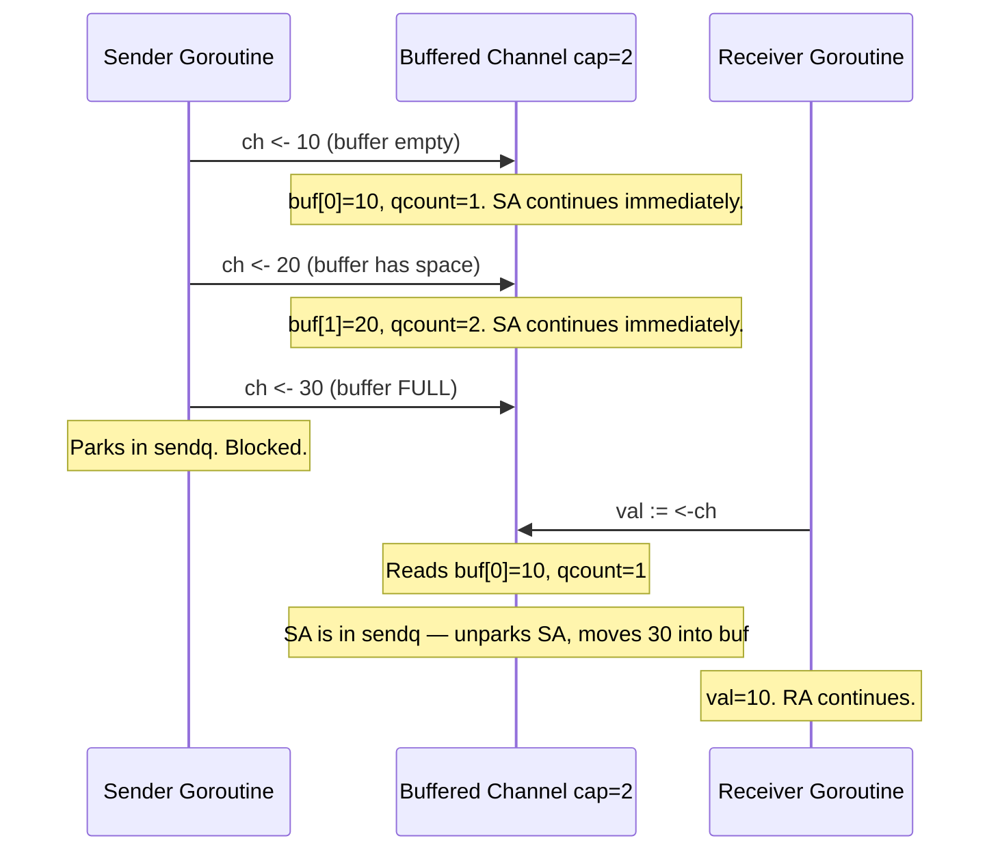
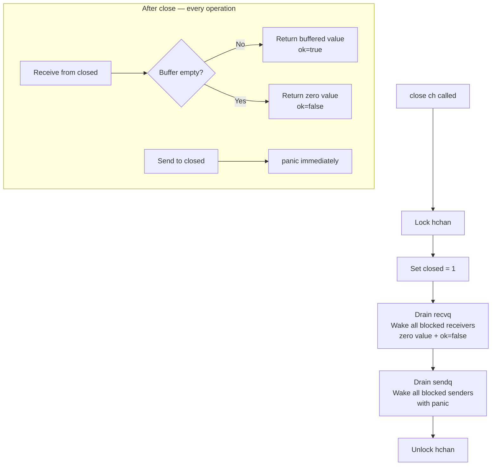
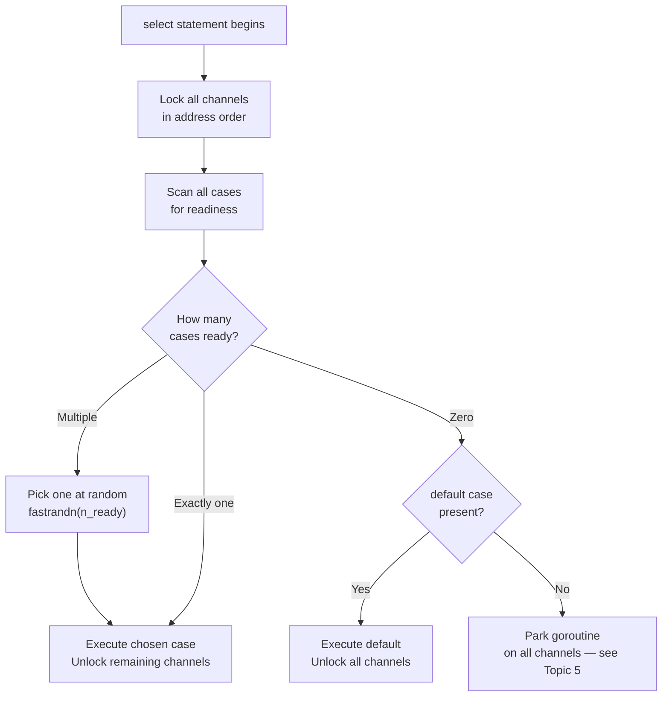
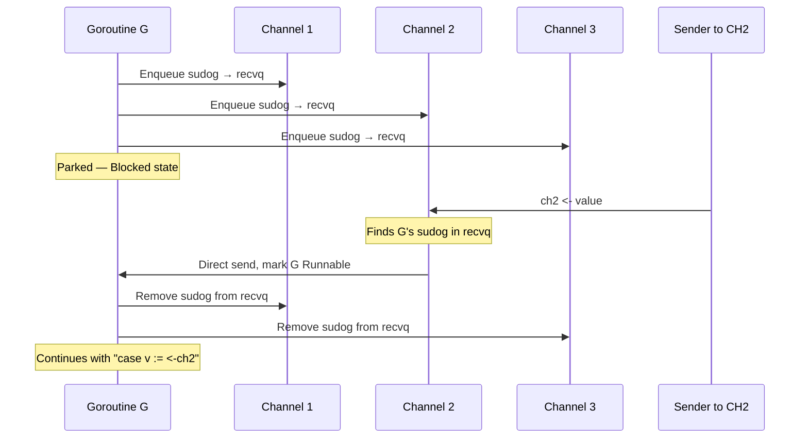
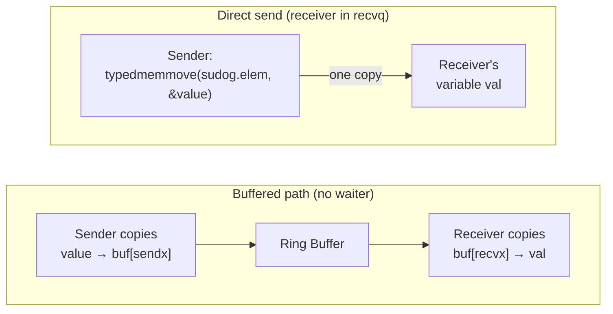

# Phase 9a — Channels

> **6 topics.** This section covers Go's primary communication mechanism between goroutines.
> Learn after Phase 7 (Go Memory Model) — channels are defined in terms of happens-before guarantees.

---

## Topic 1 / 6 — Channel Internals

---

### 1. Motivation — Why Does This Exist?

Goroutines need to talk to each other. The naive approach is to share a variable:

```go
var result int
go func() { result = compute() }()
time.Sleep(1 * time.Second) // "wait" for it
fmt.Println(result)
```

This is broken — it's a data race (Phase 7, Topic 2). The sleep is not a happens-before guarantee.

You need a mechanism that both **transfers a value** and **establishes ordering** — so the receiver is guaranteed to see the value the sender wrote. That's exactly what a channel does. Sending on a channel happens-before the corresponding receive observes the value.

But how does it actually work? If the receiver arrives before the sender, it has to wait somewhere. That "somewhere" is the channel's internal wait queue.

---

### 2. Building Blocks

The runtime represents every channel as an `hchan` struct. Its key fields:

| Field | Type | What it does |
|---|---|---|
| `buf` | ring buffer (`unsafe.Pointer`) | Holds buffered values waiting to be received |
| `qcount` | `uint` | Number of values currently in the buffer |
| `dataqsiz` | `uint` | Buffer capacity (0 for unbuffered channels) |
| `sendq` | `waitq` | Linked list of goroutines blocked on send |
| `recvq` | `waitq` | Linked list of goroutines blocked on receive |
| `lock` | `mutex` | Protects the entire hchan struct |
| `closed` | `uint32` | Non-zero when the channel has been closed |

A **`sudog`** (short for "suspended goroutine") is each node in those linked lists. It holds:
- A pointer back to the waiting goroutine (G)
- The value being sent — or a pointer to where the received value should be written

---

### 3. How It Works — The Mechanics

Every channel operation takes one of four paths:



The ring buffer for a buffered channel works like a circular array. Two cursors — `sendx` and `recvx` — advance independently using modulo arithmetic:

```mermaid
flowchart LR
    subgraph hchan["hchan — make(chan int, 3)"]
        direction LR
        B0["buf[0] = 10\n← recvx reads here"]
        B1["buf[1] = 20"]
        B2["buf[2] — empty\n← sendx writes here"]
    end

    SA[Sender A wrote 10] --> B0
    SB[Sender B wrote 20] --> B1
    RA[Receiver reads buf[recvx]] --> B0
```

When `sendx` wraps past the end, it resets to 0 — hence "ring."

---

### 4. A Concrete Scenario

**Buffered send — no parking:**

```go
ch := make(chan int, 1)

go func() {
    ch <- 42 // buffer is empty → copies 42 into buf[0], continues immediately
}()

val := <-ch // buffer has a value → copies buf[0] into val, continues immediately
```

**Unbuffered send — parking and direct send:**

```go
ch := make(chan int)

go func() {
    ch <- 42
    // No buffer. No receiver yet.
    // Runtime creates a sudog with value=42, parks goroutine into sendq.
}()

// Scheduler runs main goroutine...
val := <-ch
// Receiver arrives. Finds sender in sendq.
// Direct send: copies 42 from sudog directly into val (no buffer at all).
// Wakes sender goroutine. Both continue.
```

The unbuffered case never touches a buffer — the value jumps directly from the sender's sudog into the receiver's variable.

---

### 5. Key Insight

**A channel is not magic — it is a mutex-protected struct with a ring buffer and two goroutine wait queues.**
When the channel cannot immediately satisfy an operation, it parks the goroutine into the right queue and removes it from the scheduler. When the condition is later met, it wakes the goroutine back up. This wake-up is the synchronisation point that creates the happens-before guarantee channels provide.

---

### 6. Common Misconceptions

- **"Channels are fast because they avoid locking."**
  They use a mutex internally (`hchan.lock`). The advantage is not "no locking" — it's that the lock is held very briefly and contention is rare, because senders and receivers typically don't arrive at exactly the same instant.

- **"Buffered channels are always faster than unbuffered."**
  Buffered channels avoid goroutine parks when the buffer is neither full nor empty — that path is faster. But if the buffer is usually full or usually empty, you still get parks, plus the memory overhead of the buffer itself. Size buffers with measurement, not assumption.

---

---

## Topic 2 / 6 — Buffered vs Unbuffered

---

### 1. Motivation — Why Does This Exist?

Two goroutines want to communicate. The fundamental design question is: does the sender need to wait for the receiver?

- **Unbuffered:** Sender and receiver must meet at the same instant. The sender cannot continue until a receiver is ready. This is **synchronisation** — it forces coordination.
- **Buffered:** The sender can write up to `cap` values ahead of a receiver. This is **decoupling** — it allows sender and receiver to work at different speeds.

This is not a performance dial. It is a correctness decision that changes the behaviour of your program.

---

### 2. Building Blocks

| Property | Unbuffered `make(chan T)` | Buffered `make(chan T, n)` |
|---|---|---|
| `dataqsiz` field | 0 | n |
| Sender parks when | Always (until receiver ready) | Buffer is full |
| Receiver parks when | Always (until sender ready) | Buffer is empty |
| Goroutine switch on send | Yes — always | Only when buffer is full |
| Happens-before point | Send completes only after receive starts | Send completes once value enters buffer |

---

### 3. How It Works — The Mechanics

#### Unbuffered — the rendezvous



An unbuffered send does not complete until a receiver shows up. The completion of the send and the start of the receive are the **same event**.

#### Buffered — the intermediate queue



---

### 4. A Concrete Scenario

Here is why the distinction matters for correctness — not just performance:

```go
// Unbuffered — caller knows work is done
func processRequest(req Request, done chan struct{}) {
    doWork(req)
    done <- struct{}{} // blocks until caller receives
    // send completing means caller has received — they KNOW the work is done
}

// Buffered — caller does NOT know work is done
func processRequest(req Request, done chan struct{}) {
    doWork(req)
    done <- struct{}{} // returns immediately if buffer has space
    // caller may not have received yet — using this as a "work done" signal is wrong
}
```

Using a buffered channel as a completion signal is a classic bug. The send completes as soon as the value enters the buffer, not when the other side actually receives it.

---

### 5. Key Insight

**Unbuffered channels are synchronisation points. Buffered channels are queues.**
Use unbuffered when you need confirmation that the other side received your message.
Use buffered when you want to decouple the production rate from the consumption rate without losing messages.
Buffered channels don't eliminate blocking — they shift the blocking point from "receiver not present" to "buffer is full."

---

### 6. Common Misconceptions

- **"Buffered channels prevent blocking."**
  They only delay it. A send still blocks when the buffer is full; a receive still blocks when the buffer is empty.

- **"Unbuffered channels are always slower."**
  Goroutine switches only happen when one side isn't ready. In tightly-coupled ping-pong patterns, unbuffered channels can be faster than buffered ones because the direct send optimisation fires every time (Topic 6).

---

---

## Topic 3 / 6 — Closed Channel Behaviour

---

### 1. Motivation — Why Does This Exist?

Channels carry values, but sometimes the most important thing to communicate is: **"there are no more values coming."**

Without a close mechanism, a receiver has no way to know when to stop waiting. It would block forever. Closing is Go's way of broadcasting "done" to any number of receivers — a closed channel can be received from any number of times by any number of goroutines, always returning the zero value immediately.

But sending to a closed channel must panic. The channel is closed precisely because no more sends should happen. There is no safe way to handle an accidental send-after-close, so Go makes it a loud, immediate crash.

---

### 2. Building Blocks

| Operation | On an open channel | On a closed channel |
|---|---|---|
| `ch <- v` | Normal | **panic** — send on closed channel |
| `v := <-ch` | Normal or parks | Returns zero value immediately |
| `v, ok := <-ch` | `ok=true`, blocks if empty | `(zero value, false)` if buffer empty |
| `close(ch)` | Marks closed | **panic** — close of closed channel |
| `close(nil)` | **panic** | — |

**Key rule: buffered values come out first.** After close, receives drain any remaining buffered values (returning `ok=true`), and only return zero values with `ok=false` once the buffer is empty.

---

### 3. How It Works — The Mechanics

When `close(ch)` is called:

1. Runtime locks `hchan`.
2. Sets `hchan.closed = 1`.
3. Drains `recvq` — all blocked receivers are woken immediately, each getting a zero value and `ok=false`.
4. Drains `sendq` — all blocked senders are woken with a **panic** (they were waiting to send; closing the channel while they wait is a programming error).
5. Unlocks `hchan`.



---

### 4. A Concrete Scenario

The classic producer-consumer shutdown:

```go
func producer(ch chan<- int) {
    for i := 0; i < 5; i++ {
        ch <- i
    }
    close(ch) // broadcast: no more values will come
}

func consumer(ch <-chan int) {
    for v := range ch { // range stops when channel is closed AND buffer is empty
        fmt.Println(v)
    }
    fmt.Println("done")
}

func main() {
    ch := make(chan int, 5)
    go producer(ch)
    consumer(ch) // prints 0 1 2 3 4, then "done"
}
```

`for v := range ch` desugars to exactly this:

```go
for {
    v, ok := <-ch
    if !ok {
        break
    }
    fmt.Println(v)
}
```

It stops automatically when `ok` is `false` — which only happens when the channel is both closed and fully drained.

**The "done" broadcast pattern** — one close, many receivers:

```go
done := make(chan struct{})

for i := 0; i < 5; i++ {
    go func(id int) {
        <-done // all 5 goroutines block here
        fmt.Printf("worker %d shutting down\n", id)
    }(i)
}

close(done) // unblocks ALL 5 goroutines simultaneously
// Sending a value would only unblock one
```

---

### 5. Key Insight

**Only the sender should close a channel — never the receiver.**
Close is the signal "I will send no more values." Only the sender knows that. With multiple senders, use a `sync.WaitGroup` to coordinate: all senders finish, then a single coordinator closes the channel. Closing from the receiver side, or closing from multiple goroutines without coordination, leads to double-close panics.

---

### 6. Common Misconceptions

- **"Receiving from a closed channel blocks forever."**
  The opposite — it returns immediately with a zero value. This is intentional: close is a broadcast, not a termination.

- **"You must always close a channel when done."**
  Only close if receivers need to know that no more values are coming (e.g., to `range` over it). Channels are garbage-collected when no goroutines hold references. An unclosed channel with no references is not a leak.

- **"Sending to a nil channel panics."**
  No — sending to a nil channel **blocks forever**. Sending to a *closed* channel panics. These are different failure modes.

---

---

## Topic 4 / 6 — select: Pseudo-Random Case Selection

---

### 1. Motivation — Why Does This Exist?

`select` lets a goroutine wait on multiple channels at once. The first one ready wins. But what happens when two or more cases are ready at the same time?

If `select` were deterministic — always picking the first case in source order — you'd get starvation. Case 1 would win every time, and cases 2, 3, 4 would never fire even if their channels were full. That would make `select` a broken, order-dependent construct.

Go's solution: **when multiple cases are ready simultaneously, pick one uniformly at random.** No channel can monopolise a goroutine just because it always has data. Every ready case has an equal chance.

---

### 2. Building Blocks

| Term | Meaning |
|---|---|
| **Case** | One channel operation inside a `select` — either send or receive |
| **Ready** | A case is ready if its channel operation can complete immediately without blocking |
| **Default** | An optional case that executes when no other case is ready — prevents parking |
| **fastrandn** | The runtime's fast pseudo-random function used for case selection |

---

### 3. How It Works — The Mechanics

The runtime processes a `select` in four phases:

1. **Lock all channels** in a consistent order (sorted by memory address) to prevent deadlock from concurrent selects locking the same channels in opposite orders.
2. **Scan all cases** — find every case whose channel operation would not block.
3. **If multiple ready:** call `fastrandn` to pick one uniformly at random. Execute it. Unlock all other channels.
4. **If none ready:** park (see Topic 5). If a `default` case exists, execute it instead.



---

### 4. A Concrete Scenario

```go
ch1 := make(chan string, 1)
ch2 := make(chan string, 1)
ch1 <- "from ch1"
ch2 <- "from ch2"

// Both channels have a value. Which case fires?
select {
case msg := <-ch1:
    fmt.Println(msg)
case msg := <-ch2:
    fmt.Println(msg)
}
// Answer: random. Run this 1000 times and you'll see roughly 500/500.
```

**The default trap — busy-wait:**

```go
// This looks innocent but spins at 100% CPU
for {
    select {
    case msg := <-ch:
        fmt.Println(msg)
    default:
        // "nothing ready, try again"
        // goroutine NEVER parks — it polls constantly
    }
}
```

The `default` case turns `select` into a non-blocking poll. Putting it inside a tight loop creates a busy-wait loop. The goroutine never yields the CPU to the scheduler. To fix it, add a timer or use `select` without a default:

```go
for {
    select {
    case msg := <-ch:
        fmt.Println(msg)
    case <-time.After(10 * time.Millisecond):
        // yields control every 10ms — not a spin
    }
}
```

---

### 5. Key Insight

**`select` with a `default` is a non-blocking poll. `select` without a `default` is a blocking wait.**
These are fundamentally different behaviours. A `default` case does not mean "do this if nothing important happened" — it means "never park this goroutine." Inside a loop, that is a CPU-burning busy-wait unless you add deliberate throttling.

---

### 6. Common Misconceptions

- **"`select` is FIFO — the first case in source order wins."**
  No. When multiple cases are ready, the selection is uniformly random. This is a deliberate language decision to prevent starvation.

- **"`select` with `default` is always fine."**
  Only when you genuinely want non-blocking behaviour for a single check. Inside a loop without any sleep or timer, it will burn 100% of a CPU core.

---

---

## Topic 5 / 6 — select When All Cases Block

---

### 1. Motivation — Why Does This Exist?

When no channel in a `select` is ready and there is no `default`, the goroutine must park. But it is waiting on *multiple* channels — it should wake up the moment *any* of them becomes ready.

A goroutine blocked on a single channel only needs one sudog in one queue. A goroutine blocked on a `select` needs to be reachable from every channel's queue simultaneously — so that whichever channel fires first can find and wake it.

---

### 2. Building Blocks

| Term | Meaning |
|---|---|
| **sudog** | "Suspended goroutine" — the node enqueued in a channel's sendq or recvq |
| **Multi-channel park** | A goroutine placing a sudog into every channel in the select simultaneously |
| **Wake and dequeue** | On waking, the goroutine must remove its sudog from every other channel's queue |

---

### 3. How It Works — The Mechanics

When all cases in a `select` block:

1. **Lock all channels** (consistent address order, same as Topic 4).
2. For each channel: create a **sudog** and enqueue it into the appropriate queue (sendq or recvq). Each sudog points back to the same goroutine G.
3. **Park G** — marks it Blocked, removes it from the scheduler.
4. **Unlock all channels.**

When any channel receives a sender or receiver that satisfies one of G's cases:

1. That channel finds G's sudog in its queue during a normal send/receive operation.
2. Locks itself, copies the value (direct send if applicable), marks G Runnable.
3. **G wakes up and removes its sudog from every other channel's queue.** This cleanup is necessary — without it, G would appear as a pending waiter on channels it's no longer blocked on.
4. G continues executing the case that was satisfied.



---

### 4. A Concrete Scenario

```go
func waitForFirst(a, b, c <-chan int) int {
    select {
    case v := <-a:
        return v
    case v := <-b:
        return v
    case v := <-c:
        return v
    }
    // Goroutine parks here with a sudog in all three channels' recvq.
    // First channel with a value wakes this goroutine.
    // The other two sudogs are cleaned up on wake.
}
```

This is exactly how **timeouts** work in Go:

```go
select {
case result := <-workCh:
    return result, nil
case <-time.After(5 * time.Second):
    return nil, errors.New("timeout")
}
// Goroutine parks in workCh's recvq AND the timer channel's recvq.
// Whichever fires first wins.
```

`time.After` returns a channel that receives a value after the duration expires. The goroutine is simultaneously waiting on both. The losing channel's sudog is cleaned up when the winner fires.

---

### 5. Key Insight

**When a goroutine blocks on a select, it is simultaneously enqueued in every channel's wait queue.**
This is more expensive than blocking on a single channel — there are N sudog allocations and a dequeue pass across all N-1 remaining channels on wake. For most production code this cost is invisible. For an extremely hot path with many select cases, the allocation pressure is worth measuring.

---

### 6. Common Misconceptions

- **"A goroutine can only be in one channel's queue at a time."**
  True for a direct `ch <- v` or `<-ch`. Not true for `select` — a blocked select places a sudog in every participating channel's queue simultaneously.

- **"The first case in source order wakes the goroutine if multiple channels become ready at the same time."**
  No. Same pseudo-random selection as Topic 4. If two channels fire in the same scheduler tick, the choice is random.

---

---

## Topic 6 / 6 — Direct Send Optimisation

---

### 1. Motivation — Why Does This Exist?

The naive model of a channel send through a buffer:

```
Sender → copy value → ring buffer → Receiver copies from ring buffer
```

That is **two memory copies** for every value transferred. But when a receiver is already parked in `recvq`, the receiver's destination variable is right there — pointed to by the sudog. Why not write directly into that variable and skip the buffer entirely?

Go does exactly that. When a send or receive finds the other side already waiting, it copies the value **directly** — from sender's stack (or value) straight into the receiver's variable — bypassing the ring buffer completely.

---

### 2. Building Blocks

| Term | Meaning |
|---|---|
| **`sudog.elem`** | A pointer inside the sudog pointing to the goroutine's destination variable |
| **Direct send** | Sender copies value into receiver's variable via `sudog.elem` — no buffer used |
| **Direct receive** | Receiver copies value from sender's sudog — no buffer used |
| **`typedmemmove`** | Runtime function that does the copy, respecting the type's GC write-barrier metadata |

---

### 3. How It Works — The Mechanics



**Direct send fires when:**
- Sending on any channel (buffered or not) and `recvq` is non-empty. The receiver is already waiting — skip the buffer, copy directly to its stack.

**Direct receive fires when:**
- Receiving from any channel and `sendq` is non-empty. The sender is already waiting — copy directly from its sudog, skip the buffer.

The same applies even for buffered channels — if a receiver is parked waiting for a value that's not yet in the buffer, and a new sender arrives, the value can go directly to the receiver without touching the buffer at all.

---

### 4. A Concrete Scenario

```go
ch := make(chan [4096]byte) // large struct, unbuffered

var result [4096]byte

go func() {
    var payload [4096]byte
    // ... fill payload ...
    ch <- payload
    // Receiver is already parked in recvq.
    // Runtime calls typedmemmove(sudog.elem, &payload):
    //   copies 4096 bytes directly into result's memory.
    // Only ONE copy. No intermediate buffer exists.
}()

result = <-ch
```

With large values, the difference between one copy and two copies is real and measurable. The optimisation matters most when:

1. Values are large (structs, arrays — copying costs are non-trivial).
2. Channels are unbuffered (no buffer path exists anyway — direct send is the *only* option).
3. Throughput is high — the optimisation fires on every operation in a producer-consumer hot path.

---

### 5. Key Insight

**When sender and receiver arrive nearly simultaneously, an unbuffered channel is as efficient as a single memory copy — there is no buffer allocation, no intermediate storage, just one pass from sender to receiver.**
This is why unbuffered channels are not inherently "slower" than buffered ones. When both sides are available, buffered channels actually do *more* work: they copy the value into the buffer and out again (two copies) versus one direct copy.

---

### 6. Common Misconceptions

- **"Buffered channels avoid copies."**
  They avoid goroutine parks when the buffer is not at capacity. They do not reduce the number of memory copies — every buffered send copies into the buffer; every buffered receive copies out. Unbuffered with direct send uses exactly one copy.

- **"Unbuffered channels always require two goroutine switches."**
  One goroutine parks waiting for the other (one switch to another goroutine). When the other side arrives, the parked goroutine is woken (one switch back). The direct send happens during the wake-up. The memory copy cost is one-pass — that part is cheap regardless.

---
