# Phase 9c — Context & Patterns

> **6 topics.** This section covers Go's `context` package and two foundational concurrency
> patterns — worker pools and fan-out/fan-in pipelines.
> Learn after Phase 9a (Channels) and Phase 9b (Sync Primitives) — context cancellation
> wires directly into channel operations, and both patterns depend on understanding goroutine
> lifecycle and clean shutdown.

---

## Topic 1 / 6 — `context.WithCancel` and the Context Tree

---

### 1. Motivation — Why Does This Exist?

A request arrives at your HTTP server. It touches a database, calls two downstream services, and spawns three goroutines to do work in parallel. Halfway through, the client disconnects.

Without `context`, every one of those goroutines, database queries, and HTTP calls continues running — burning CPU, holding connections, and producing results nobody will ever read. You have no way to tell them the work is no longer needed.

`context.Context` solves this with a single, composable signal: **cancellation**. One cancel call propagates instantly to every goroutine, query, and RPC that is watching the same context — no matter how deep the call stack goes.

---

### 2. Building Blocks

| Term | What it is |
|---|---|
| `context.Context` | An interface with four methods: `Deadline()`, `Done()`, `Err()`, `Value()` |
| `context.Background()` | The root context — never cancelled, never times out. Lives at the top of every context tree. |
| `context.WithCancel(parent)` | Creates a child context and a `cancel()` function. Calling `cancel()` closes the child's `Done` channel. |
| `Done()` channel | A `<-chan struct{}` that is closed when the context is cancelled or times out. Goroutines `select` on it. |
| `Err()` | Returns `context.Canceled` or `context.DeadlineExceeded` after `Done` is closed. Returns `nil` while still active. |
| `cancel()` function | The function returned by `WithCancel`. **Must always be called** — even if the work completed successfully. |

---

### 3. How It Works — The Mechanics

`context.WithCancel` creates a **tree of contexts**. Each child registers itself with its parent. When a parent is cancelled, it walks its list of children and cancels each one — and each child cancels its own children, and so on. Cancellation propagates downward through the entire subtree in a single call.

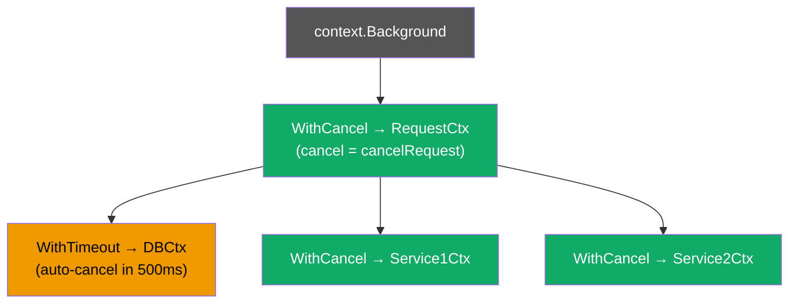

*Cancel `RequestCtx` and every node below it — DBCtx, Service1Ctx, Service2Ctx — is cancelled simultaneously.*

When `cancel()` is called (or a timeout fires):

1. The context's internal `Done` channel is **closed** (not sent to — closed, so all receivers unblock at once).
2. The context's `Err()` is set to `context.Canceled` (or `context.DeadlineExceeded`).
3. Each registered child context is cancelled recursively.
4. The child deregisters itself from the parent.

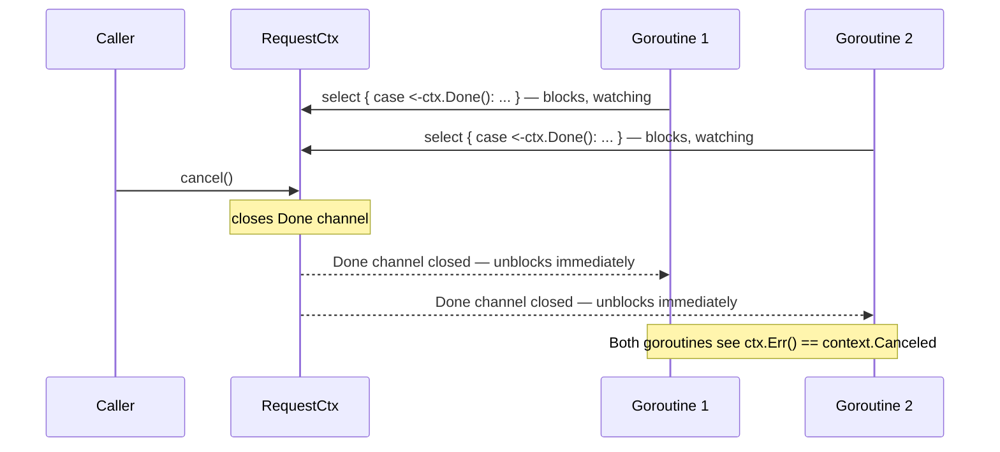

Goroutines check for cancellation using a `select`:

```go
func doWork(ctx context.Context) error {
    for {
        select {
        case <-ctx.Done():
            return ctx.Err() // return the reason: Canceled or DeadlineExceeded
        default:
            // do a unit of work
        }
    }
}
```

---

### 4. A Concrete Scenario

An HTTP handler spawns a goroutine to fetch data. The request context is passed down so the goroutine can stop if the client disconnects:

```go
func handler(w http.ResponseWriter, r *http.Request) {
    ctx, cancel := context.WithCancel(r.Context())
    defer cancel() // always clean up, even on success

    result := make(chan string, 1)
    go func() {
        data, err := fetchFromDB(ctx) // passes ctx into every blocking call
        if err != nil {
            return // ctx was cancelled — fetchFromDB returned early
        }
        result <- data
    }()

    select {
    case data := <-result:
        fmt.Fprintln(w, data)
    case <-ctx.Done():
        http.Error(w, "request cancelled", http.StatusRequestTimeout)
    }
}
```

When the client disconnects, `r.Context()` is cancelled by the HTTP server. Because `ctx` is a child of `r.Context()`, it is cancelled too — `fetchFromDB` sees its context cancelled, returns early, and the goroutine exits cleanly.

---

### 5. Key Insight

**A context is a cancellation signal broadcast to an entire call tree with a single function call.**
The tree structure is what makes it powerful — cancel the root and every descendant is cancelled, no matter how many layers deep the call stack goes. You never have to thread a separate "quit channel" through every function signature.

---

### 6. Common Misconceptions

- **"Cancelling a context stops the goroutines immediately."**
  It doesn't stop anything — it closes a channel. Goroutines must actively check `ctx.Done()` and return when they see it. A goroutine that never checks its context cannot be cancelled.

- **"You only need to call `cancel()` if you want to cancel early."**
  You must **always** call `cancel()` — even when the work completes normally. If you don't, the child context stays registered with its parent and holds internal resources until the parent is eventually cancelled. This is the context leak covered in Topic 2.

---

---

## Topic 2 / 6 — Context Leak

---

### 1. Motivation — Why Does This Exist?

Every call to `context.WithCancel`, `context.WithTimeout`, or `context.WithDeadline` does two things:
1. Creates a child context.
2. **Registers that child with its parent** so cancellation can propagate.

That registration is a pointer stored inside the parent. It keeps the child alive. If you never call the `cancel` function, that registration is **never removed**. The child context, its timer (if any), and the goroutines watching it can all stay alive long after the work they were meant to scope is complete.

In a long-running service that creates hundreds of contexts per request, this is a memory leak and a goroutine leak waiting to happen.

---

### 2. Building Blocks

| Concept | What happens |
|---|---|
| Child registration | `WithCancel` stores a pointer to the child in the parent's internal children list |
| `cancel()` called | Child removes itself from the parent's list, frees internal resources |
| `cancel()` NOT called | Child stays in the parent's list until the parent is eventually cancelled |
| Effect in long-lived parent | Children accumulate — each holds memory, a `Done` channel, and possibly a timer goroutine |

---

### 3. How It Works — The Mechanics

Each `cancelCtx` (the internal struct behind `WithCancel`) has a `children` map. When a child is created, it is inserted into this map. When `cancel()` is called, the child removes itself.

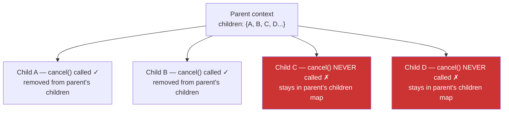

*Children C and D hold references and resources until the parent itself is eventually cancelled — which for a `context.Background()` root is never.*

For `WithTimeout` and `WithDeadline`, not calling `cancel()` also leaks the internal **timer** — a goroutine that the runtime parks until the deadline fires. If the work completes before the deadline, that timer goroutine and its resources linger unnecessarily until the timer expires.

---

### 4. A Concrete Scenario

**The leak:**

```go
func handleRequest(parentCtx context.Context) {
    ctx, _ := context.WithTimeout(parentCtx, 5*time.Second) // _ discards cancel — BUG
    // Even if this function returns in 1ms, the child context and its timer
    // goroutine stay alive for 5 full seconds, registered in parentCtx.
    fetchData(ctx)
}
```

`go vet` will warn: *"the cancel function is not used on all paths"*.

**The fix — always defer cancel:**

```go
func handleRequest(parentCtx context.Context) {
    ctx, cancel := context.WithTimeout(parentCtx, 5*time.Second)
    defer cancel() // fires when handleRequest returns, however it returns
    fetchData(ctx)
}
```

`defer cancel()` is the idiomatic pattern. Place it on the very next line after creating the context — never separate the creation from the cleanup.

---

### 5. Key Insight

**The `cancel` function is not optional — it is the cleanup.**
`context.WithCancel` and friends allocate resources. `cancel()` is how you free them. Treat the `cancel` function the same way you treat `defer f.Close()` on a file: the moment you create the resource, the next line defers its cleanup.

---

### 6. Common Misconceptions

- **"If the context times out, I don't need to call cancel."**
  You do. A timeout triggers cancellation of the context's `Done` channel, but the child is still registered with its parent. Only `cancel()` deregisters it and frees the internal timer.

- **"Discarding the cancel function is safe if I'm using WithDeadline."**
  Never discard `cancel`. Use `_` only if you are certain you have no children and no timer — in practice, there is no safe reason to discard it. `go vet` treats discarding cancel as a warning for exactly this reason.

---

---

## Topic 3 / 6 — `WithTimeout` vs `WithDeadline`

---

### 1. Motivation — Why Does This Exist?

Cancellation on demand (`WithCancel`) is powerful, but many operations need a **time limit**. A database query should not run for ten minutes. An external API call should fail fast, not hold a connection open indefinitely. You want the operation to cancel itself after a fixed duration — without requiring the caller to manually track time and call `cancel()`.

Go provides two functions for this: `WithTimeout` and `WithDeadline`. They express the same concept in two ways — and knowing when to use each makes your API surface clearer.

---

### 2. Building Blocks

| | `context.WithTimeout(parent, d)` | `context.WithDeadline(parent, t)` |
|---|---|---|
| Parameter | A **duration** — how long from now | An absolute **time.Time** — a clock moment |
| Internally | Calls `WithDeadline(parent, time.Now().Add(d))` | Sets an absolute deadline |
| Use when | You know "this should finish within 200ms" | You know "this must finish by 3:00:00 PM" |
| Example | HTTP client timeout, DB query timeout | "Process all jobs before midnight" |
| Both return | `(ctx, cancelFunc)` | `(ctx, cancelFunc)` |
| `cancel()` required | Yes — always | Yes — always |

`WithTimeout` is literally a one-line wrapper around `WithDeadline`. There is no internal difference — they produce the same underlying `timerCtx`.

---

### 3. How It Works — The Mechanics

Both create a `timerCtx` — a `cancelCtx` with an embedded `time.Timer`. When the deadline arrives, the timer fires and calls the context's internal cancel function automatically.

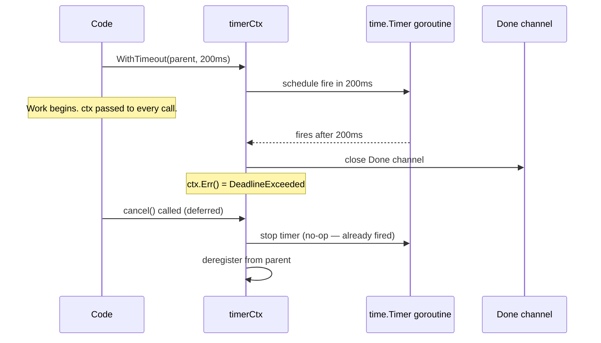

If the work completes **before** the deadline:

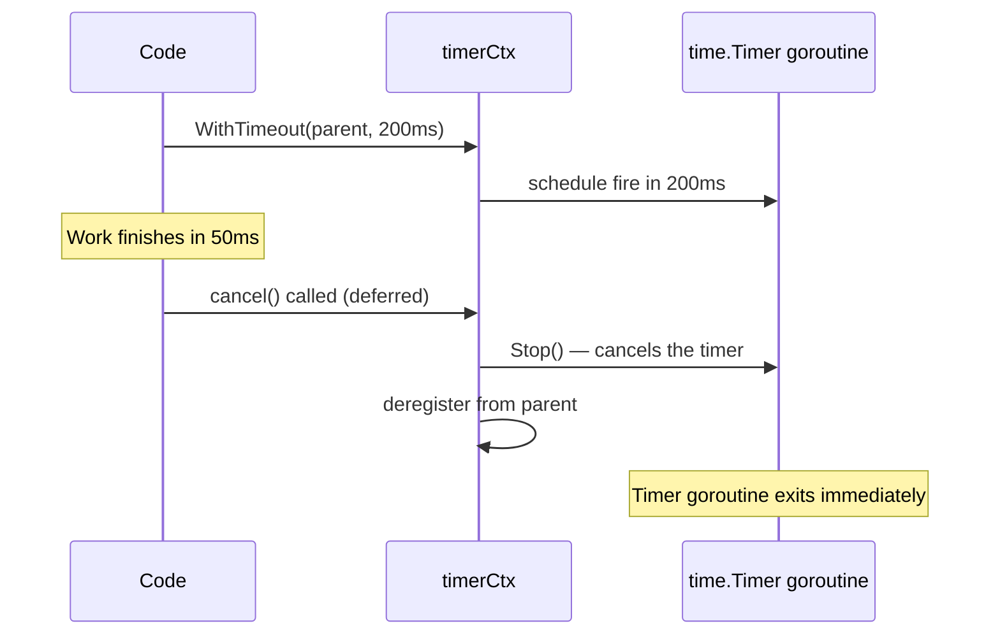

Calling `cancel()` before the deadline fires calls `time.Timer.Stop()` — this prevents the timer from firing and releases the timer's goroutine immediately. This is another reason `cancel()` must always be called.

#### Deadline inheritance

If a parent context already has a deadline of T+500ms and you call `WithTimeout(parent, 2s)`, the child's effective deadline is **T+500ms** — the tighter of the two. The child can never outlive its parent.

```go
ctx, cancel := context.WithTimeout(parent, 2*time.Second)
// If parent already expires in 300ms, ctx also expires in 300ms — not 2s.
deadline, ok := ctx.Deadline()
// ok=true, deadline = min(parent.deadline, now+2s)
```

---

### 4. A Concrete Scenario

```go
// HTTP call with a 500ms timeout
func fetchUser(ctx context.Context, id int) (*User, error) {
    reqCtx, cancel := context.WithTimeout(ctx, 500*time.Millisecond)
    defer cancel()

    req, _ := http.NewRequestWithContext(reqCtx, "GET", userURL(id), nil)
    resp, err := http.DefaultClient.Do(req)
    if err != nil {
        // If timeout fired: err wraps context.DeadlineExceeded
        if errors.Is(ctx.Err(), context.DeadlineExceeded) {
            return nil, fmt.Errorf("fetchUser: timed out after 500ms: %w", err)
        }
        return nil, err
    }
    defer resp.Body.Close()
    // ...
}
```

**When to use `WithDeadline` instead:**

```go
// All jobs in this batch must finish before midnight
midnight := time.Date(now.Year(), now.Month(), now.Day()+1, 0, 0, 0, 0, time.Local)
batchCtx, cancel := context.WithDeadline(ctx, midnight)
defer cancel()
runBatch(batchCtx, jobs)
```

`WithDeadline` is clearer here — you are not saying "finish within N hours", you are saying "finish by a specific clock time."

---

### 5. Key Insight

**`WithTimeout` and `WithDeadline` are the same thing expressed two ways.**
Use `WithTimeout` when you think in durations ("this call gets 500ms"), and `WithDeadline` when you think in clock times ("this must finish before X"). A child's deadline is always the minimum of its own deadline and its parent's — you can only tighten a deadline going down the tree, never loosen it.

---

### 6. Common Misconceptions

- **"WithTimeout always gives the operation the full duration."**
  Only if the parent has no deadline (or a looser one). If the parent expires first, the child expires with it — regardless of what duration you passed.

- **"WithDeadline is lower-level and rarely used."**
  It is the primitive. `WithTimeout` calls it. Use `WithDeadline` whenever you have a real wall-clock constraint — it communicates intent more clearly than a duration that needs mental arithmetic.

---

---

## Topic 4 / 6 — `context.Value` Lookup Cost

---

### 1. Motivation — Why Does This Exist?

Sometimes you need to carry request-scoped values across an API boundary — a request ID for logging, an authenticated user, a tracing span. You cannot change every function signature in a deep call stack to add these parameters. `context.Value` provides a way to attach key-value pairs to a context and retrieve them anywhere in the call tree.

But this convenience comes with a cost and a sharp design constraint: **it is an O(depth) linear search**, not an O(1) map lookup. Understanding why is critical for knowing when to use it and when to avoid it.

---

### 2. Building Blocks

| Concept | Meaning |
|---|---|
| `context.WithValue(parent, key, val)` | Creates a new child context that wraps `parent` and stores one key-value pair |
| `ctx.Value(key)` | Walks up the context chain, checking each node for the key |
| Key comparison | Uses `==` — keys must be comparable. Use an unexported custom type to avoid collisions |
| Depth | Every `WithValue` call adds one more node to the chain — `Value` must walk the whole chain |

---

### 3. How It Works — The Mechanics

Each `WithValue` creates a tiny `valueCtx` struct that holds exactly one key-value pair and a pointer to its parent:

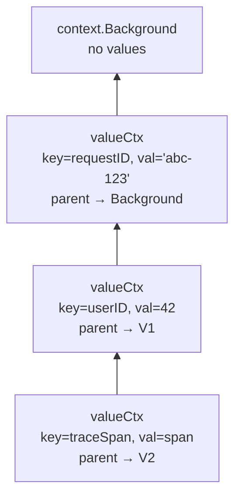

*Every `WithValue` call adds one node. The chain grows downward.*

When you call `ctx.Value(key)`:

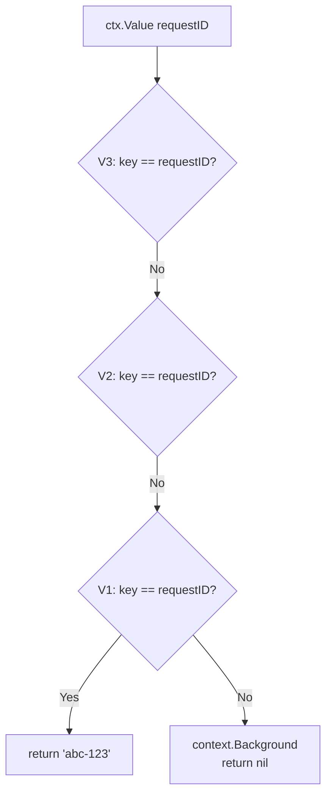

`Value` walks from the **current node upward toward the root**, checking each node's key in turn. It stops at the first match. If it reaches `context.Background()` without a match, it returns `nil`.

**Cost:** If the chain has depth N, retrieving a value from the root takes N pointer dereferences and N equality checks. In a deeply nested context (e.g., middleware → handler → service → DB layer, each adding a `WithCancel` or `WithTimeout`), the effective search length is bounded by all nodes, not just `WithValue` nodes.

**Key collision prevention** — the correct pattern is to use an unexported type as a key:

```go
// In your package:
type contextKey int // unexported — cannot be accessed or faked by other packages

const (
    requestIDKey contextKey = iota
    userIDKey
)

ctx = context.WithValue(ctx, requestIDKey, "abc-123")
id := ctx.Value(requestIDKey) // type-safe — no other package can construct this key
```

Using a plain `string` key (`ctx.Value("requestID")`) is a bug waiting to happen: two packages using the same string will silently shadow each other's values.

---

### 4. A Concrete Scenario

Request tracing in middleware:

```go
// Middleware: attach request ID
func requestIDMiddleware(next http.Handler) http.Handler {
    return http.HandlerFunc(func(w http.ResponseWriter, r *http.Request) {
        id := generateID()
        ctx := context.WithValue(r.Context(), requestIDKey, id)
        next.ServeHTTP(w, r.WithContext(ctx))
    })
}

// Deep in the call stack: retrieve request ID for logging
func (s *service) processOrder(ctx context.Context, order Order) error {
    id, _ := ctx.Value(requestIDKey).(string) // type assertion — returns "" if not found
    s.logger.Info("processing order", "requestID", id, "orderID", order.ID)
    // ...
}
```

The request ID is attached once in middleware and accessed anywhere in the call tree — without threading it through every function parameter.

---

### 5. Key Insight

**`context.Value` is a linked list lookup, not a map lookup.**
Every `WithValue` call adds one node; every `Value` call walks the chain from the current node to the root. Keep the chain shallow. Store one composite struct per concern rather than calling `WithValue` once per field. And use `context.Value` only for request-scoped cross-cutting concerns (tracing, auth, logging) — never for passing required function inputs (those belong in function signatures).

---

### 6. Common Misconceptions

- **"context.Value is a thread-safe map — use it freely."**
  It has no data race issues (each `WithValue` creates an immutable node), but it is not efficient for many values. Store a struct rather than calling `WithValue` ten times.

- **"String keys are fine as long as you namespace them."**
  String keys are always wrong. Two packages independently using `"userID"` will silently interfere. Always use an unexported custom type.

- **"ctx.Value returns nil means the key was never set."**
  It means the key was not found in this context's chain. It could have been set in a *sibling* branch of the tree (which is invisible from your branch) or simply never set. Always check for nil before using the result.

---

---

## Topic 5 / 6 — Worker Pool

---

### 1. Motivation — Why Does This Exist?

A web scraper receives 10,000 URLs to fetch. The naive approach: launch one goroutine per URL.

```go
for _, url := range urls {
    go fetch(url) // 10,000 goroutines launched simultaneously
}
```

10,000 goroutines is fine for memory — goroutines are cheap. But 10,000 simultaneous outbound HTTP connections is not fine. It hammers DNS, exhausts file descriptors, rate-limits you on remote servers, and floods the network. You want **bounded concurrency** — at most N things happening at once.

A **worker pool** is the idiomatic Go solution: launch exactly N goroutines at startup, feed them work through a shared channel, and let them drain it. The channel naturally throttles the producers — if all N workers are busy, the producer blocks until a worker is free.

---

### 2. Building Blocks

| Concept | Role |
|---|---|
| **Jobs channel** | A buffered (or unbuffered) channel the producer writes work into |
| **Worker goroutines** | N goroutines, each ranging over the jobs channel — blocks when empty |
| **Results channel** (optional) | Workers write results back; a collector goroutine reads them |
| **context.Context** | Passed to each worker; cancelling it signals all workers to stop |
| **sync.WaitGroup** | Tracks when all N workers have exited; signals it is safe to close results channel |

---

### 3. How It Works — The Mechanics

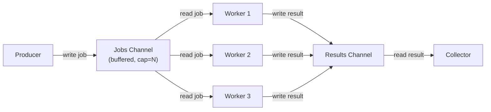

**Shutdown sequence:**

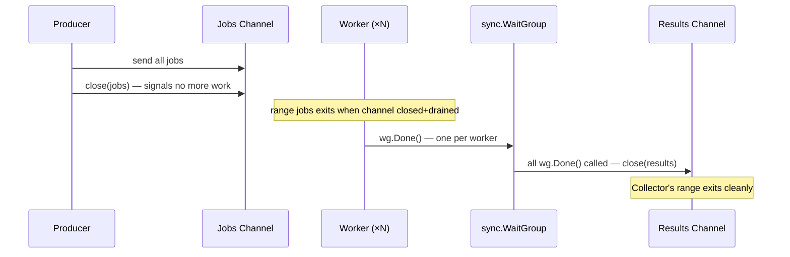

Close the jobs channel to tell workers there is no more work. Workers that are ranging over the jobs channel exit their loop automatically when the channel is both closed and drained. The `WaitGroup` ensures results are only closed after **all** workers have finished — closing results before a worker has written its last result would cause a panic.

---

### 4. A Concrete Scenario

```go
func workerPool(ctx context.Context, jobs <-chan string, numWorkers int) <-chan string {
    results := make(chan string, numWorkers)
    var wg sync.WaitGroup

    for i := 0; i < numWorkers; i++ {
        wg.Add(1)
        go func() {
            defer wg.Done()
            for {
                select {
                case job, ok := <-jobs:
                    if !ok {
                        return // jobs channel closed — exit
                    }
                    result := process(job)
                    select {
                    case results <- result:
                    case <-ctx.Done():
                        return // cancelled — stop sending results
                    }
                case <-ctx.Done():
                    return // cancelled — stop receiving jobs
                }
            }
        }()
    }

    // Close results once all workers are done
    go func() {
        wg.Wait()
        close(results)
    }()

    return results
}
```

**Why two `select` statements?**
The first `select` races between a new job and cancellation. The second races between sending a result and cancellation. Without the second check, a worker that just finished a job could block forever trying to send its result if the collector is gone (e.g., because `ctx` was cancelled and the collector exited).

**Why a goroutine to close results?**
You cannot close `results` in the main goroutine because the main goroutine returns `results` immediately — it doesn't wait for workers. The closer goroutine blocks on `wg.Wait()` and only closes after every worker has exited.

---

### 5. Key Insight

**A worker pool is a jobs channel drained by N goroutines.**
The channel's blocking behaviour is the throttle — you never need a semaphore or explicit "only N at a time" logic. Close the jobs channel to shut down workers gracefully. Use `context` + `WaitGroup` to ensure clean shutdown: context signals workers to stop, WaitGroup signals that all workers have stopped.

---

### 6. Common Misconceptions

- **"I can close the results channel in the producer."**
  The producer doesn't know when the last worker finishes — that's what `WaitGroup` tracks. The closer must block on `wg.Wait()`.

- **"Cancelling the context stops the workers immediately."**
  Cancelling closes `ctx.Done()`. Workers only see this when they reach a `select` that includes `<-ctx.Done()`. A worker blocked on a slow `process(job)` call (with no context awareness) won't stop until that call returns. Pass the context into every blocking operation.

- **"A buffered jobs channel speeds up the pool."**
  It allows the producer to enqueue some work ahead of time without blocking — this is useful when the producer is bursty. But it doesn't increase throughput; N workers can process at most N jobs simultaneously regardless of buffer size.

---

---

## Topic 6 / 6 — Fan-out / Fan-in Pipeline

---

### 1. Motivation — Why Does This Exist?

Some workloads are naturally pipeline-shaped:

1. **Generate** data (read files, stream events, query a database)
2. **Transform** it (parse, filter, enrich)
3. **Collect** the results

You want each stage to run concurrently. You want back-pressure — if a later stage is slow, the earlier stage should pause rather than build up unbounded memory. And you want the whole pipeline to shut down cleanly when either the work is done or a cancellation fires.

**Fan-out** means taking one input stream and distributing work across multiple goroutines (for parallel processing of a single stage). **Fan-in** means merging multiple output streams back into one (so the next stage reads from a single channel). Together they form a scalable, composable, cancellable pipeline.

---

### 2. Building Blocks

| Stage | What it does |
|---|---|
| **Generator** | Produces values into a channel; closes channel when done |
| **Fan-out** | Reads from one input channel; N worker goroutines each read from it in parallel |
| **Stage function** | Transforms one value, produces one (or zero) output values |
| **Fan-in (merge)** | N input channels → one output channel; closes output when all inputs are drained |
| **Collector** | Reads from the final channel; accumulates or writes results |

---

### 3. How It Works — The Mechanics

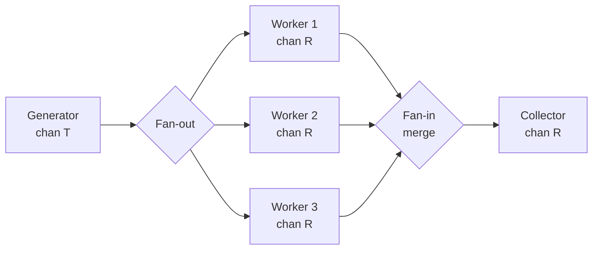

**Fan-in (merge)** starts one goroutine per input channel; each goroutine ranges over its input channel and forwards values to the shared output. A `WaitGroup` closes the output when all forwarder goroutines are done:

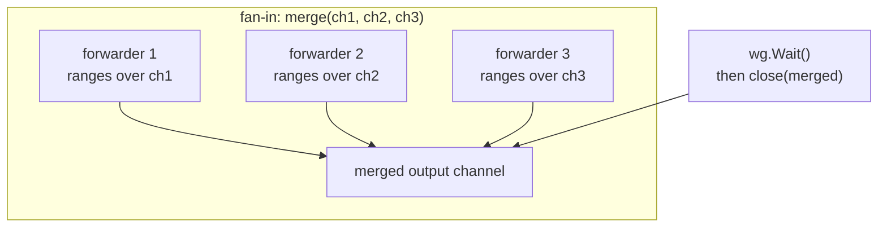

---

### 4. A Concrete Scenario

A complete fan-out/fan-in pipeline that processes file paths:

```go
// generator: emits paths, respects cancellation
func generate(ctx context.Context, paths []string) <-chan string {
    out := make(chan string)
    go func() {
        defer close(out)
        for _, p := range paths {
            select {
            case out <- p:
            case <-ctx.Done():
                return
            }
        }
    }()
    return out
}

// stage: reads from in, processes, writes to out
func process(ctx context.Context, in <-chan string) <-chan Result {
    out := make(chan Result)
    go func() {
        defer close(out)
        for path := range in {
            r := doExpensiveWork(path)
            select {
            case out <- r:
            case <-ctx.Done():
                return
            }
        }
    }()
    return out
}

// fan-in: merges multiple channels into one
func merge(ctx context.Context, channels ...<-chan Result) <-chan Result {
    merged := make(chan Result)
    var wg sync.WaitGroup

    forward := func(ch <-chan Result) {
        defer wg.Done()
        for r := range ch {
            select {
            case merged <- r:
            case <-ctx.Done():
                return
            }
        }
    }

    wg.Add(len(channels))
    for _, ch := range channels {
        go forward(ch)
    }

    go func() {
        wg.Wait()
        close(merged)
    }()

    return merged
}

// Wiring it together:
func run(ctx context.Context, paths []string) {
    paths_ch := generate(ctx, paths)

    // Fan-out: 3 workers processing in parallel
    workers := make([]<-chan Result, 3)
    for i := range workers {
        workers[i] = process(ctx, paths_ch)
    }

    // Fan-in: merge worker outputs back to one channel
    for result := range merge(ctx, workers...) {
        fmt.Println(result)
    }
}
```

---

### 5. When Fan-out/Fan-in Creates Back-pressure Problems

Fan-out/fan-in works beautifully when stages have roughly equal throughput. Problems arise when they don't:

**Fast generator, slow workers:**

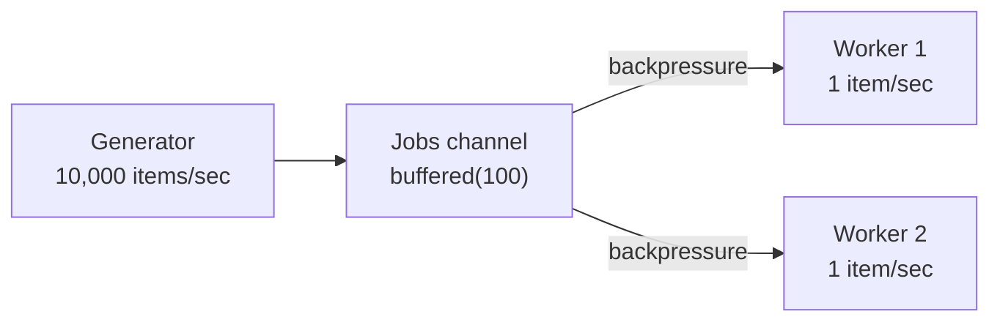

The jobs channel fills instantly. Once full, the generator blocks. This is **back-pressure working correctly** — the slow consumers naturally throttle the producer. The problem is when the channel is **unbuffered or undersized**: the generator blocks on the very first item if no worker is ready. Add a buffered channel to absorb bursts.

**Fast workers, slow collector:**

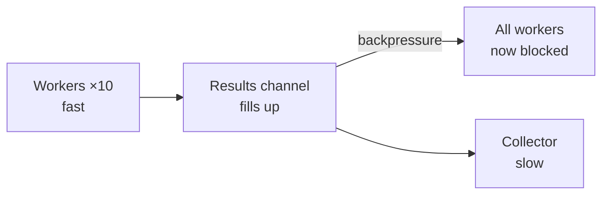

If the results channel fills up, all workers block on their send — the fan-out collapses into a serial bottleneck. Either increase the buffer size, add more collectors, or fan-out the collection stage too.

**The diagnostic question:** Which channel is full? That channel is your bottleneck — the stage that feeds it is faster than the stage that drains it. Buffer sizes are knobs that absorb temporary bursts but cannot fix a sustained throughput mismatch.

---

### 6. Key Insight

**Fan-out/fan-in pipelines are the composable form of a worker pool.**
Each stage is independent — you can swap, reorder, or scale stages without touching the others. Channels are the seams between stages, and channel blocking is the back-pressure mechanism. Context cancellation propagates through every stage simultaneously because every `select` listens on `ctx.Done()`. When one stage returns early (due to cancellation or error), the remaining stages drain naturally — goroutines exit once their input channel is closed.

---

### 7. Common Misconceptions

- **"Fan-out means launching more goroutines than channels."**
  Fan-out means one input channel read by multiple goroutines in parallel. Each goroutine reads from the **same** channel — Go's channel operations are safe for concurrent use, and the scheduler distributes items across goroutines naturally.

- **"Closing the context stops the pipeline instantly."**
  It signals all stages. Stages with items already in their buffers will continue draining until each goroutine reaches a `select` that includes `ctx.Done()`. Instant stop requires an unbuffered pipeline — buffered pipelines drain their in-flight items first.

- **"Bigger buffers always make the pipeline faster."**
  Bigger buffers reduce stalls from momentary throughput mismatches, but they also increase latency — an item can sit in the buffer for longer before being processed. For latency-sensitive workloads, keep buffers small or unbuffered.

---
