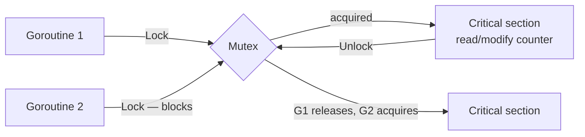
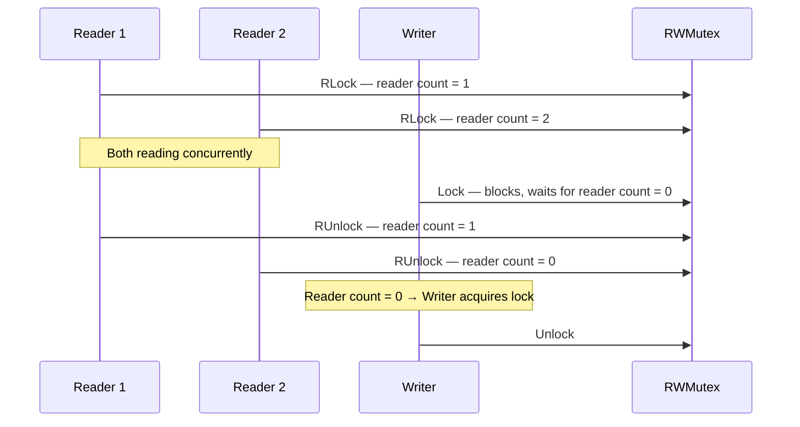
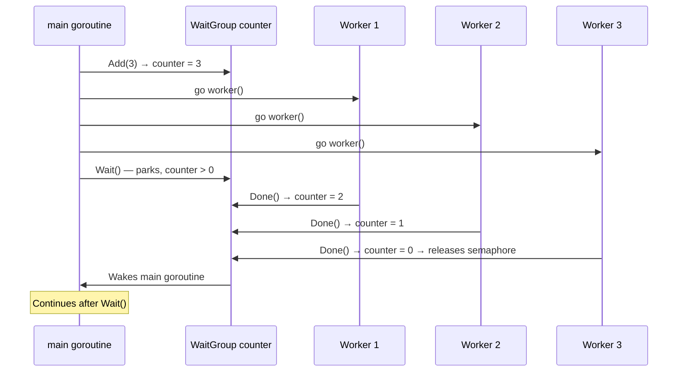
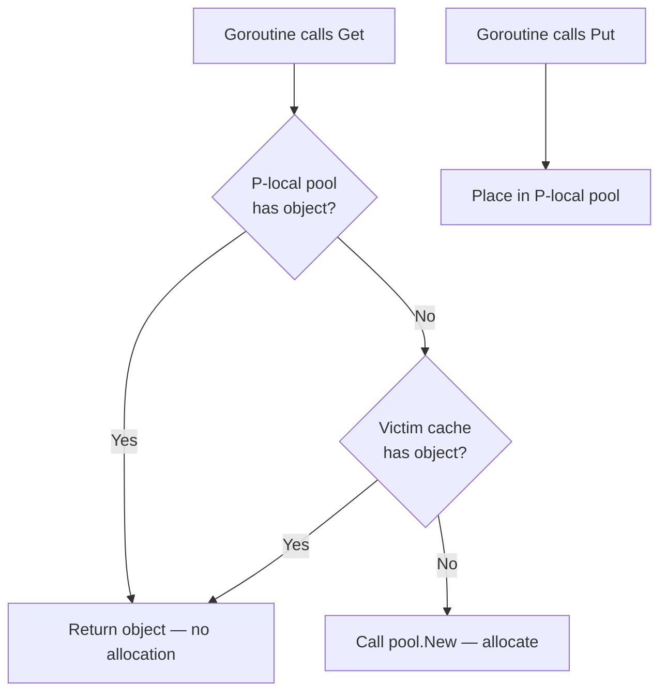
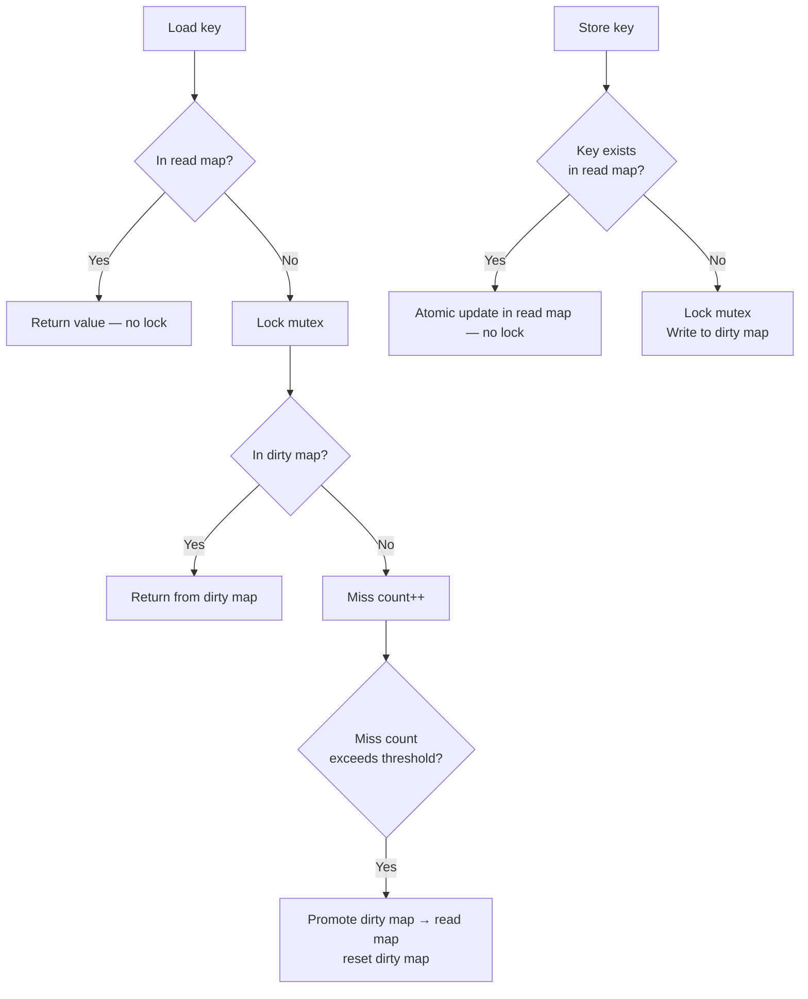
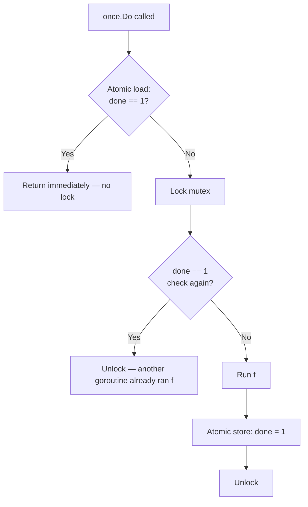
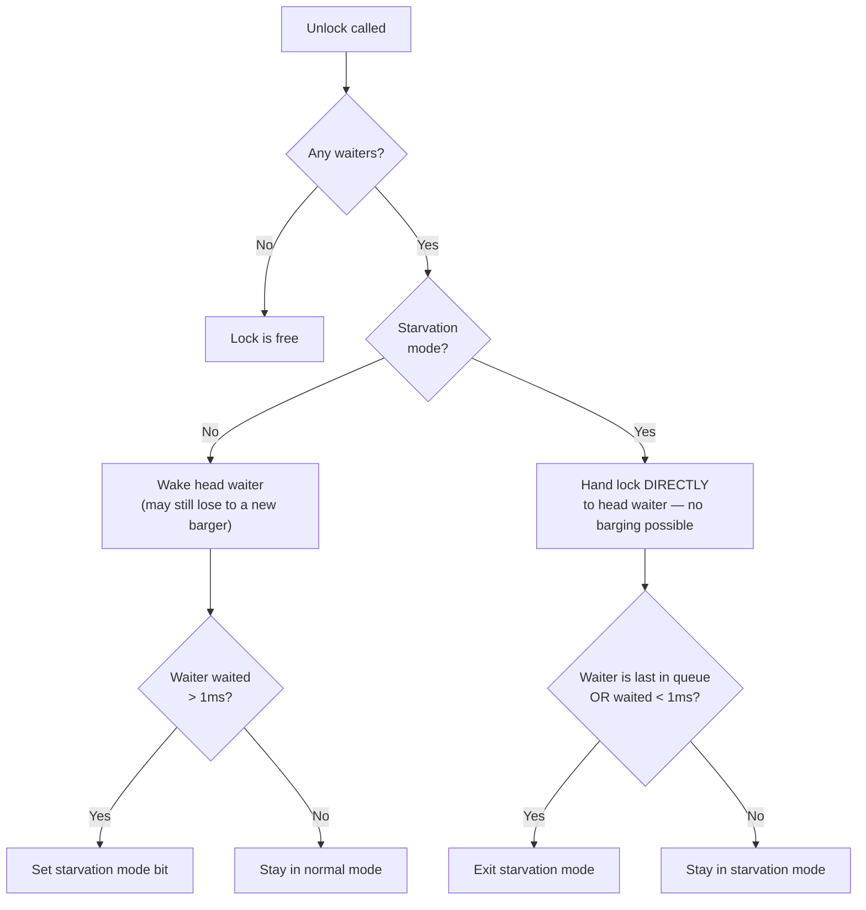
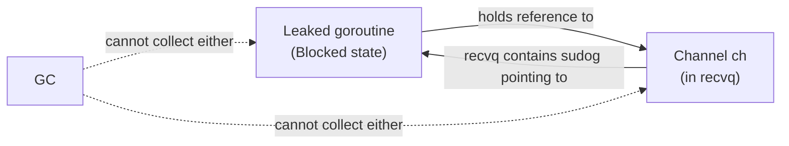

# Phase 9b — Sync Primitives & Goroutine Safety

> **8 topics.** This section covers Go's synchronisation building blocks in the `sync` package,
> when to use each one, and how goroutine leaks happen and are detected.
> Learn after Phase 9a (Channels) — you need to understand what "blocking" means at the scheduler
> level before the trade-offs here make sense.

---

## Topic 1 / 8 — `sync.Mutex` vs Channel

---

### 1. Motivation — Why Does This Exist?

You have a counter that multiple goroutines increment. Two goroutines read the value, add 1, and write it back. Without synchronisation they can both read the same stale value, both compute the same result, and one increment gets silently lost.

```go
// DATA RACE — do not do this
var counter int
go func() { counter++ }()
go func() { counter++ }()
```

Go gives you two tools to fix this: a **mutex** and a **channel**. Both work. They are not interchangeable — each fits a different shape of problem.

---

### 2. Building Blocks

| Tool | Core idea | What it protects |
|---|---|---|
| `sync.Mutex` | One goroutine at a time may hold the lock | **Shared state** — a variable or data structure that multiple goroutines read/write |
| Channel | Values flow from sender to receiver | **Ownership transfer** — passing a piece of data from one goroutine to another |

A useful heuristic from the Go team:

> **Use a mutex when goroutines share state. Use a channel when goroutines communicate.**

---

### 3. How It Works — The Mechanics

#### sync.Mutex

A `Mutex` has two states: **unlocked** and **locked**. Internally it is a 32-bit integer that the runtime flips with an atomic compare-and-swap (CAS).



When a second goroutine calls `Lock()` while the mutex is held:
1. It first **spins** briefly (cheap: just burns a few CPU cycles) hoping the lock is released quickly.
2. If the lock is still held after spinning, the goroutine is **parked** — it joins an internal wait queue and the scheduler picks another goroutine to run.
3. When the holder calls `Unlock()`, the runtime wakes one waiter from the queue.

This park/unpark path makes mutex contention visible as goroutine scheduler activity, not raw CPU burn.

#### Channel as a mutex (ownership transfer)

```go
// A buffered channel of capacity 1 acts as a binary semaphore
token := make(chan struct{}, 1)
token <- struct{}{} // "acquire"
// critical section
<-token             // "release"
```

This works, but it is the wrong tool here. The channel communicates nothing — it just controls access. It also has higher per-operation overhead than a mutex.

#### The Decision Rule

```
Does the problem look like:
  "multiple goroutines need to read/write X safely"  → mutex
  "goroutine A produces a value, goroutine B consumes it" → channel
  "wait for a group of goroutines to finish" → WaitGroup (Topic 3)
  "one result shared by many readers" → sync.Once (Topic 6) or mutex
```

---

### 4. A Concrete Scenario

```go
type SafeCounter struct {
    mu    sync.Mutex
    count int
}

func (c *SafeCounter) Inc() {
    c.mu.Lock()
    c.count++ // only one goroutine can be here at a time
    c.mu.Unlock()
}

func (c *SafeCounter) Value() int {
    c.mu.Lock()
    defer c.mu.Unlock()
    return c.count
}
```

Compare with the channel equivalent for the same job:

```go
inc := make(chan struct{})
go func() {
    var count int
    for range inc {
        count++
    }
}()
inc <- struct{}{} // increment
```

The channel version gives a single goroutine exclusive ownership of `count` — it's safe, but now you can't read the value without another channel, and the design is more complex than the problem requires.

---

### 5. Key Insight

**A mutex guards shared state. A channel transfers ownership.**
When multiple goroutines need concurrent access to the same piece of memory, a mutex is the direct, readable solution. A channel is not a general-purpose locking primitive — it's a communication mechanism, and forcing it into the role of a mutex produces code that is harder to read without being safer.

---

### 6. Common Misconceptions

- **"Channels are always the Go way — avoid mutexes."**
  This is a misreading of the Go proverb "don't communicate by sharing memory." The proverb says prefer communication *over* sharing. It doesn't say never use a mutex. The `sync` package exists for a reason.

- **"A mutex blocks the whole program."**
  A mutex only blocks goroutines that are trying to acquire that specific lock. Other goroutines on other data run freely.

---

---

## Topic 2 / 8 — `sync.RWMutex`

---

### 1. Motivation — Why Does This Exist?

A regular `sync.Mutex` allows only one goroutine at a time — whether it's reading or writing. If you have 100 goroutines that all want to *read* a shared map and only one that *writes* to it occasionally, forcing each reader to wait for exclusive access is wasteful. Reads don't interfere with each other — only a write interferes with reads.

`sync.RWMutex` separates the two cases:
- **Multiple readers can hold the lock simultaneously** — they don't block each other.
- **A writer gets exclusive access** — it blocks all readers and other writers until it's done.

---

### 2. Building Blocks

| Method | Who can proceed | Who blocks |
|---|---|---|
| `RLock()` / `RUnlock()` | Any number of concurrent readers | Blocks if a writer holds the lock |
| `Lock()` / `Unlock()` | One writer at a time | Blocks all readers and all other writers |

---

### 3. How It Works — The Mechanics

`RWMutex` maintains a reader count. `RLock` atomically increments it; `RUnlock` decrements it. A writer calling `Lock()` first waits for all current readers to finish (reader count reaches zero), then takes exclusive control.



#### When RWMutex hurts: writer starvation (inverted)

The real danger is the opposite — **reader starvation of writers**. If readers arrive in a continuous stream and always hold at least one `RLock`, a writer waiting for `Lock()` can be blocked indefinitely. Go's `RWMutex` solves this: once a writer is waiting, **new readers are blocked** until the writer has had its turn. This prevents writer starvation but means a waiting writer temporarily converts the `RWMutex` into a full exclusive mutex — killing read concurrency until the writer is done.

In a write-heavy workload, this means `RWMutex` performs *worse* than a plain `Mutex` because:
1. Every `RLock` / `RUnlock` is more work than `Lock` / `Unlock` (atomic operations on the reader count).
2. Writers arriving frequently still block all readers — you get the cost of both.

---

### 4. A Concrete Scenario

```go
type Cache struct {
    mu   sync.RWMutex
    data map[string]string
}

func (c *Cache) Get(key string) (string, bool) {
    c.mu.RLock()
    defer c.mu.RUnlock()
    v, ok := c.data[key]
    return v, ok
}

func (c *Cache) Set(key, value string) {
    c.mu.Lock()
    defer c.mu.Unlock()
    c.data[key] = value
}
```

This is the correct pattern: many concurrent `Get` calls proceed in parallel. A `Set` call blocks everyone briefly, then releases. The cache is read-heavy, so `RWMutex` wins over a plain `Mutex`.

**But swap the ratio**: if `Set` is called as often as `Get`, you'd be better off with a plain `sync.Mutex`. The extra complexity of `RWMutex` gives you nothing, and the atomic reader-count bookkeeping adds overhead.

---

### 5. Key Insight

**`RWMutex` only wins when reads are both frequent and significantly more common than writes.**
Rule of thumb: if your read-to-write ratio is less than ~10:1, benchmark before assuming `RWMutex` is faster. The atomic operations on the reader count, plus the writer-priority blocking, add up quickly under write pressure.

---

### 6. Common Misconceptions

- **"RWMutex allows concurrent reads and concurrent writes."**
  Only concurrent reads. Writes are still exclusive — they block all readers and all other writers.

- **"An RWMutex always outperforms a plain Mutex."**
  Only when reads dominate. Under write pressure, `RWMutex` is slower because each `RLock`/`RUnlock` is heavier than a plain `Lock`/`Unlock`.

---

---

## Topic 3 / 8 — `sync.WaitGroup`

---

### 1. Motivation — Why Does This Exist?

You launch 10 goroutines to do parallel work. Now you need to know when all 10 are done before continuing. You could use a channel and count 10 receives, but that requires careful bookkeeping and a correctly sized channel. `sync.WaitGroup` is the standard, purpose-built tool for this exact pattern.

---

### 2. Building Blocks

| Method | What it does |
|---|---|
| `wg.Add(n)` | Increments the internal counter by `n` — "I am about to launch n goroutines" |
| `wg.Done()` | Decrements the counter by 1 — "one goroutine has finished" |
| `wg.Wait()` | Blocks the calling goroutine until the counter reaches zero |

`Done()` is shorthand for `Add(-1)`.

---

### 3. How It Works — The Mechanics

Internally, `WaitGroup` holds a counter and a semaphore. `Wait()` parks the calling goroutine by waiting on the semaphore. When `Done()` decrements the counter to zero, it releases the semaphore and wakes all goroutines parked in `Wait()`.



#### The one ordering rule that matters

`Add()` must be called **before** the goroutine is launched — never inside the goroutine itself.

```go
// WRONG — race between Add and Wait
var wg sync.WaitGroup
for i := 0; i < 3; i++ {
    go func() {
        wg.Add(1)  // too late — Wait() may run before this Add
        defer wg.Done()
        doWork()
    }()
}
wg.Wait()

// CORRECT
for i := 0; i < 3; i++ {
    wg.Add(1)      // Add BEFORE go
    go func() {
        defer wg.Done()
        doWork()
    }()
}
wg.Wait()
```

If `Wait()` is called before `Add()` runs, the counter is zero and `Wait()` returns immediately — before any goroutine has done any work.

---

### 4. A Concrete Scenario

```go
func processAll(items []Item) {
    var wg sync.WaitGroup

    for _, item := range items {
        wg.Add(1)
        go func(it Item) {
            defer wg.Done() // guaranteed to run even if process panics
            process(it)
        }(item) // pass item as argument — avoids the loop-variable capture gotcha
    }

    wg.Wait() // blocks until all goroutines have called Done()
    fmt.Println("all items processed")
}
```

Note the `defer wg.Done()` pattern. Putting `Done()` in a `defer` ensures it runs even if `process` panics — otherwise a panic would leave the counter permanently above zero and `Wait()` would block forever.

---

### 5. Key Insight

**`Add` before the goroutine, `Done` via defer, `Wait` after the loop — that ordering is non-negotiable.**
Any deviation from it introduces a race between the counter and the wait. The `defer wg.Done()` pattern is not just style — it is a correctness guarantee against panics leaving the counter stuck.

---

### 6. Common Misconceptions

- **"You can reuse a WaitGroup by calling Add again after Wait returns."**
  You can — but only after `Wait()` has returned and the counter is at zero. Calling `Add()` on a WaitGroup that has active waiters on `Wait()` can cause a panic.

- **"Done() and Add(-1) are different."**
  They are identical. `Done()` is literally defined as `wg.Add(-1)`. Some codebases prefer `Done()` for readability at the call site.

---

---

## Topic 4 / 8 — `sync.Pool`

---

### 1. Motivation — Why Does This Exist?

Some objects are expensive to allocate and are needed frequently, but only one at a time — like a `bytes.Buffer` used to format a log line, or a JSON encoder. Every request allocates one, uses it, and throws it away. That's a lot of garbage for the GC to clean up.

`sync.Pool` is a cache for reusable objects. Instead of allocating a new one every time, a goroutine borrows one from the pool, uses it, and returns it. The pool reduces allocation pressure and GC work.

---

### 2. Building Blocks

| Method | What it does |
|---|---|
| `pool.Get()` | Returns a pooled object if one is available; calls `New()` to create one if not |
| `pool.Put(obj)` | Returns an object to the pool for reuse |
| `New` field | A function that creates a new object when the pool is empty |

---

### 3. How It Works — The Mechanics

`sync.Pool` maintains a **per-P local pool** (one per logical processor) and a **victim cache**. The per-P design means `Get()` and `Put()` are lock-free on the fast path — each P only touches its own local pool.



#### The Main Gotcha — GC clears the pool

**Every GC cycle, the pool is cleared.** Objects that are sitting in the pool when the GC runs are dropped. Your goroutine calls `Get()`, gets an object, puts it back with `Put()` — and the next `Get()` after a GC may call `New()` and allocate fresh.

The "victim cache" softens this: objects from the previous GC cycle are moved to the victim cache instead of being dropped immediately. The next `Get()` can still find them there. After two GC cycles without being retrieved, they are gone.

This means `sync.Pool` is **not a permanent cache** — it's an allocation amortiser within a GC epoch. Do not store objects in the pool that hold important state or resources (open files, connections).

---

### 4. A Concrete Scenario

```go
var bufPool = sync.Pool{
    New: func() any {
        return new(bytes.Buffer)
    },
}

func formatLog(msg string) string {
    buf := bufPool.Get().(*bytes.Buffer)
    buf.Reset() // CRITICAL — pool objects may carry stale data from previous use
    defer bufPool.Put(buf)

    buf.WriteString("[INFO] ")
    buf.WriteString(msg)
    return buf.String()
}
```

Two things to never forget:
1. **Always reset the object before use** — a pooled buffer may contain leftover data from a previous goroutine.
2. **Never store a pointer to a pooled object after Put** — once you return it, another goroutine may be using it.

---

### 5. Key Insight

**`sync.Pool` reduces allocation pressure, not allocation count to zero.**
In a high-throughput service, it can meaningfully reduce GC frequency by reusing short-lived objects. But after every GC cycle the pool may be partially or fully empty. Design your code so that a pool miss (calling `New()`) is correct and unremarkable — it just costs an allocation, not a correctness failure.

---

### 6. Common Misconceptions

- **"Objects in sync.Pool survive forever."**
  They are cleared every GC cycle. The pool is a hint to the runtime, not a permanent store.

- **"sync.Pool is safe to use as a connection pool or resource cache."**
  No. Connections and resources must be explicitly managed and closed. If the GC drops a connection object from `sync.Pool`, the underlying connection is leaked. Use a purpose-built pool for resources.

- **"Get() always returns a non-nil value."**
  Only if `New` is set. If `New` is nil and the pool is empty, `Get()` returns `nil`.

---

---

## Topic 5 / 8 — `sync.Map`

---

### 1. Motivation — Why Does This Exist?

The standard `map` in Go is not safe for concurrent access. Two goroutines writing to the same map simultaneously causes a **runtime panic** (not a silent data race — Go detects concurrent map writes at runtime and crashes immediately).

The obvious fix is `map + sync.RWMutex` — wrap every read in `RLock`, every write in `Lock`. This works, but under high contention the mutex becomes a bottleneck because all goroutines funnel through it.

`sync.Map` is a concurrent map optimised for a specific access pattern: **reads heavily outnumber writes, and the set of keys is mostly stable.** For that pattern, it uses internal sharding and atomic operations to allow reads without any locking at all.

---

### 2. Building Blocks

| Method | What it does |
|---|---|
| `m.Store(key, value)` | Writes a key-value pair |
| `m.Load(key)` | Reads a value — returns `(value, ok)` |
| `m.LoadOrStore(key, value)` | Atomic read-or-write — returns existing value if present |
| `m.Delete(key)` | Removes a key |
| `m.Range(func(k, v any) bool)` | Iterates all entries — callback returns false to stop |

---

### 3. How It Works — The Mechanics

`sync.Map` has two internal maps: a **read map** (atomic pointer, no lock required to read) and a **dirty map** (protected by a mutex, handles writes and new keys).



The key insight: **loading an already-known key is entirely lock-free** — it reads from the atomic read map directly. This is why `sync.Map` excels when keys are mostly stable (set once, read many times) and reads dominate.

New keys always go to the dirty map first (requires a lock). After enough misses on the read map, the dirty map is "promoted" — swapped atomically into the read map. This is the only moment when the read map is updated and it happens under the lock.

---

### 4. A Concrete Scenario

`sync.Map` is the right tool for:

```go
// Handler registry — registered once at startup, read on every request
var handlers sync.Map

func register(name string, h Handler) {
    handlers.Store(name, h)
}

func dispatch(name string) {
    v, ok := handlers.Load(name) // lock-free after initial promotion
    if !ok {
        return
    }
    v.(Handler).ServeHTTP(...)
}
```

`sync.Map` is the **wrong** tool for:

```go
// Counter per user — new keys added constantly, each key written frequently
var hitCount sync.Map
hitCount.Store(userID, count+1) // wrong pattern — frequent writes to many keys
```

A map with heavy write activity on constantly-changing keys forces `sync.Map` to go through the dirty map path and lock on nearly every operation — worse than `map + sync.Mutex`.

---

### 5. Key Insight

**`sync.Map` trades write performance for read performance.** Reads on existing keys are lock-free and extremely fast. Writes, new key insertions, and key deletions all go through a mutex. Use it when your access pattern is "write a few times at startup, read millions of times after" — not as a general-purpose concurrent map replacement.

---

### 6. Common Misconceptions

- **"`sync.Map` is always better than `map + RWMutex`."**
  Only for the read-heavy, stable-key pattern. For balanced or write-heavy access, `map + sync.Mutex` (or `RWMutex`) is simpler and often faster.

- **"`sync.Map` avoids all locking."**
  Reads on known keys are lock-free. Writes and new key insertions still lock.

---

---

## Topic 6 / 8 — `sync.Once`

---

### 1. Motivation — Why Does This Exist?

Some initialisation should happen exactly once, regardless of how many goroutines ask for it. The naive approach — check a boolean flag — has a race condition:

```go
var initialised bool
var config Config

func getConfig() Config {
    if !initialised {       // two goroutines can both see false here
        config = loadConfig()
        initialised = true  // and both run this
    }
    return config
}
```

Even wrapping it in a mutex has a subtlety: once `initialised` is true, you still lock the mutex on every call just to check the flag. For something that is read millions of times after initialisation, that lock contention is wasted.

`sync.Once` solves this cleanly — the function runs exactly once, the first caller runs it, all other callers block until it completes and then proceed without any locking.

---

### 2. Building Blocks

| Part | What it does |
|---|---|
| `once.Do(f)` | Calls `f` exactly once, even if called from many goroutines simultaneously. All callers block until `f` returns. |
| Internal state | A `done` uint32 flag (checked with an atomic load) + a `Mutex` for the slow path |

---

### 3. How It Works — The Mechanics

`sync.Once` uses a two-phase check — a **fast path** with an atomic load and a **slow path** with a mutex:



The double-check inside the mutex (the "check again" step) is necessary: between the failed fast-path check and acquiring the mutex, another goroutine may have already run `f` and set `done=1`. Without the double-check, two goroutines could both fail the fast path, both acquire the mutex sequentially, and both run `f`.

After `f` runs and `done` is set to 1 atomically, every future call hits the fast path and returns instantly — **zero lock contention** for all calls after the first.

---

### 4. A Concrete Scenario

```go
type DB struct {
    once sync.Once
    conn *sql.DB
}

func (db *DB) Connection() *sql.DB {
    db.once.Do(func() {
        var err error
        db.conn, err = sql.Open("postgres", dsn)
        if err != nil {
            panic(err) // Once does not retry on panic — see misconceptions
        }
    })
    return db.conn
}
```

The `once.Do` call is safe to call from thousands of goroutines simultaneously at startup. Exactly one will run `sql.Open`. All others wait, and once the first is done, everyone proceeds — with zero locking overhead on all subsequent calls.

#### The "cannot be reset" implication

`sync.Once` has no `Reset()` method. Once `done=1`, it stays 1 forever. This is intentional — "initialise once" means permanently. If you need re-runnable initialisation (e.g., reconnect after a failure), `sync.Once` is the wrong tool. Use a mutex-guarded state machine instead.

---

### 5. Key Insight

**`sync.Once` gives you one-time initialisation with zero overhead on the hot path after the first call.**
The atomic load on every call is essentially free — a single CPU instruction. Compare this to a mutex-guarded check: even an uncontended `Lock()`/`Unlock()` pair has more overhead than an atomic load. For "initialise once, read forever" patterns, `Once` is the optimal choice.

---

### 6. Common Misconceptions

- **"If the function passed to Do panics, Once will retry on the next call."**
  No. If `f` panics, `Do` still marks `done=1`. The next call to `Do` returns immediately without running `f` again. The panic propagates to the caller that ran `f`, but the Once is permanently consumed. This means a failed initialisation leaves your program in a broken state — which is why panicking inside `Once.Do` is usually the right choice for truly unrecoverable setup failure.

- **"sync.Once can be reset to run the function again."**
  It cannot. There is no `Reset()`. If you need repeated runs, use a mutex and a boolean flag you control.

- **"Do blocks all callers until f returns."**
  Correct. If `f` takes 5 seconds, all goroutines calling `Do` during those 5 seconds are parked and waiting.

---

---

## Topic 7 / 8 — `sync.Mutex` Starvation Mode

---

### 1. Motivation — Why Does This Exist?

A busy mutex under high contention has a subtle fairness problem. When a goroutine unlocks a mutex, the runtime wakes one of the parked waiters — but it does not immediately hand off the lock. Instead, it marks the waiter as runnable and moves on. Meanwhile, a *new* goroutine calling `Lock()` right now can spin, acquire the immediately-available lock, and proceed — before the woken waiter ever gets to run.

This is called **barging** — a goroutine barges in front of goroutines that have been waiting longer. Under high load, the same newly-scheduled goroutines keep winning the spin race and parked goroutines can wait indefinitely. That is starvation.

Go 1.9 added **starvation mode** to `sync.Mutex` to prevent this.

---

### 2. Building Blocks

| Mode | Behaviour |
|---|---|
| **Normal mode** | Lock is handed off by waking a waiter, but new arrivals can barge (spin and acquire ahead of the waiter). Low latency for uncontended cases. |
| **Starvation mode** | Lock is handed **directly** to the head of the wait queue. No new goroutine may acquire the lock — they go straight to the queue. Strict FIFO. |

---

### 3. How It Works — The Mechanics

The `sync.Mutex` state word tracks whether starvation mode is active with a dedicated bit.



**Trigger:** A waiter that has been parked for more than **1 millisecond** sets the starvation mode bit when it eventually acquires the lock.

**Exit:** Starvation mode turns off when the wait queue is drained (no more waiters) or when the goroutine at the head of the queue waited less than 1ms (contention has naturally subsided).

---

### 4. A Concrete Scenario

In practice, you never directly control starvation mode — the runtime manages it automatically. But it changes what you should expect under load:

```go
var mu sync.Mutex
var count int

// 1000 goroutines competing for the same mutex
for i := 0; i < 1000; i++ {
    go func() {
        for j := 0; j < 1000; j++ {
            mu.Lock()
            count++
            mu.Unlock()
        }
    }()
}
```

Without starvation mode: a small number of goroutines that happen to be running on active CPUs could dominate lock acquisition, and goroutines on idle CPUs could wait hundreds of milliseconds. Some goroutines would finish dramatically faster than others.

With starvation mode: after ~1ms of waiting, the mutex switches to FIFO handoff. Tail latency is bounded. The overall throughput may be slightly lower (FIFO handoff is less cache-friendly than barging), but every goroutine makes progress.

---

### 5. Key Insight

**Normal mode optimises for throughput; starvation mode optimises for tail latency.**
Go's mutex automatically switches between them based on observed wait times. For most code you never think about this — but when you see some goroutines completing much faster than others under mutex contention, starvation mode is why the slow ones eventually catch up.

---

### 6. Common Misconceptions

- **"sync.Mutex is always FIFO."**
  Only in starvation mode. In normal mode, new arrivals can barge ahead of parked waiters.

- **"Starvation mode means the mutex is performing badly."**
  It means contention was high enough that some goroutines waited over 1ms. It's the runtime protecting those goroutines from indefinite delay — a correctness feature, not a warning sign.

---

---

## Topic 8 / 8 — Goroutine Leak

---

### 1. Motivation — Why Does This Exist?

A goroutine leak is a goroutine that is created but **never terminates**. It is the goroutine equivalent of a memory leak. Unlike a regular memory leak, a leaked goroutine:

- Holds its stack alive (starting at ~2KB, potentially grown to much more)
- May hold references to heap objects, preventing GC from collecting them
- Consumes a slot in the scheduler's internal queues
- Can hold locks, channels, or file descriptors open indefinitely

In a long-running service, goroutine leaks accumulate until memory is exhausted or goroutine dumps become unreadable.

---

### 2. Building Blocks

The two most common causes of goroutine leaks, and the detection tools:

| Cause | Description |
|---|---|
| **Blocked channel** | Goroutine waits to send or receive on a channel that will never be ready |
| **Missing context cancellation** | Goroutine loops or waits with no way to be told to stop |

| Detection tool | How to use it |
|---|---|
| `runtime.NumGoroutine()` | Returns current goroutine count — if it grows without bound, you have a leak |
| `pprof` goroutine dump | HTTP endpoint `GET /debug/pprof/goroutine?debug=2` — shows every goroutine and its stack |
| `goleak` (test library) | Checks that no goroutines are unexpectedly running at the end of a test |

---

### 3. How It Works — The Mechanics

#### Cause 1 — Blocked channel (no receiver / no sender)

```go
func leak() {
    ch := make(chan int)
    go func() {
        val := <-ch // blocks forever — nobody sends to ch
        process(val)
    }()
    // function returns, ch goes out of scope, but the goroutine is still parked in ch's recvq
    // ch is not garbage-collected because the goroutine holds a reference to it
}
```

The goroutine is parked in `ch`'s `recvq`. The channel stays alive because the goroutine references it. The goroutine stays alive because the channel hasn't fired. Both are stuck — a reference cycle that the GC cannot break.



#### Cause 2 — No stop signal

```go
func leak() {
    go func() {
        for {
            doWork() // loops forever — no context, no quit channel
        }
    }()
}
```

The goroutine is always Runnable or Running. It never blocks. The only way to stop it is to kill the whole process.

#### The fix: always give goroutines a way to exit

```go
func noLeak(ctx context.Context) {
    go func() {
        for {
            select {
            case <-ctx.Done():
                return // goroutine exits cleanly
            default:
                doWork()
            }
        }
    }()
}
```

---

### 4. A Concrete Scenario

**The fan-out leak — very common:**

```go
func fetchAll(urls []string) []Result {
    results := make(chan Result) // unbuffered
    
    for _, url := range urls {
        go func(u string) {
            results <- fetch(u) // what if nobody reads all results?
        }(url)
    }
    
    // Suppose we only read the first result and return early:
    return []Result{<-results}
    // The remaining goroutines are now blocked on `results <-`
    // They will never exit. Leak.
}
```

Fix — use a buffered channel sized to the number of goroutines, or use context cancellation:

```go
func fetchAll(ctx context.Context, urls []string) []Result {
    results := make(chan Result, len(urls)) // buffered — senders never block
    
    for _, url := range urls {
        go func(u string) {
            select {
            case results <- fetch(u):
            case <-ctx.Done():
                return // context cancelled — exit without sending
            }
        }(url)
    }
    
    // Drain results...
}
```

---

### 5. Key Insight

**Every goroutine you launch must have a clearly defined exit condition.**
The question to ask before writing `go func()` is: *"How and when does this goroutine stop?"* If you cannot answer that, you have a potential leak. The two reliable mechanisms are: a `context.Context` whose `Done()` channel the goroutine selects on, and a properly-sized channel so the goroutine never parks indefinitely.

---

### 6. Common Misconceptions

- **"Goroutines are so cheap that leaking a few is fine."**
  Each leaked goroutine is ~2KB of stack minimum, but leaked goroutines often hold heap references that grow over time. In a service that handles thousands of requests per minute, "a few per request" becomes millions. I've seen services OOM overnight from goroutine leaks that were invisible under light load.

- **"The GC will clean up leaked goroutines."**
  The GC collects unreachable memory. A leaked goroutine is still *reachable* — it is on the scheduler's internal list, its stack is alive, and it holds references to channels or closures. The GC cannot collect it.

- **"My goroutine will exit when the function that launched it returns."**
  No. A goroutine is independent of the function that created it. When `leak()` returns, the goroutine it launched keeps running — the goroutine's lifetime is entirely decoupled from the launching scope.
