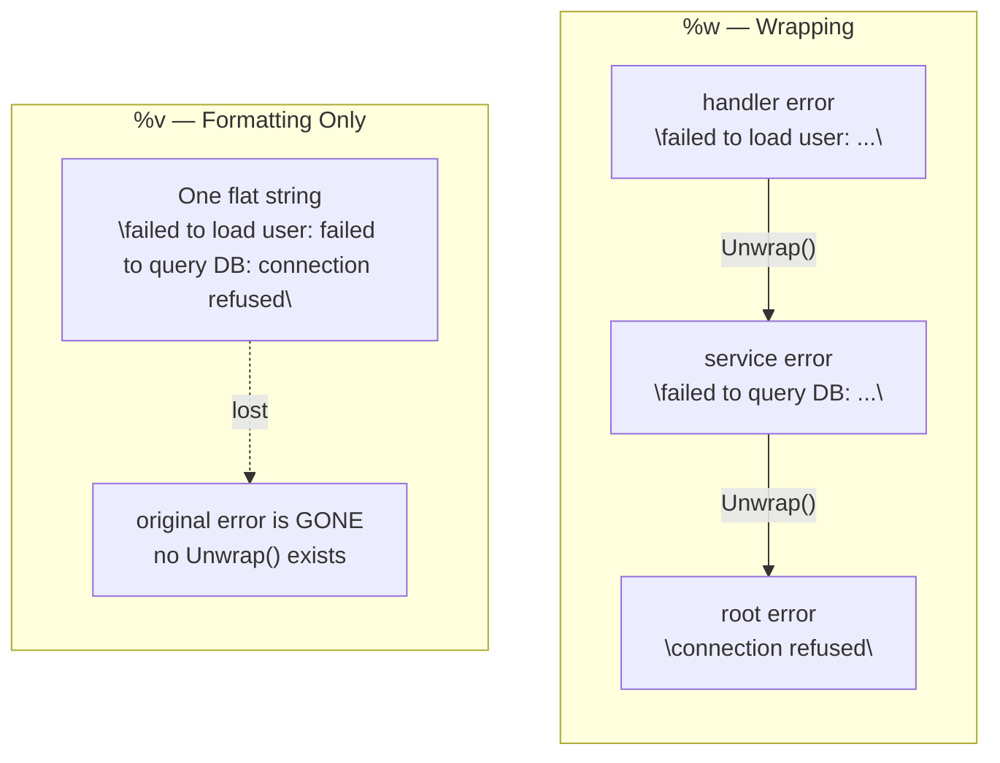
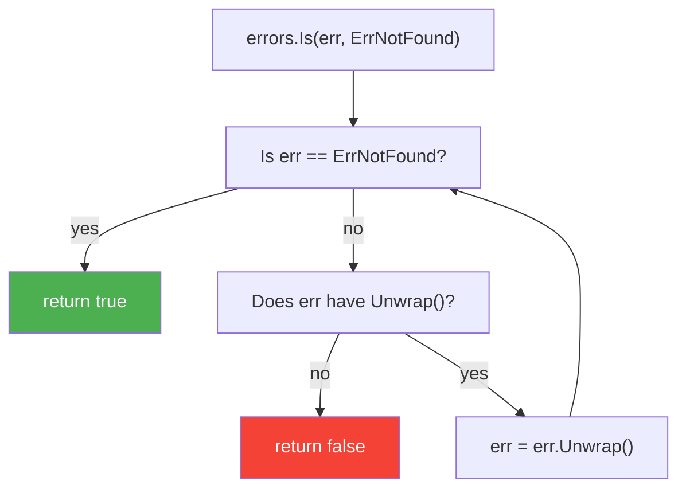
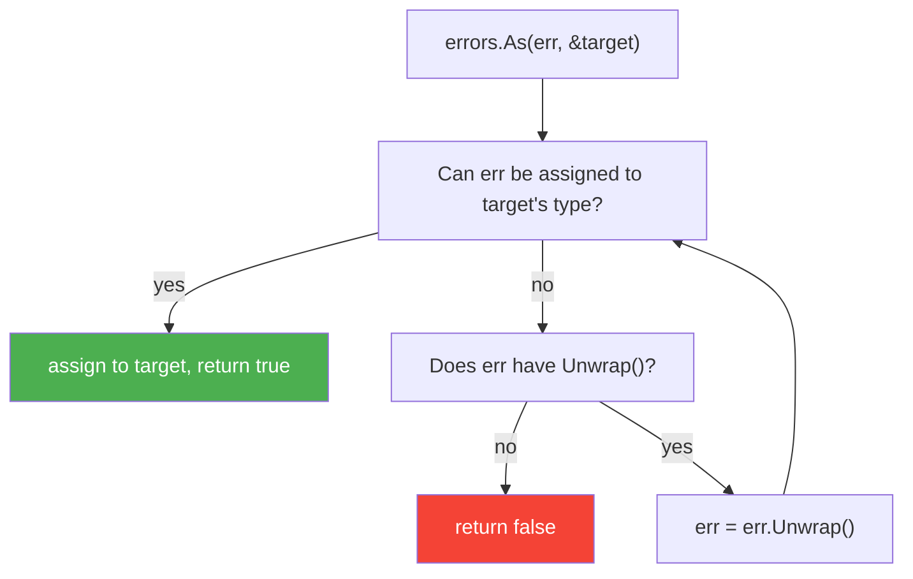
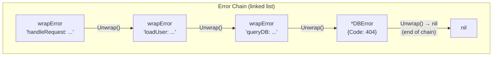
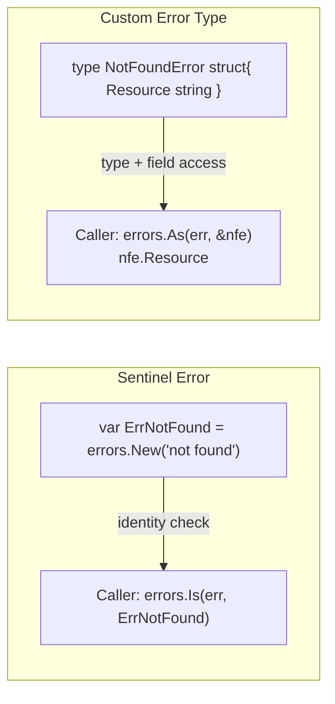
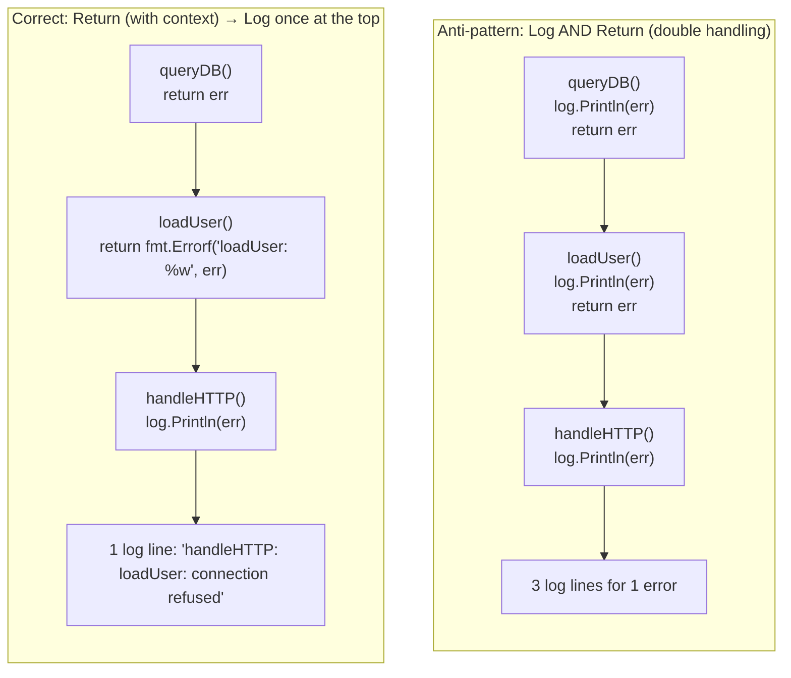

# Phase 3 — Error Handling

Topics in this phase:
- 1 on **Error formatting** (`%w` vs `%v`)
- 1 on **Error inspection** (`errors.Is` vs `errors.As`)
- 1 on **Error wrapping chain** (how `Unwrap()` traversal works)
- 1 on **Error design** (sentinel errors vs custom types)
- 1 on **Error handling idiom** (handle once — log or return, not both)

---

## Topic 1 / 5 — `fmt.Errorf` with `%w` vs `%v`

### 1. Motivation — "Why does this exist?"

Imagine your program has this call chain:

```
HTTP handler → service layer → database layer
```

A database connection times out. You get a raw error: `connection refused`.
That error alone is useless to the caller — it has no context. Which operation failed? Which service tried to connect?

So every layer adds context:

```
"failed to load user: failed to query DB: connection refused"
```

That's great for **humans reading a log**. But what if the HTTP handler wants to
**programmatically check** whether the root cause was a network timeout? It needs
to unwrap all those layers and inspect the original error.

That's the problem. You need two things at once:
1. A human-readable message with added context at each layer.
2. The original error still accessible for programmatic inspection.

`%w` gives you both. `%v` only gives you number 1.

---

### 2. Building Blocks — "What are the pieces?"

| Verb | What it does | Chain preserved? |
|------|-------------|------------------|
| `%v` | Formats the error as a string using its `.Error()` method | **No** — the original error is gone |
| `%w` | Wraps the error: formats as string AND stores the original inside a `wrapError` struct | **Yes** — the original error is accessible via `Unwrap()` |

- **Error chain**: a linked list of errors, each one wrapping the previous.
- **`Unwrap()`**: a method that returns the next error in the chain. `%w` causes `fmt.Errorf` to return a value that implements this.
- **`wrapError`**: the internal struct `fmt.Errorf` creates when `%w` is used. Holds the message string and a pointer to the wrapped error.

---

### 3. How It Works — "The mechanics"



*`%w` creates a linked chain. `%v` collapses everything into a flat string — the original error is destroyed.*

Step by step for `%w`:
1. You call `fmt.Errorf("failed to load user: %w", err)`.
2. `fmt.Errorf` detects `%w` and creates a `wrapError{msg: "...", err: err}`.
3. The returned error's `.Error()` method returns the full message string.
4. The returned error's `.Unwrap()` method returns the original `err`.
5. `errors.Is` and `errors.As` can now walk this chain.

For `%v`:
1. You call `fmt.Errorf("failed to load user: %v", err)`.
2. `fmt.Errorf` formats `err.Error()` into the string and is done.
3. No `Unwrap()` method is attached. The original error is gone.

---

### 4. A Concrete Scenario — "Walk me through an example"

```go
package main

import (
    "errors"
    "fmt"
)

var ErrNotFound = errors.New("not found")

func queryDB() error {
    return ErrNotFound // root cause from the database layer
}

func loadUser() error {
    err := queryDB()
    // %w preserves the chain; %v would destroy it
    return fmt.Errorf("loadUser: %w", err)
}

func handleRequest() error {
    err := loadUser()
    return fmt.Errorf("handleRequest: %w", err)
}

func main() {
    err := handleRequest()

    // This works because %w preserved the chain all the way up
    fmt.Println(errors.Is(err, ErrNotFound)) // true

    // The human-readable message still has all the context
    fmt.Println(err) // handleRequest: loadUser: not found

    // Now try with %v — break the chain
    flat := fmt.Errorf("handleRequest: %v", loadUser())
    fmt.Println(errors.Is(flat, ErrNotFound)) // false — chain is broken
}
```

---

### 5. Key Insight / Mental Model Summary

**`%w` is a wrapping operation; `%v` is a formatting operation.**
Use `%w` when the caller might need to inspect the error. Use `%v` only when
you are deliberately discarding the chain — for example, when crossing an API
boundary where the caller should not see internal error types.

---

### 6. Common Misconceptions

- **"They produce the same string, so they're the same."** The string output is
  identical. The difference is entirely in what you can do with the error programmatically.
- **"I should always use `%w`."** Not always. If you don't want callers to depend
  on your internal error types leaking through `errors.Is`, use `%v` deliberately.
- **"You can use `%w` multiple times in one `fmt.Errorf` call."** As of Go 1.20,
  you can wrap multiple errors with `%w %w`, which creates an error with multiple
  parents. Before 1.20, only one `%w` was allowed.

---

Topic 1 / 5 done. Say **next** to continue, or ask a question.

---

## Topic 2 / 5 — `errors.Is` vs `errors.As`: When to Use Each

### 1. Motivation — "Why does this exist?"

You have an error returned from deep in the call stack, wrapped multiple times.
You need to answer one of two questions:

1. **Is this specific error in the chain?** (identity check)
   - "Did this fail because of a `not found` sentinel?"
2. **Is there an error of this type in the chain?** (type check, with data extraction)
   - "Did this fail because of an `*os.PathError`, and if so, which path was it?"

These are fundamentally different needs. `errors.Is` answers question 1.
`errors.As` answers question 2 — and it also gives you the actual error value so
you can read its fields.

---

### 2. Building Blocks — "What are the pieces?"

| Function | Asks | Returns |
|----------|------|---------|
| `errors.Is(err, target)` | Is `target` anywhere in the chain? | `bool` |
| `errors.As(err, &target)` | Is there a value of `target`'s type anywhere in the chain? | `bool`, and populates `target` |

- **Identity check**: comparing error values directly (pointer equality or custom `Is()` method).
- **Type check**: checking whether an error can be assigned to a specific type.
- **Unwrap chain**: both functions walk the chain automatically by calling `Unwrap()`.

---

### 3. How It Works — "The mechanics"



*`errors.Is` walks the chain link by link, checking identity at each step.*



*`errors.As` walks the chain checking if each error is assignable to the target type, and assigns it when found.*

---

### 4. A Concrete Scenario — "Walk me through an example"

```go
package main

import (
    "errors"
    "fmt"
    "os"
)

func readConfig() error {
    // os.Open returns an *os.PathError if the file doesn't exist
    _, err := os.Open("/nonexistent/config.yaml")
    return fmt.Errorf("readConfig: %w", err)
}

func main() {
    err := readConfig()

    // --- errors.Is: identity check ---
    // Check if the root cause is "file not found" specifically
    if errors.Is(err, os.ErrNotExist) {
        fmt.Println("config file does not exist") // this prints
    }

    // --- errors.As: type check + data extraction ---
    var pathErr *os.PathError
    if errors.As(err, &pathErr) {
        // pathErr is now populated with the actual *os.PathError value
        // We can read its fields
        fmt.Println("failed on path:", pathErr.Path) // /nonexistent/config.yaml
        fmt.Println("operation was:", pathErr.Op)    // open
    }
}
```

When to use which:
- Use `errors.Is` when you have a **specific sentinel value** to match (`io.EOF`, `sql.ErrNoRows`, your own `ErrNotFound`).
- Use `errors.As` when you have a **custom error type** with fields you need to inspect (`*os.PathError`, `*json.SyntaxError`, your own `*ValidationError`).

---

### 5. Key Insight / Mental Model Summary

**`errors.Is` = "is this the error I'm looking for?"**
**`errors.As` = "give me the error struct so I can read it."**

One is a yes/no identity check. The other is a cast that gives you the full value.

---

### 6. Common Misconceptions

- **"I can use `err == ErrNotFound` directly."** This breaks the moment the error
  is wrapped. `errors.Is` handles unwrapping; `==` does not.
- **"I can use a type assertion `err.(*os.PathError)` instead of `errors.As`."**
  A type assertion only checks the outermost error. `errors.As` walks the whole chain.
- **"`errors.As` needs a pointer to an interface."** It needs a pointer to the
  type you want. If you want `*os.PathError`, pass `&pathErr` where `pathErr` is `*os.PathError`.

---

Topic 2 / 5 done. Say **next** to continue, or ask a question.

---

## Topic 3 / 5 — Error Wrapping Chain: How `errors.Is` Traverses `Unwrap()` Recursively

### 1. Motivation — "Why does this exist?"

You know that `%w` creates a chain and `errors.Is` walks it. But what exactly
**is** that chain? How does Go store it? What happens when you call `errors.Is`
on a deeply nested error?

This topic is about the **plumbing underneath** — the `Unwrap()` interface,
how `errors.Is` uses it, and what happens when you implement your own error
types that need to participate in the chain.

---

### 2. Building Blocks — "What are the pieces?"

| Piece | What it is |
|-------|-----------|
| `error` interface | Just one method: `Error() string` |
| `Unwrap() error` | An **optional** second method. If your error type implements it, it becomes part of the chain |
| `wrapError` | The private struct `fmt.Errorf` creates when `%w` is used. Has both `Error()` and `Unwrap()` |
| `Unwrap() []error` | Go 1.20+ variant — returns **multiple** wrapped errors (for `errors.Join`) |

---

### 3. How It Works — "The mechanics"



*Each `%w` call adds one link. The chain ends when `Unwrap()` returns nil.*

`errors.Is` pseudocode:
```
func Is(err, target error) bool {
    for {
        if err == target { return true }      // 1. identity check
        if x, ok := err.(interface{ Is(error) bool }); ok {  // 2. custom Is() method
            if x.Is(target) { return true }
        }
        err = Unwrap(err)                     // 3. go one level deeper
        if err == nil { return false }        // 4. end of chain, not found
    }
}
```

Three checks happen at each node:
1. Pointer/value equality check (`==`).
2. Custom `Is(error) bool` method — lets you define what "equal" means for your type.
3. Move to the next link by calling `Unwrap()`.

---

### 4. A Concrete Scenario — "Walk me through an example"

A custom error type that participates correctly in the chain:

```go
package main

import (
    "errors"
    "fmt"
)

// Custom error type with a code field
type AppError struct {
    Code    int
    Message string
    Wrapped error // we manually hold the wrapped error
}

func (e *AppError) Error() string {
    if e.Wrapped != nil {
        return fmt.Sprintf("AppError(%d): %s: %v", e.Code, e.Message, e.Wrapped)
    }
    return fmt.Sprintf("AppError(%d): %s", e.Code, e.Message)
}

// Unwrap() makes AppError a participant in the error chain
func (e *AppError) Unwrap() error {
    return e.Wrapped
}

var ErrDatabase = errors.New("database failure")

func queryDB() error {
    // Root: a sentinel error wrapped in our custom type
    return &AppError{Code: 500, Message: "query failed", Wrapped: ErrDatabase}
}

func handleRequest() error {
    // Add another layer of wrapping
    return fmt.Errorf("handleRequest: %w", queryDB())
}

func main() {
    err := handleRequest()

    // Chain: handleRequest wrapError → *AppError → ErrDatabase

    // errors.Is walks: wrapError → *AppError → ErrDatabase ← found!
    fmt.Println(errors.Is(err, ErrDatabase)) // true

    // errors.As walks: wrapError (not *AppError) → *AppError ← found! assigns it
    var appErr *AppError
    if errors.As(err, &appErr) {
        fmt.Println("code:", appErr.Code) // 500
    }
}
```

Without `Unwrap()` on `AppError`, `errors.Is(err, ErrDatabase)` would return `false` —
the chain would stop at `*AppError` because it has no door to the next link.

---

### 5. Key Insight / Mental Model Summary

**`Unwrap()` is the door between links in the chain.** If your custom error type
wraps another error, you must implement `Unwrap() error` — otherwise the chain
is severed at your type and nothing below it is reachable by `errors.Is` or `errors.As`.

---

### 6. Common Misconceptions

- **"The chain is built automatically."** Only if you use `%w`. If you manually
  store an error in a struct field (like `Wrapped error` above), *you* are
  responsible for implementing `Unwrap()` to expose it.
- **"Implementing `Is()` on my type is required."** It's optional. The default
  comparison is pointer equality. Only implement `Is()` if you need custom equality
  (e.g., two errors are "equal" if their codes match, regardless of instance).
- **"`errors.Is` is expensive."** It's a tight loop of pointer comparisons and
  interface checks — negligible cost for chains of realistic depth (3-10 links).

---

Topic 3 / 5 done. Say **next** to continue, or ask a question.

---

## Topic 4 / 5 — Sentinel Errors vs Custom Error Types: Trade-offs

### 1. Motivation — "Why does this exist?"

When you need to return an error from a function, you have a choice. You could:

**Option A**: Return a package-level variable with a fixed message.
```go
var ErrNotFound = errors.New("not found")
```

**Option B**: Return a struct that carries context about what specifically failed.
```go
type NotFoundError struct{ Resource string; ID int }
```

These are not just style choices. They have real consequences for API stability,
testability, and how much information callers can extract from the error.
Picking the wrong one creates pain at scale.

---

### 2. Building Blocks — "What are the pieces?"

| Term | What it is |
|------|-----------|
| **Sentinel error** | A package-level `var` of type `error`. Its identity (the pointer) is what callers check against. Created with `errors.New(...)`. |
| **Custom error type** | A `struct` (or other type) that implements the `error` interface. Callers use `errors.As` to extract the value and read its fields. |
| **Public sentinel** | An exported `var Err... = errors.New(...)`. Part of the package's public API. Callers can use `errors.Is` against it. |
| **Opaque error** | An error whose type is unexported. Callers cannot assert its type. Forces them to treat the error as a black box. |

---

### 3. How It Works — "The mechanics"



**When to use a sentinel error:**
- When the caller only needs to know *that* a specific condition occurred, not *details* about it.
- When the API is stable and the error message will never need additional fields.
- Examples: `io.EOF`, `sql.ErrNoRows`, `http.ErrNoCookie`.

**When to use a custom error type:**
- When the caller needs to extract structured data from the error.
- When different instances of the same error class carry different information.
- Examples: `*os.PathError` (which path), `*json.SyntaxError` (which offset), your own `*ValidationError` (which field, which rule).

**The coupling trade-off:**

Exporting a sentinel error or a custom error type is an **API contract**.
If callers depend on `errors.Is(err, ErrXxx)` or `errors.As(err, &xxx)`, you
can never remove or rename that type without a breaking change. Keep error types
unexported if callers don't need to inspect them.

---

### 4. A Concrete Scenario — "Walk me through an example"

```go
package store

import (
    "errors"
    "fmt"
)

// --- Sentinel: caller only needs to know "not found" ---
var ErrNotFound = errors.New("not found")

// --- Custom type: caller needs to know WHICH resource and WHICH ID ---
type NotFoundError struct {
    Resource string
    ID       int
}

func (e *NotFoundError) Error() string {
    return fmt.Sprintf("%s with id %d not found", e.Resource, e.ID)
}

func GetUser(id int) error {
    // Use the sentinel if the caller doesn't need to know which resource
    return fmt.Errorf("GetUser: %w", ErrNotFound)
}

func GetOrder(id int) error {
    // Use the custom type when the caller might need to log or display the resource/id
    return fmt.Errorf("GetOrder: %w", &NotFoundError{Resource: "order", ID: id})
}
```

Caller:
```go
err := store.GetOrder(42)

// With sentinel: only yes/no
fmt.Println(errors.Is(err, store.ErrNotFound)) // if GetOrder wrapped ErrNotFound

// With custom type: structured data
var nfe *store.NotFoundError
if errors.As(err, &nfe) {
    fmt.Printf("Could not find %s #%d\n", nfe.Resource, nfe.ID)
    // "Could not find order #42"
}
```

---

### 5. Key Insight / Mental Model Summary

**Sentinel errors are for conditions. Custom error types are for data.**
If the answer to "what does the caller do with this error?" is "branch on it,"
use a sentinel. If the answer is "read its fields," use a custom type.

---

### 6. Common Misconceptions

- **"Sentinels are simple so they're always better."** Sentinels are simple but
  they carry zero context. At scale, "not found" without knowing *what* wasn't
  found produces useless logs.
- **"Custom types are always better because they carry more data."** They create
  a tighter coupling between packages. Callers importing your error type for
  `errors.As` are now depending on your internal struct layout.
- **"Using `errors.New` inside a function creates a sentinel."** No — it creates
  a new error instance each time. A sentinel must be a **package-level variable**
  so every call gets the same pointer.

```go
// WRONG — this is NOT a sentinel, it's a new error every call
func getUser() error {
    return errors.New("not found") // different pointer every time
}

// CORRECT — package-level var, same pointer every call
var ErrNotFound = errors.New("not found")
func getUser() error {
    return ErrNotFound
}
```

---

Topic 4 / 5 done. Say **next** to continue, or ask a question.

---

## Topic 5 / 5 — Handle an Error Only Once: Log It or Return It, Not Both

### 1. Motivation — "Why does this exist?"

Picture this call stack:

```
main() → handleHTTP() → loadUser() → queryDB()
```

`queryDB` encounters a connection error. It logs it. Then it returns the error.
`loadUser` receives the error. It logs it again. Then it returns the error.
`handleHTTP` receives it. It logs it again.

Now your log file has **three entries for one event**, each with partial context,
none with the full picture. Someone debugging at 2am has to piece together which
three log lines belong to the same failure.

This is the "double handling" problem. The Go idiom eliminates it with a simple rule:
**every error is either logged or returned — never both at the same layer.**

---

### 2. Building Blocks — "What are the pieces?"

| Action | When to do it | Where |
|--------|---------------|-------|
| **Return the error** | When the caller is in a better position to decide what to do | Every intermediate layer |
| **Log the error** | When you are the final handler — you have full context and nowhere left to return to | The top layer (main, HTTP handler, worker loop) |
| **Wrap with context** | Add information at each layer *before* returning, so the final log entry has the full picture | Every intermediate layer with `%w` |
| **Discard the error** | Deliberately ignore it — must be documented with a comment explaining why | Only when truly harmless |

---

### 3. How It Works — "The mechanics"



*The correct pattern bubbles the error up with context added at each layer, then logs it exactly once at the top with full visibility.*

---

### 4. A Concrete Scenario — "Walk me through an example"

```go
package main

import (
    "errors"
    "fmt"
    "log"
)

var ErrConnectionRefused = errors.New("connection refused")

// queryDB — bottom layer. Just return the error. Don't log it.
// It has no business context here. The caller knows more.
func queryDB(userID int) error {
    return ErrConnectionRefused
}

// loadUser — middle layer. Add context with %w, then return.
// Still don't log — the HTTP handler knows whether this was
// a user-triggered request or a background job.
func loadUser(userID int) error {
    if err := queryDB(userID); err != nil {
        return fmt.Errorf("loadUser(id=%d): %w", userID, err)
    }
    return nil
}

// handleHTTP — top layer. This IS the final handler.
// Now we have full context. Log once and respond.
func handleHTTP(userID int) {
    if err := loadUser(userID); err != nil {
        // ONE log line with the full story
        log.Printf("request failed: %v", err)
        // respond to the caller — don't expose internal details
        fmt.Println("500 internal server error")
        return
    }
    fmt.Println("200 OK")
}

func main() {
    handleHTTP(42)
    // Log output: "request failed: loadUser(id=42): connection refused"
    // One line. Full context. No duplicates.
}
```

**The "discard deliberately" variant:**
```go
// If closing a read-only resource fails, there's nothing we can do.
// Document why the error is intentionally ignored.
_ = rows.Close() // read-only cursor — close failure has no side effects
```

---

### 5. Key Insight / Mental Model Summary

**Errors travel up. Logs travel out. Never do both in the same function.**
Every intermediate layer's job is to add context (with `%w`) and return.
The top-level handler's job is to log and act. If every layer follows this rule,
you always get exactly one log entry per error, with the full call chain embedded in it.

---

### 6. Common Misconceptions

- **"Logging is safe — it doesn't hurt to log extra."** It does. It creates noise
  that makes real issues harder to find. It also reveals implementation details
  (stack depth, internal module names) that should not be visible to log aggregators.
- **"If I return the error without logging, I might lose it."** You will not — as
  long as someone at the top handles it. The only way to lose an error is to
  explicitly discard it (`_ = someFunc()`).
- **"The top layer is always `main`."** No. In an HTTP server, the top layer is
  the request handler. In a worker pool, it's the worker loop. "Top layer" means
  "the layer where you have enough context to make the final decision about this error."
- **"Panicking is an alternative to logging."** Only for truly unrecoverable
  programmer errors (nil dereference, broken invariants). Not for expected runtime
  errors like network failures or missing files.

---

Topic 5 / 5 done. **Phase 3 — Error Handling is complete.**

---

## Phase Summary

| # | Topic | Core Rule |
|---|-------|-----------|
| 1 | `%w` vs `%v` | `%w` wraps (chain preserved); `%v` formats (chain destroyed) |
| 2 | `errors.Is` vs `errors.As` | `Is` = identity check; `As` = type check + data extraction |
| 3 | Error wrapping chain | `Unwrap()` is the door between links; implement it on custom types |
| 4 | Sentinel vs custom type | Conditions → sentinel; structured data → custom type |
| 5 | Handle once | Return with context at every layer; log once at the top |
