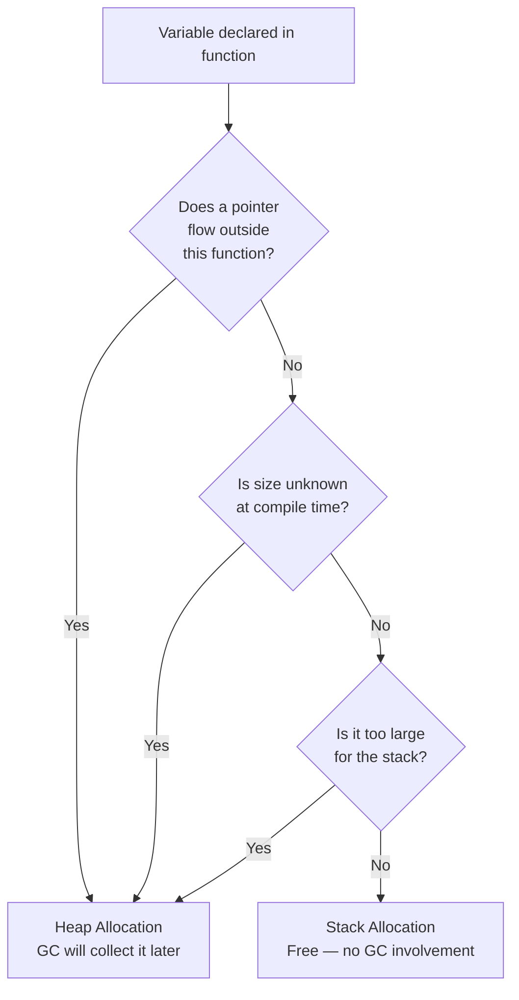
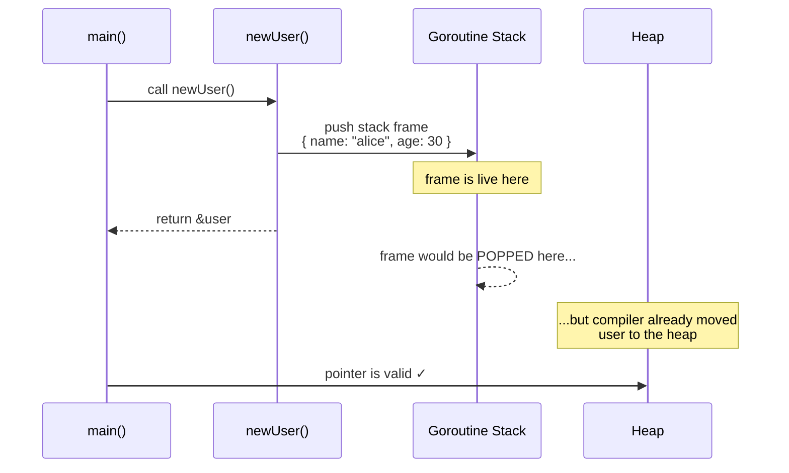
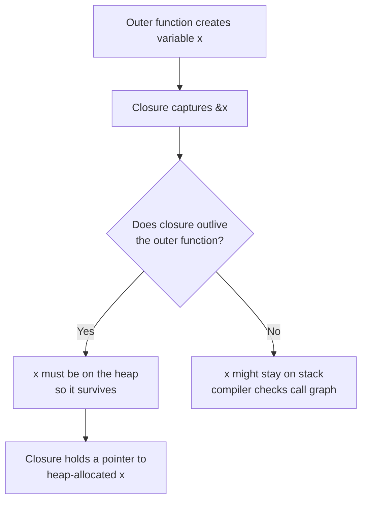

# Phase 6 — Escape Analysis · 5 Topics

> **Why this phase exists here:** You just finished the GMP Scheduler (Phase 5).
> You learned that goroutines have tiny stacks (~2KB) that grow dynamically.
> A natural question follows — *where exactly do Go variables live, and who decides?*
> That is exactly what escape analysis answers. It also sets up everything you need
> for the Garbage Collector (Phase 8) — because the GC only manages heap memory.
> No heap allocation → no GC work at all.

---

## Topic 1 / 5 — Stack vs Heap: How the Compiler Decides

### 1. Motivation — "Why does this exist?"

In **C**, the programmer decides where a variable lives:

- `int x = 5;` → stack (local variable, gone when function returns)
- `malloc(sizeof(int))` → heap (you manage its lifetime manually)

In C, if you return a pointer to a local variable, you get a **dangling pointer** —
a bug that corrupts memory silently or crashes the program.

Go takes a different approach. The compiler makes the decision **automatically**
through a technique called **escape analysis** — a static analysis pass that runs
at compile time. The compiler asks one question:

> *"Can this variable's lifetime be guaranteed to fit inside the current function's
> stack frame? Or does it need to outlive this function?"*

If the variable can stay inside the function → **stack**.  
If it might outlive the function (or the compiler is not sure) → **heap**.

This matters for performance. Stack allocation is essentially free — it is just
a pointer increment. Heap allocation goes through the allocator and eventually
through the garbage collector.

---

### 2. Building Blocks — "What are the pieces?"

| Term | What It Is | Analogy |
|---|---|---|
| **Stack** | Per-goroutine memory. LIFO. Variables are pushed/popped as functions call and return. | A stack of plates — you always add and remove from the top |
| **Heap** | Shared process memory. Variables live here until the GC reclaims them. | A warehouse — items go in, GC periodically cleans up what's no longer referenced |
| **Escape analysis** | A compiler pass that determines which variables must go to the heap | The compiler is a customs officer deciding what goes in your carry-on vs checked luggage |
| **Escaping** | When a variable is determined to need heap allocation | The variable "escapes" the function — it has to live somewhere more permanent |

---

### 3. How It Works — "The mechanics"

The compiler walks the code's data flow graph. For each variable it asks:

1. Does a pointer to this variable flow **outside** the current function?
   (e.g., returned, stored in a global, passed to a goroutine, put in an interface)
2. Is the variable **too large** for the stack? (very large arrays, structs)
3. Is the size **unknown at compile time**? (e.g., `make([]int, n)` where `n` is a runtime value)

If **any** of these is true → the variable **escapes to the heap**.



*The compiler's escape analysis decision tree. Only variables that stay entirely
within a function's lifetime and have a known, reasonable size live on the stack.*

---

### 4. A Concrete Scenario — "Walk me through an example"

Consider two functions:

```go
package main

// Case A: variable stays on the stack
func addOnStack() int {
    x := 42      // compiler sees: x never leaves this function
    return x     // value is copied out — x itself stays here
}

// Case B: variable escapes to the heap
func escapeToHeap() *int {
    x := 42      // compiler sees: a pointer to x is returned
    return &x    // &x must survive after this function returns → heap
}
```

In `addOnStack`, `x` is used locally and its **value** is returned. The variable
itself doesn't need to survive the function call. Stack allocation.

In `escapeToHeap`, a **pointer** to `x` is returned. Once the function returns,
its stack frame is gone — but the pointer is still live. The compiler solves this
by silently moving `x` to the heap before returning `&x`. Safe, but not free.

---

### 5. Key Insight

> **The compiler, not the programmer, chooses stack vs heap in Go.**
> The rule is simple: if a variable can be proven to die with its function, it
> lives on the stack. If it can outlive the function in any way, it moves to the
> heap and the GC takes care of it.

---

### 6. Common Misconceptions

- ❌ "Local variables always live on the stack in Go." — **False.** A local variable
  escapes the moment you take its address and let that address outlive the function.
- ❌ "Heap allocation is always bad." — **False.** It is slower and creates GC work,
  but it is often necessary. The goal is to avoid *unnecessary* heap allocations on hot paths.
- ❌ "The programmer controls this." — **Partially false.** You can influence it with
  code structure, but you cannot override the compiler's analysis directly.

---
---

## Topic 2 / 5 — How to Verify: `go build -gcflags="-m"`

### 1. Motivation — "Why does this exist?"

Escape analysis is invisible by default. The compiler silently moves variables to
the heap and your program works correctly. But *performance-sensitive* code demands
transparency — if a hot path is allocating when it shouldn't be, you need a way to
see it. The `-gcflags="-m"` flag exposes the compiler's escape decisions.

---

### 2. How It Works — "The flag and its output"

```bash
go build -gcflags="-m" ./...
# or for a single file
go build -gcflags="-m" main.go
# for even more detail (shows the full data-flow reason)
go build -gcflags="-m -m" ./...
```

The output is printed to **stderr** and looks like this:

```
./main.go:12:2: moved to heap: x
./main.go:18:14: &y escapes to heap
./main.go:25:6: sum does not escape
./main.go:31:16: leaking param: s
```

**Reading the output:**

| Message | Meaning |
|---|---|
| `moved to heap: x` | Variable `x` was declared on the stack but must live on the heap |
| `&y escapes to heap` | Taking the address of `y` causes it to escape |
| `does not escape` | Variable stays on the stack — no allocation |
| `leaking param: s` | Parameter `s` has its address stored somewhere that outlives the call |
| `inlining call to f` | The compiler inlined function `f` — inlining can *eliminate* escapes |

---

### 3. A Concrete Scenario

```go
package main

import "fmt"

type Point struct {
    X, Y int
}

func newPointHeap() *Point {
    p := Point{1, 2} // does p escape?
    return &p        // yes — pointer returned
}

func newPointStack() Point {
    p := Point{3, 4} // does p escape?
    return p         // value copy returned — p stays on stack
}

func main() {
    h := newPointHeap()
    s := newPointStack()
    fmt.Println(h, s)
}
```

Running `go build -gcflags="-m" main.go` outputs:

```
./main.go:9:2:  moved to heap: p        ← newPointHeap
./main.go:14:2: p does not escape       ← newPointStack
```

Exactly what the model predicts. `newPointHeap` causes one allocation per call.
`newPointStack` causes zero.

---

### 4. Key Insight

> **`-gcflags="-m"` is the ground truth for allocation decisions.**
> Profiling tools like `pprof` tell you *how many* allocations happened.
> This flag tells you *why* they happened — at the source line level.
> Use it when optimising hot paths to prove your changes actually reduced escapes.

---
---

## Topic 3 / 5 — Returning a Pointer to a Local Variable

### 1. Motivation — "Why does this exist?"

In C, this is undefined behaviour — a classic bug that causes random crashes
months after the code ships:

```c
int* broken() {
    int x = 42;
    return &x;  // stack frame gone when function returns — DANGLING POINTER
}
```

Go's escape analysis exists *partly* to make this safe. Go lets you write the
same pattern, compiles it correctly, and your code works. The cost is a heap
allocation. The guarantee is safety.

Understanding *why* this always escapes is the mental model that unlocks all the
other escape scenarios.

---

### 2. The Mechanics — "Why does returning a pointer force heap allocation?"

Every function call in Go pushes a new **stack frame** — a slice of the goroutine's
stack holding the function's local variables. When the function returns, that frame
is popped. The memory is no longer valid.



*When a pointer to a local variable escapes the function, the compiler silently
allocates it on the heap before the function returns.*

---

### 3. A Concrete Scenario

```go
package main

import "fmt"

type User struct {
    Name string
    Age  int
}

// Every call allocates a User on the heap.
func newUser(name string, age int) *User {
    u := User{Name: name, Age: age}
    // The compiler sees: &u escapes to the caller
    // So it places u on the heap, not the stack
    return &u
}

// No heap allocation — returns a copy.
func newUserValue(name string, age int) User {
    u := User{Name: name, Age: age}
    return u // value copy — u can stay on the stack
}

func main() {
    u1 := newUser("alice", 30)       // 1 heap allocation
    u2 := newUserValue("bob", 25)    // 0 heap allocations
    fmt.Println(u1, u2)
}
```

`go build -gcflags="-m"`:
```
./main.go:13:2: moved to heap: u   ← newUser
./main.go:20:2: u does not escape  ← newUserValue
```

---

### 4. Key Insight

> **A pointer returned from a function is a promise that the pointed-to value
> will outlive the function's stack frame.** The compiler honours that promise
> by allocating the value on the heap. There is no way around this — it is not
> a Go limitation but a fundamental consequence of what "returning a pointer" means.

---

### 5. Common Misconceptions

- ❌ "This pattern is bad — I should always return values." — **Not always.**
  For large structs, returning a pointer avoids copying. The allocation cost may
  be less than the copy cost. Profile before deciding.
- ❌ "The pointer is dangling, like in C." — **False.** Go allocates `u` on the
  heap first. The pointer is valid and the GC will keep it alive as long as the
  pointer is reachable.

---
---

## Topic 4 / 5 — Closures and Escape

### 1. Motivation — "Why do closures cause escapes?"

A **closure** is a function that *closes over* variables from its surrounding scope.
It "remembers" the environment where it was created.

The problem: the closure can outlive the function that created those variables.
If the closure runs after the outer function has returned, the variables it captured
must still be accessible. Stack memory is gone after the function returns — so those
captured variables *must* live on the heap.

---

### 2. Building Blocks

| Term | Plain English |
|---|---|
| **Closure** | A function + the variables it captured from the enclosing scope |
| **Captured variable** | A variable from an outer function that a closure references |
| **Closed-over variable** | Same as captured — the closure "closes around" it |
| **Capture by reference** | Go closures always capture the *address* of the variable, not a copy |

Go closures always capture **by reference** (a pointer to the variable).
This is why closures and mutations interact — the closure sees the *current*
value of the variable when it runs, not the value at the time it was created.

---

### 3. How It Works — "The mechanics"



*The closure forces x to escape because it holds a pointer to x and may run
after the outer function's stack frame is gone.*

---

### 4. A Concrete Scenario

```go
package main

import "fmt"

// counter returns a closure that increments a counter.
// 'count' must escape to the heap — the closure will outlive makeCounter.
func makeCounter() func() int {
    count := 0  // count is captured by the closure below
    return func() int {
        count++ // closure holds a pointer to count — count lives on heap
        return count
    }
}

func main() {
    c1 := makeCounter()
    c2 := makeCounter() // independent counter — its own 'count' on heap

    fmt.Println(c1(), c1(), c1()) // 1 2 3
    fmt.Println(c2(), c2())       // 1 2
}
```

`go build -gcflags="-m"`:
```
./main.go:9:2:  moved to heap: count
./main.go:10:9: func literal escapes to heap
```

Two separate heap allocations per `makeCounter()` call:
1. The `count` variable itself
2. The closure's function value (it is stored on the heap too)

---

### 5. The Famous Goroutine-in-Loop Gotcha

This topic directly causes one of the most common Go bugs:

```go
// BUG: all goroutines print the same final value of i
for i := 0; i < 3; i++ {
    go func() {
        fmt.Println(i) // captures &i — reads i when goroutine runs, not when it was created
    }()
}
// likely prints: 3 3 3 (or similar — all see the final i)

// FIX: pass i as a parameter — creates a new variable each iteration
for i := 0; i < 3; i++ {
    i := i // shadow i — creates a new variable, each closure gets its own copy
    go func() {
        fmt.Println(i)
    }()
}
// prints: 0 1 2 (in some order)
```

The root cause is exactly this topic: the closure captures **a pointer to `i`**,
not a copy of its value. When the goroutines run (potentially after the loop finishes),
they all read the same `i`.

---

### 6. Key Insight

> **A closure is a snapshot of pointers, not values.** Every variable a closure
> references must outlive the closure itself. The compiler guarantees this by moving
> those variables to the heap. The side effect: goroutines that capture loop variables
> share the *same* variable — a famous source of bugs.

---
---

## Topic 5 / 5 — Interface and Escape

### 1. Motivation — "Why does putting a value in an interface cause a heap allocation?"

You already know (Phase 2, Topic 1) that an interface value is a **two-word struct**:

```
interface{} = [ type pointer | data pointer/value ]
```

The data word holds either the actual value (if it fits in one word — pointer-sized
or smaller) or a **pointer to the value**. When the compiler stores a value through
an interface and it needs a pointer, the original value must have a stable address —
which means it must be on the **heap**.

This is called **interface boxing** and it is a hidden source of allocations that
surprises many developers.

---

### 2. Building Blocks

| Term | Plain English |
|---|---|
| **Interface boxing** | The act of wrapping a concrete value inside an interface value |
| **Unboxing / type assertion** | Extracting the concrete value back out with `.(T)` |
| **Scalar / pointer-sized value** | An `int`, `bool`, pointer — fits in one machine word |
| **Non-scalar value** | A struct, string, slice, etc. — needs a pointer in the interface |

---

### 3. How It Works — "The mechanics"

```mermaid
flowchart TD
    A[Store value v into interface{}] --> B{Does v fit in\none pointer-sized word?}
    B -- "Maybe\n(small scalar)" --> C[Compiler checks\nif it can avoid allocation]
    B -- No --> D[v must be copied to heap\nInterface data word = &v]
    C -- "Cannot avoid" --> D
    C -- "Can avoid" --> E[Value stored directly\nin interface data word\nNo heap allocation]
    D --> F[Interface = type ptr + heap ptr]
    E --> G[Interface = type ptr + inline value]
```

*Whether a value escapes when stored in an interface depends on its size and
how the compiler can prove the value's lifetime.*

---

### 4. A Concrete Scenario

```go
package main

import "fmt"

type Point struct {
    X, Y float64  // 16 bytes — does not fit in one word
}

func storeInInterface(p Point) {
    var i interface{} = p  // p must be copied to heap so interface can hold a pointer to it
    fmt.Println(i)
}

func passThroughInterface(n int) {
    var i interface{} = n  // int is pointer-sized — may avoid allocation
    fmt.Println(i)
}

// The most common real-world case: fmt.Println takes ...interface{}
func main() {
    p := Point{1.0, 2.0}
    storeInInterface(p) // allocation happens here

    n := 42
    passThroughInterface(n) // may or may not allocate depending on compiler
}
```

`go build -gcflags="-m"`:
```
./main.go:11:6:  p escapes to heap
./main.go:16:18: n escapes to heap   ← fmt.Println forces this
```

Note the second case: even though `int` is pointer-sized, `fmt.Println`'s
`...interface{}` variadic forces the argument into an interface slice — which
causes an allocation. This is why `fmt.Println` in hot paths is a problem.

---

### 5. The Real-World Pattern This Explains

```go
// This pattern causes allocations on EVERY call in a hot path:
func (s *Server) handleRequest(w http.ResponseWriter, r *http.Request) {
    id := r.URL.Query().Get("id")
    // Every log call boxes id (a string) into interface{}
    log.Printf("handling request for id: %s", id)
    //                                       ^^^
    //                                       string → interface{} → heap allocation
}

// In truly hot paths, use a structured logger that avoids boxing:
// (e.g. zerolog, zap) — they accept typed fields, not interface{}
logger.Info().Str("id", id).Msg("handling request")
// No boxing, no allocation
```

---

### 6. Key Insight

> **Every time a non-trivial value is stored in an `interface{}` (or `any`), there
> is a potential heap allocation.** This is why high-performance Go code avoids
> `interface{}` in hot paths, and why structured loggers (zerolog, zap) exist —
> they eliminate the boxing that `fmt.Printf` style logging forces.

---

### 7. Common Misconceptions

- ❌ "Only large structs escape when boxed." — **False.** Even an `int` can escape
  when passed to a function that accepts `interface{}`, because the compiler cannot
  always prove it won't be stored somewhere long-lived.
- ❌ "Type assertions are expensive because they unbox from the heap." — **Partially
  true.** The assertion itself is a single pointer comparison. The *allocation* that
  happened when boxing is the expensive part — the assertion just reads the type word.
- ❌ "Using `any` instead of `interface{}` changes allocation behaviour." — **False.**
  `any` is just an alias for `interface{}` since Go 1.18. Identical runtime behaviour.

---

## Phase 6 — Summary

| # | Topic | Core Rule |
|---|---|---|
| 1 | Stack vs heap | Compiler decides: if a variable outlives its function, it goes to heap |
| 2 | `-gcflags="-m"` | The only reliable way to see escape decisions at source-line level |
| 3 | Return `*local` | A pointer returned from a function always causes a heap allocation |
| 4 | Closures | Captured variables always escape because the closure may outlive the outer function |
| 5 | Interface boxing | Storing a non-trivial value in `interface{}` often allocates on the heap |

**The connecting thread across all five topics:**

> A variable escapes to the heap whenever its **address** needs to remain valid
> longer than the function's stack frame. Returning a pointer, capturing in a
> closure, and storing in an interface are all just different ways to let an address
> "leak out" of its original scope — and the compiler handles all three consistently.

---

*Say **next** to start Phase 7 — Go Memory Model (5 topics), or ask any question to go deeper on a topic above.*
