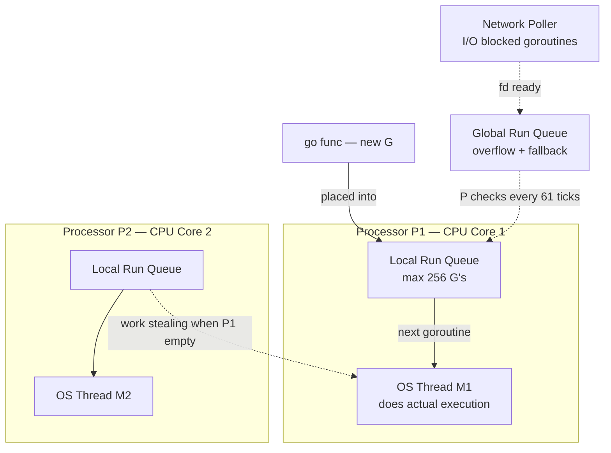
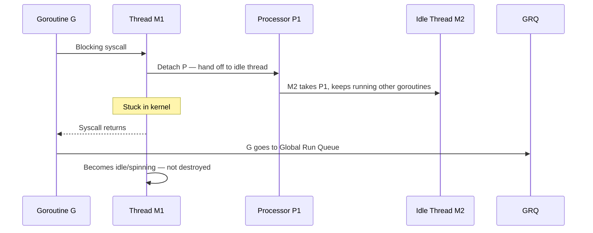

# Go Runtime Scheduler — GMP Model

## The Problem in One Line
OS threads are expensive (~1MB stack, slow context switch). Go needs to run **millions of goroutines** cheaply across a handful of CPU cores.

---

## The Three Pieces

| Letter | Name | What it is |
|---|---|---|
| **G** | Goroutine | Your concurrent task. Starts at ~2KB stack. |
| **M** | Machine (OS Thread) | The actual executor. Managed by the OS kernel. |
| **P** | Logical Processor | A scheduler context. Holds a local run queue. Fixed count = CPU cores. |

> One P per CPU core. One M per active P. Millions of G distributed across all P's.

---

## The Architecture

### The Analogy First

Think of a restaurant kitchen:

- **G (Goroutine)** = a food order — the actual task to be done
- **P (Processor)** = a chef's station — holds a list of pending orders and coordinates what gets cooked next
- **M (OS Thread)** = the chef — does the actual cooking, must be standing at a station to work

A chef (M) must stand at a station (P) to cook. A station holds the order queue (LRQ). Orders (G) come in and sit at a station's queue. If a station's queue is empty, the chef walks over and steals orders from a busy station.

---

### Why Does P Exist at All?

You might ask: why not just attach the run queue directly to M?

Because the number of M's (threads) can fluctuate — new threads spin up during syscalls, old ones go idle. If the queue lived inside M, you'd have to scan every thread (including idle ones doing nothing) during work stealing and GC. That's wasted scanning.

**P is fixed in number** (defaults to number of CPU cores via `GOMAXPROCS`). So work stealing only ever scans a small, known set of queues — not a ballooning list of threads.

```go
runtime.GOMAXPROCS(4)  // 4 P's → up to 4 goroutines running truly in parallel
```

> P is the stable, fixed anchor. M is the flexible, dynamic worker. G is the work.

---

### The Structure



---

### The Normal (Happy) Path — No Blocking

This is what happens when a goroutine runs cleanly from start to finish:

```
1. You write:  go doWork()
2. Runtime creates a G struct (~2KB)
3. G is placed into the current P's Local Run Queue
4. M picks up G from the front of the LRQ
5. M executes G's function
6. G finishes → marked Dead → memory reclaimed
7. M loops back → picks next G from LRQ
```

No kernel involvement. No locks (LRQ is per-P, no contention). This loop runs at near function-call speed.

---

## Goroutine States

```
Runnable → Running → Blocked → Runnable → ... → Dead
```

| State | Meaning |
|---|---|
| **Runnable** | Waiting in a run queue for a thread |
| **Running** | Executing on an M right now |
| **Blocked** | Waiting on channel / syscall / mutex / timer |
| **Dead** | Finished |

---

## Where Do Blocked Goroutines Go?

A blocked goroutine **must not block its OS thread**. Each block reason has its own waiting room:

| Blocked on | Waiting room | Who unblocks it |
|---|---|---|
| Channel | Channel's `sendq` / `recvq` | The other goroutine on the channel |
| Network I/O | Network Poller (epoll/kqueue) | Poller when fd is ready |
| Mutex / Timer | Internal queues | Lock release / timer fire |
| Blocking syscall | Thread M is stuck — special case below | Syscall returns |

---

## The Blocking Syscall — P Handoff

When a goroutine makes a **blocking syscall**, the OS freezes thread M. Go rescues the CPU core:



> M1 spins instead of being destroyed — thread creation is expensive. Spinning is cheap.

---

## Work Stealing

When a P's local queue is empty, it doesn't idle. It steals:

1. Check **Local Run Queue** (no lock)
2. Check **Global Run Queue** (locked, but rare)
3. Check **Network Poller** (I/O ready goroutines)
4. **Steal half** from another P's local queue

No CPU sits idle as long as there is work anywhere.

---

## Fairness Rules

| Rule | Detail |
|---|---|
| Time slice | Goroutine running >10ms is marked preemptible |
| Global queue | Checked every **61st scheduler tick** (prime — avoids sync with other events) |
| Network poller | `sysmon` background thread polls every 10ms |
| Preemption | Since Go 1.14 — goroutines can be preempted even without function calls |

---

## The Key Mental Model

```
go doWork()
    ↓
G created → placed in P's Local Run Queue
    ↓
M picks G from LRQ → executes it
    ↓
G blocks?  → parked in waiting room, M continues with next G
G syscall? → P detached, idle M takes over the queue
G done?    → G destroyed, M loops back for next G
Queue empty? → work steal from other P's
```

> **The scheduler's one job:** keep every P busy, keep every M moving, never waste a CPU core on waiting.
