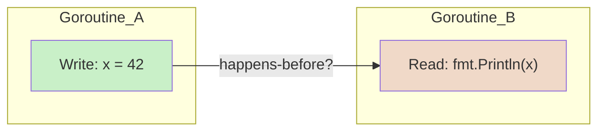
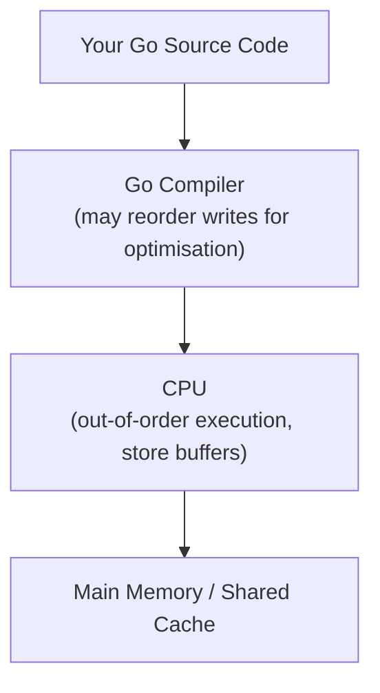
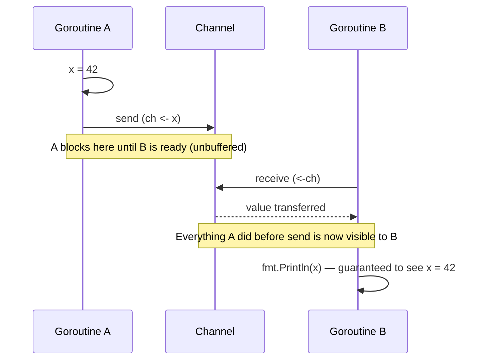
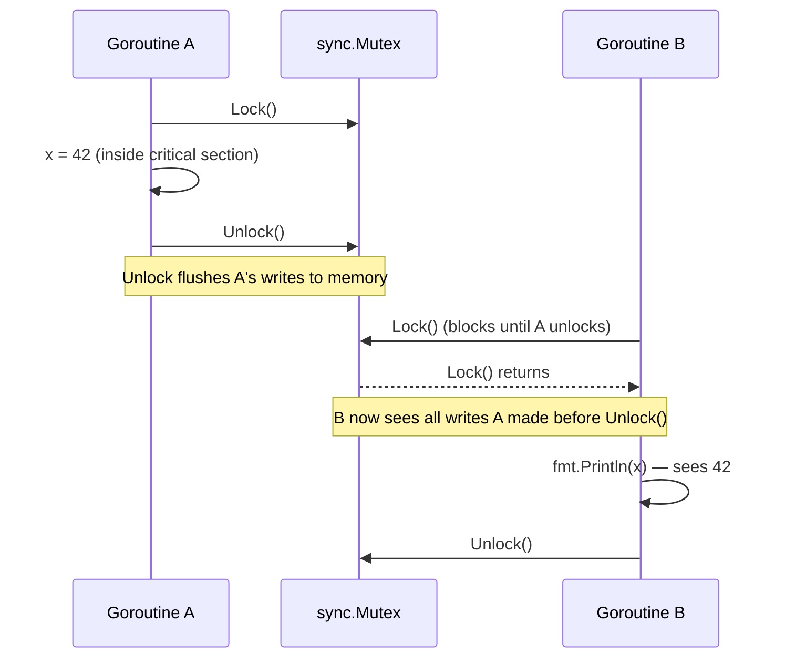
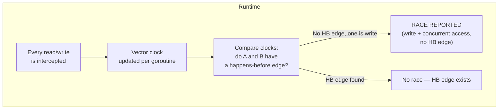
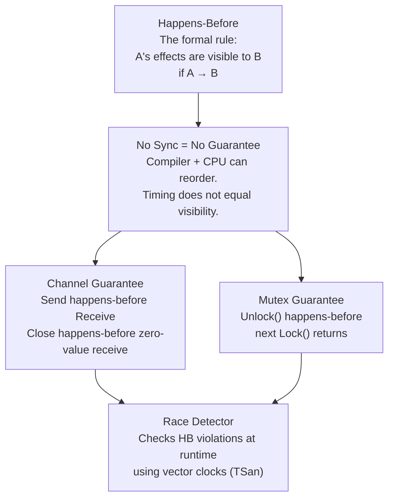

# Phase 7 — Go Memory Model

> **5 topics.** This phase is the theoretical foundation for everything in Phase 9 (Concurrency Depth).
> Learn this before channels, mutexes, and goroutine safety patterns.

---

## Topic 1 / 5 — Happens-Before

---

### 1. Motivation — Why Does This Exist?

Imagine two goroutines. One writes a value to a variable. The other reads it.

```
Goroutine A:  x = 42
Goroutine B:  fmt.Println(x)   // what prints here?
```

Your intuition says: "A writes before B reads, so B prints 42."

But here is the problem — **you have no way to guarantee that.** The CPU, the compiler,
and the Go runtime are all free to reorder instructions as long as the *single-threaded*
behaviour of each goroutine is correct. From the CPU's perspective, unless told otherwise,
A's write and B's read have no ordering relationship at all.

Without a formal way to define ordering across goroutines, concurrent programs would be
unpredictable. The **happens-before** relationship is the language's answer to this.

---

### 2. Building Blocks

| Term | Plain English |
|---|---|
| **Event** | Any single operation — a write, a read, a function call |
| **Happens-before (A → B)** | Every effect of A is visible to B before B runs |
| **Concurrent** | Two events where neither happens-before the other |
| **Data race** | A write and a read (or two writes) to the same variable that are concurrent |
| **Memory model** | The formal rules that define which happens-before guarantees a language provides |

---

### 3. How It Works — The Mechanics

Go defines its memory model with one core rule:

> **A read of a variable `x` is guaranteed to observe the most recent write to `x`
> only if the write happens-before the read.**

If there is no happens-before relationship between a write and a read — they are
**concurrent** — the read may observe *any* value: the new value, the old value, or
something in between (for multi-word writes).



**Without a synchronisation point between them, there is no arrow. The read is undefined.**

Within a single goroutine, happens-before is straightforward: statements execute in
source order, so every statement happens-before the next one in that goroutine.

The hard part is establishing happens-before *across* goroutines — that is what
synchronisation primitives (channels, mutexes) do.

---

### 4. A Concrete Scenario

```go
var x int

func main() {
    x = 1                    // Write A
    go func() {
        fmt.Println(x)       // Read B — is Write A visible here?
    }()
    // ... do other things
}
```

**Is Write A guaranteed to happen-before Read B?**

No. Goroutine launch is a happens-before point only in *one direction*:
> "The goroutine launch happens-before the goroutine's first instruction."

So the launch of the goroutine happens-before `fmt.Println(x)`.
But **the write `x = 1` happens-before the launch only if they are in program order
in the same goroutine** — and here they are! So:

`x = 1` → goroutine launch → `fmt.Println(x)`

This chain gives us the guarantee. **But if `x = 1` came after the `go` statement
in source order, there would be no guarantee.**

---

### 5. Key Insight

**Happens-before is about visibility guarantees, not wall-clock time.**
Two events can happen at "the same time" by the clock and still have a happens-before
relationship if a synchronisation primitive establishes it.
Conversely, A can finish before B starts on the clock and still have *no* happens-before
relationship if there is no synchronisation — the compiler or CPU may have already
reordered things.

---

### 6. Common Misconceptions

- **"If A finishes before B starts, A happens-before B."**
  Not unless there is a synchronisation point. Without one, the compiler may have
  reordered A's write to happen even later in the CPU pipeline.

- **"Happens-before means A runs first in time."**
  It means A's *effects* are *visible* to B. Timing and visibility are different things.

---

---

## Topic 2 / 5 — No Guarantee Without Synchronisation

---

### 1. Motivation — Why Does This Exist?

This topic is the practical consequence of Topic 1. The Go memory model does not give
you any guarantee just because your code *looks* safe or *usually* works.

Consider this — a developer writes:

```go
var ready bool
var result int

func setup() {
    result = 42
    ready = true
}

func waitAndRead() {
    for !ready {}       // spin until ready
    fmt.Println(result) // expects 42
}
```

This looks correct. `setup` writes `result` before `ready`. `waitAndRead` checks `ready`
first. But **this program has a data race and is undefined behaviour in Go.**

---

### 2. Building Blocks

| Term | Plain English |
|---|---|
| **Data race** | Two goroutines access the same variable concurrently, and at least one is a write |
| **Reordering** | The compiler or CPU executing writes/reads in a different order than source code |
| **Cache coherency** | Each CPU core has its own cache — a write on core 1 may not be visible on core 2 immediately |
| **Synchronisation point** | An operation that guarantees memory visibility across goroutines (channel send/receive, mutex lock/unlock) |

---

### 3. How It Works — The Mechanics

Three layers can all reorder memory operations independently:



The **Go compiler** is allowed to reorder `result = 42` and `ready = true` if it
believes no single-goroutine behaviour changes. It might write `ready = true` first.

The **CPU** has per-core store buffers. Even if the compiler kept the order, the
write to `result` may be sitting in core 1's store buffer, while `ready = true`
has already flushed to main memory. Core 2 reads `ready = true` and then reads
a stale `result = 0` from its own cache.

**No synchronisation = no protection against either of these.**

---

### 4. A Concrete Scenario

The spin-loop example from the motivation:

```
Goroutine A (setup):        Goroutine B (waitAndRead):
    result = 42                 for !ready {}
    ready  = true               fmt.Println(result)
```

What can actually happen:
1. Compiler reorders A's writes → `ready = true` executes before `result = 42`.
2. B sees `ready = true`, exits the loop, reads `result` which is still `0`.
3. Output: `0`. 

Or even worse — on some architectures, B's `for !ready {}` loop gets compiled to
check `ready` once, cache it in a register, and loop forever because the compiler
sees no reason to re-read it from memory (no synchronisation point to force a reload).

---

### 5. Key Insight

**"It works fine in testing" is not a memory safety guarantee.**
Data races may only manifest under specific CPU load, specific hardware, or specific
compiler versions. A program with a data race is **undefined behaviour** — Go makes
no promises about what it does. The only fix is a proper synchronisation point.

---

### 6. Common Misconceptions

- **"It's a tiny race, it probably doesn't matter."**
  On modern CPUs with out-of-order execution and store buffers, even a single
  unprotected write-read pair can produce completely wrong results consistently.

- **"My machine has one core so there's no real parallelism — it's fine."**
  The compiler reordering alone is enough to break your program, even on a
  single-core machine.

---

### 7. Code Snippet

```go
package main

import (
    "fmt"
    "sync"
)

// WRONG: data race — no synchronisation
var result int
var ready bool

func badSetup() {
    result = 42
    ready = true  // compiler may reorder this above result = 42
}

// CORRECT: use a channel as a synchronisation point
func main() {
    ch := make(chan struct{})
    var safeResult int

    go func() {
        safeResult = 42
        close(ch) // close happens-after safeResult = 42 (same goroutine, program order)
    }()

    <-ch // receive happens-after close (channel guarantee)
    // Therefore: safeResult = 42 happens-before this line
    fmt.Println(safeResult) // guaranteed to print 42
}
```

---

---

## Topic 3 / 5 — Channel as a Happens-Before Guarantee

---

### 1. Motivation — Why Does This Exist?

We now know that without synchronisation, there is no ordering guarantee across goroutines.
Channels are Go's primary tool for both **communicating values** and **establishing
happens-before relationships**.

Most developers use channels to pass data. But the deeper reason channels are safe is
that Go's memory model gives them a happens-before guarantee — they are not just pipes,
they are **synchronisation fences**.

---

### 2. Building Blocks

| Term | Plain English |
|---|---|
| **Unbuffered channel** | A channel with capacity 0 — send and receive must meet at the same moment |
| **Buffered channel** | A channel with capacity N — sender can proceed until N items are queued |
| **Send** | `ch <- value` — writes a value into the channel |
| **Receive** | `<-ch` — reads a value from the channel |
| **Synchronisation fence** | A point in execution that forces memory writes to be visible to another goroutine |

---

### 3. How It Works — The Mechanics

Go's memory model guarantees:

**Rule 1 — Unbuffered channel:**
> A **send** on an unbuffered channel happens-before the corresponding **receive** from
> that channel completes.

**Rule 2 — Buffered channel:**
> The **k-th receive** from a channel with capacity C happens-before the **(k+C)-th send**
> to that channel completes.

In plain English for unbuffered channels:
- The sender blocks until the receiver is ready.
- At the moment they "meet", everything the sender did *before* the send is visible
  to the receiver *after* the receive.



For a **buffered channel**, the guarantee is weaker:
- The sender does not have to wait for a receiver if the buffer has space.
- But Go still guarantees that the **send completes before the receive** observes the value.

**Closing a channel:**
> `close(ch)` happens-before a receive that returns the zero value because the channel is closed.

This is why `close(ch)` + `<-ch` is a valid synchronisation pattern (used for broadcasting
a "done" signal to multiple goroutines).

---

### 4. A Concrete Scenario

```
Goroutine A:                Goroutine B:
    data = computeResult()
    ch <- data              (blocks until B is ready, if unbuffered)
                                val := <-ch
                                use(val)  ← guaranteed to see computeResult()
```

Step by step:
1. A calls `computeResult()` and stores in `data`. This is entirely within Goroutine A.
2. A executes `ch <- data`. On an unbuffered channel, A parks itself.
3. B executes `val := <-ch`. The runtime wakes A (or vice versa — they synchronise).
4. At this point, the memory model guarantees: **everything A wrote before the send
   is visible to B after the receive.**
5. `use(val)` is safe. No additional synchronisation needed.

---

### 5. Key Insight

**A channel does two things at once: it transfers a value AND creates a happens-before edge.**
This is why Go code that communicates exclusively through channels tends to be correct
by construction — the synchronisation is built into the communication itself.

---

### 6. Common Misconceptions

- **"Buffered channels are always safe because sends don't block."**
  A buffered channel still gives you happens-before for each send/receive pair —
  but it is possible to have a data race if you share a variable through *both*
  a buffered channel and unprotected direct access.

- **"I used a channel to pass the data so I'm fine."**
  Only if you do not also access the shared variable directly from another goroutine
  after the send. Once you send ownership via a channel, do not touch the original.

---

### 7. Code Snippet

```go
package main

import "fmt"

func main() {
    ch := make(chan int) // unbuffered

    var sharedData string

    go func() {
        // Everything written here before the send is visible to main after the receive
        sharedData = "hello from goroutine"
        ch <- 1 // signal: I'm done writing
    }()

    <-ch // this receive happens-after the send above

    // Safe: the happens-before chain guarantees sharedData is visible here
    fmt.Println(sharedData) // always prints "hello from goroutine"
}
```

---

---

## Topic 4 / 5 — `sync.Mutex` Memory Ordering Guarantee

---

### 1. Motivation — Why Does This Exist?

Channels are great for communication, but they are not always the right tool.
Sometimes you just need **multiple goroutines to safely read and write a shared variable**
without building a communication pipeline.

`sync.Mutex` is the answer — but most developers think of it only as "a lock that
prevents two goroutines from running at the same time." That understanding is incomplete.

A mutex does *more* than prevent concurrent access. It also establishes **memory ordering
guarantees** — it is a synchronisation fence, just like a channel.

---

### 2. Building Blocks

| Term | Plain English |
|---|---|
| **`sync.Mutex`** | A mutual exclusion lock — only one goroutine holds it at a time |
| **`Lock()`** | Acquire the mutex — blocks if another goroutine holds it |
| **`Unlock()`** | Release the mutex — wakes a waiting goroutine if any |
| **Critical section** | The code between `Lock()` and `Unlock()` — only one goroutine runs it at a time |
| **Memory fence** | A hardware/compiler instruction that says: "flush all pending writes and make them visible" |

---

### 3. How It Works — The Mechanics

Go's memory model guarantees:

> **For any `sync.Mutex` variable `l`:**
> The `n`-th call to `l.Unlock()` happens-before the `(n+1)`-th call to `l.Lock()` returns.

In plain English:
- When Goroutine A calls `Unlock()`, every write A did *inside the critical section*
  is guaranteed to be visible to the next goroutine that successfully calls `Lock()`.



This means a mutex gives you **two guarantees**:
1. **Mutual exclusion** — only one goroutine in the critical section at a time.
2. **Memory visibility** — writes made before `Unlock()` are visible to the goroutine
   that acquires the lock next.

**`sync.RWMutex` follows the same rules:**
- `RUnlock()` happens-before `Lock()` returns (readers release → writer acquires).
- `Unlock()` happens-before `RLock()` returns (writer releases → reader acquires).

---

### 4. A Concrete Scenario

```go
var mu sync.Mutex
var counter int

// Goroutine A:               Goroutine B:
mu.Lock()                     mu.Lock()
counter++                     fmt.Println(counter)
mu.Unlock()                   mu.Unlock()
```

Step by step:
1. A acquires the lock. A is now alone in the critical section.
2. A increments `counter`. This write is inside the lock.
3. A calls `Unlock()`. This is the memory fence — A's write to `counter` is now
   flushed and guaranteed visible to the next lock holder.
4. B calls `Lock()` — this blocks until A's `Unlock()` completes.
5. B's `Lock()` returns. The happens-before guarantee means B *sees* `counter++`.
6. B prints the updated value correctly.

Without the mutex, `counter++` is itself three operations (read, add, write) and
any of them could interleave with B.

---

### 5. Key Insight

**A mutex is not just a traffic light — it is also a memory visibility guarantee.**
"Mutual exclusion" prevents concurrent *execution*. The memory ordering guarantee
ensures that the *effects* of the critical section are visible to the next holder.
Both halves matter. Removing the mutex removes both protections at once.

---

### 6. Common Misconceptions

- **"`sync.RWMutex` is always faster than `sync.Mutex`."**
  Only for workloads that are read-heavy. Under heavy concurrent writes, `RWMutex`
  has more overhead than a plain `Mutex` because of the reader counting mechanism.
  Benchmark before switching.

- **"I only need to lock the write, reads are safe."**
  False. Concurrent reads and writes to the same variable without any synchronisation
  is a data race, even if reads do not modify data. Always lock both sides.

---

### 7. Code Snippet

```go
package main

import (
    "fmt"
    "sync"
)

type SafeCounter struct {
    mu sync.Mutex
    v  int
}

func (c *SafeCounter) Increment() {
    c.mu.Lock()
    // Everything inside this section is protected:
    // 1. Only one goroutine runs at a time (mutual exclusion)
    // 2. Writes here are visible to the next goroutine that locks (memory ordering)
    c.v++
    c.mu.Unlock()
}

func (c *SafeCounter) Value() int {
    c.mu.Lock()
    defer c.mu.Unlock()
    // Reading is also inside the lock — a concurrent write without a lock is a data race
    return c.v
}

func main() {
    c := SafeCounter{}
    var wg sync.WaitGroup

    for i := 0; i < 1000; i++ {
        wg.Add(1)
        go func() {
            defer wg.Done()
            c.Increment()
        }()
    }

    wg.Wait()
    fmt.Println(c.Value()) // always prints 1000
}
```

---

---

## Topic 5 / 5 — What the Race Detector Checks

---

### 1. Motivation — Why Does This Exist?

Data races are the hardest bugs in concurrent programming. They are:
- **Non-deterministic** — they may only appear under certain CPU load or scheduling sequences.
- **Silent** — they do not always crash. They often produce wrong results that look plausible.
- **Invisible** — code review cannot reliably catch them.

Go ships with a built-in **race detector** that catches these bugs at runtime. Understanding
what it checks — and what it does *not* check — helps you use it correctly and interpret its output.

---

### 2. Building Blocks

| Term | Plain English |
|---|---|
| **Thread sanitizer (TSan)** | The underlying C library Go's race detector is built on |
| **Shadow memory** | Extra memory the race detector allocates to track recent accesses to every memory location |
| **Happens-before graph** | A graph the race detector builds dynamically as your program runs |
| **Race report** | The output the detector prints when it finds a violation |
| `-race` flag | The build flag that instruments your binary with the race detector |

---

### 3. How It Works — The Mechanics

Enable the race detector with:

```
go test -race ./...
go build -race .
go run -race main.go
```

**What it does at runtime:**

The race detector instruments every memory access in your program (reads and writes).
For each memory location, it tracks:
- The last few goroutines that accessed it
- The vector clock at the time of each access

A **vector clock** is a data structure that precisely represents the happens-before
relationship at a given point. If two accesses have no happens-before relationship
between their vector clocks — and at least one is a write — the detector reports a race.



**What it reports:**
- The two goroutines involved
- The exact file and line number of each conflicting access
- A stack trace for both

**What it does NOT check:**
- It does not check for logical deadlocks (use `go vet` and careful design for that)
- It does not check for hardware-level races on non-x86 memory models
- It does not find races in code paths that were not executed during the run

---

### 4. A Concrete Scenario

```go
package main

import "fmt"

func main() {
    x := 0

    go func() {
        x = 1          // Write in goroutine
    }()

    fmt.Println(x)     // Read in main goroutine — concurrent write above
}
```

Run with `go run -race main.go`. The race detector output looks like:

```
==================
WARNING: DATA RACE
Write at 0x... by goroutine 6:
  main.main.func1()
      /tmp/main.go:8

Previous read at 0x... by main goroutine:
  main.main()
      /tmp/main.go:11

Goroutine 6 (running) created at:
  main.main()
      /tmp/main.go:7
==================
```

The detector tells you:
1. **Where the conflicting accesses are** (line 8 and line 11)
2. **Which goroutines are involved** (goroutine 6 and main)
3. **Where the goroutine was created** (line 7)

This is enough information to fix the bug. In this case, add a `sync.WaitGroup`
or a channel to establish happens-before between the write and the read.

---

### 5. Key Insight

**The race detector checks happens-before violations, not hardware races.**
It does not need to see two operations literally overlap in time. If two operations
on the same memory have no happens-before relationship according to Go's memory model,
the detector reports a race — even if on your hardware they happened to execute in
the "right" order this time. This is the correct thing to do: the program is broken
by definition, regardless of observed behaviour.

---

### 6. Common Misconceptions

- **"My tests pass with `-race`, so I have no races."**
  The race detector is dynamic — it only finds races in code paths that actually
  execute during the run. A race hiding behind an unlikely scheduling sequence or
  a rarely-exercised code path will not be caught. High code coverage under `-race`
  is important.

- **"The race detector finds all possible data races."**
  It finds races that *occur during that specific run*. It cannot find races in
  code paths that were not exercised.

- **"I can ship with `-race` enabled to catch production races."**
  The race detector has **2-20x CPU overhead** and **5-10x memory overhead**.
  It is a development and CI tool, not suitable for production binaries.

---

### 7. Code Snippet — Fixing a Race the Detector Found

```go
package main

import (
    "fmt"
    "sync"
)

func main() {
    x := 0
    var wg sync.WaitGroup

    wg.Add(1)
    go func() {
        defer wg.Done()
        x = 1 // Write in goroutine
    }()

    wg.Wait() // Wait() happens-after Done(), which happens-after the write above

    // The happens-before chain:
    //   x = 1 → Done() → Wait() returns → fmt.Println(x)
    fmt.Println(x) // safe: guaranteed to see x = 1
}
```

Run this with `go run -race main.go` — the detector stays silent. The fix works.

---

## Phase 7 — Mental Model Summary



| Topic | One-line Takeaway |
|---|---|
| Happens-before | Write is only guaranteed visible to a read if there is a HB edge between them |
| No sync = no guarantee | Even "obviously correct timing" has no memory ordering promise without a synchronisation point |
| Channel guarantee | Channel send/receive and close/receive pairs create HB edges — communication *is* synchronisation |
| Mutex guarantee | `Unlock()` → next `Lock()` creates a HB edge — mutual exclusion and memory visibility together |
| Race detector | Catches HB violations dynamically via vector clocks; it is a dev/CI tool, not a production tool |

---

> **Next up — Phase 8** covers Garbage Collector internals (tri-colour mark-and-sweep, write barriers, STW pauses).
> Phase 9 (Concurrency Depth) builds directly on Phase 7 — every channel pattern and sync primitive
> you will learn there is grounded in the happens-before rules you just studied.
