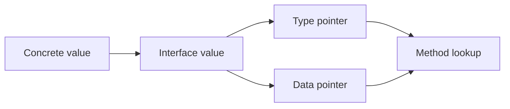
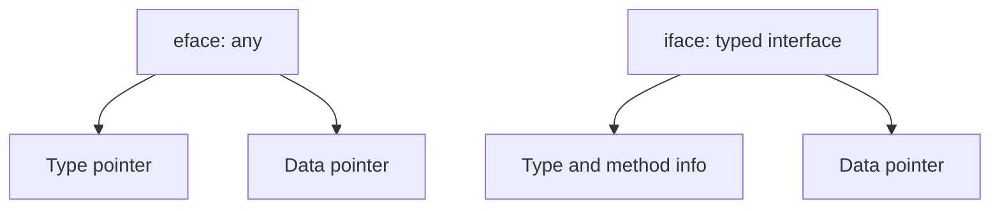
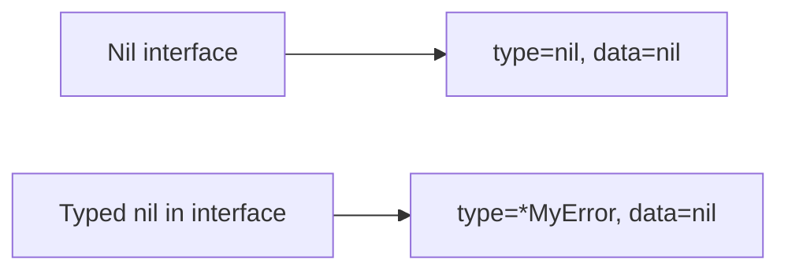
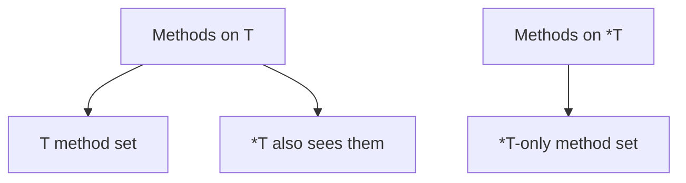

# Phase 2 — Interface & Type System

Topics in this phase:

- 2 on **Interface representation** (layout, `iface` vs `eface`)
- 2 on **Nil and allocation behaviour** (nil-interface bug, boxing/escape)
- 3 on **Method dispatch rules** (receiver matching, assertion cost, dispatch cost)
- 1 on **Object construction** (`make` vs `new` vs composite literal)

---

## Topic 1 / 8 — Interface Two-Word Structure: Type Pointer + Data Pointer

Why this exists:
Go needs one variable shape that can hold many concrete types and still know which method to call.

The pieces:

- **Type pointer**: what concrete type is inside.
- **Data pointer**: where the concrete value data is.
- **Interface value**: both of those together.

How it works:



*An interface carries both the type identity and the data needed to use that type.*

1. A concrete value is assigned to an interface.
2. Runtime stores the type information.
3. Runtime stores or points to the value data.
4. A method call uses the type pointer to find the right method.

Example:
If `Dog{}` is stored in `Speaker`, the interface remembers:

1. this is a `Dog`
2. here is the `Dog` value

Then `s.Speak()` resolves to `Dog.Speak()`.

Mental model:
**An interface value is not just data. It is data plus type identity.**

Common mistake:

- Thinking an interface is only a bag of bytes.

Code:

```go
type Speaker interface{ Speak() string }
type Dog struct{}

func (Dog) Speak() string { return "woof" }

var s Speaker = Dog{}
fmt.Println(s.Speak())
```

---

## Topic 2 / 8 — `iface` vs `eface`: Typed Interface vs `interface{}` / `any`

Why this exists:
Go treats empty interfaces and non-empty interfaces slightly differently because only one of them has methods.

The pieces:

- **`eface`**: runtime form of `interface{}` / `any`
- **`iface`**: runtime form of a non-empty interface like `io.Reader`

How it works:

1. `any` can hold anything because it has no methods.
2. A typed interface must also support method lookup.
3. So non-empty interfaces carry method-related metadata.



*Empty interfaces need type + data. Non-empty interfaces need type/method info + data.*

Example:

1. `var x any = 42` only needs to know that the value is an `int`.
2. `var r io.Reader = file` must also know how to call `Read`.

Mental model:
**`any` stores a value. A typed interface stores a value plus a method view of that value.**

Common mistake:

- Assuming all interfaces are identical under the hood.

Code:

```go
var x any = 10

type Speaker interface{ Speak() string }
var s Speaker = Dog{}

_, _ = x, s
```

---

## Topic 3 / 8 — Nil Interface vs Nil Pointer Bug

Why this exists:
This is the classic Go bug where something looks nil but is not actually a nil interface.

The pieces:

- **Nil interface**: type=nil, data=nil
- **Typed nil in interface**: type=set, data=nil

How it works:

1. A typed nil pointer still has a concrete type.
2. When stored in an interface, the type field is filled.
3. So the interface is non-nil even though the data pointer is nil.



*Interface nil-ness depends on both the type field and the data field.*

Example:
You return `(*MyError)(nil)` as `error`.
The caller checks `err != nil` and gets `true` because the interface still knows the concrete type is `*MyError`.

Mental model:
**A typed nil inside an interface is not a nil interface.**

Common mistake:

- Assuming nil data automatically means nil interface.

Code:

```go
type MyError struct{}

func (e *MyError) Error() string { return "boom" }

func bad() error {
    var e *MyError = nil
    return e
}

func main() {
    err := bad()
    fmt.Println(err == nil) // false
}
```

---

## Topic 4 / 8 — Interface Boxing and Heap Allocation

Why this exists:
Interfaces are convenient, but boxing a concrete value into an interface can affect allocation and escape behavior.

The pieces:

- **Boxing**: wrapping a concrete value in an interface
- **Escape**: value moves from stack to heap because it must live longer

How it works:

1. A concrete value is assigned to an interface.
2. Runtime needs a stable representation for that value.
3. If the compiler cannot keep it safely on the stack, it escapes to the heap.

Example:
Passing a struct to `fmt.Println` often boxes it into `any`.
That may or may not allocate depending on what the compiler can prove.

Mental model:
**Interfaces do not always allocate, but boxing into an interface often helps a value escape.**

Common mistake:

- Saying interface boxing always allocates.
- Saying interface boxing never allocates.

Code:

```go
type Big struct {
    A, B, C, D int
}

func printAny(x any) {
    fmt.Println(x)
}

func main() {
    v := Big{1, 2, 3, 4}
    printAny(v)
}
```

Use `go build -gcflags="-m"` to inspect escapes.

---

## Topic 5 / 8 — Pointer vs Value Receiver Rules

Why this exists:
Interface satisfaction depends on method sets, and method sets depend on receiver type.

The pieces:

- **Value receiver method**: belongs to `T`, and also usable through `*T`
- **Pointer receiver method**: belongs only to `*T`

How it works:

1. `T` gets only value-receiver methods in its method set.
2. `*T` gets both value-receiver and pointer-receiver methods.
3. Interface satisfaction checks method sets, not convenience call rules.



*A value type has a smaller method set than its pointer type.*

Example:
If `func (u *User) Save()` exists:

1. `User{}` does not satisfy `Saver`
2. `&User{}` does satisfy `Saver`

Mental model:
**Direct calls are flexible. Interface satisfaction is stricter.**

Common mistake:

- Thinking that because `u.Save()` compiles, `User` must satisfy the interface.

Code:

```go
type Saver interface{ Save() }

type User struct{}

func (u *User) Save() {}

var _ Saver = &User{} // OK
// var _ Saver = User{} // compile error
```

---

## Topic 6 / 8 — Type Assertion Cost

Why this exists:
People often imagine type assertions are expensive, but normal assertions are usually simple checks.

The pieces:

- **Type assertion**: asking whether an interface currently holds type `T`
- **Checked form**: `v, ok := x.(T)`

How it works:

1. Runtime compares the interface's stored type information with `T`.
2. If they match, the value is extracted.
3. If they do not match, `ok` is false or a panic happens.

Example:
If `var x any = 42`, then `x.(int)` succeeds because the interface already stores an `int`.

Mental model:
**A type assertion is usually just a runtime type check, not a big reflective operation.**

Common mistake:

- Treating every assertion like heavy reflection.

Code:

```go
var x any = 42

v, ok := x.(int)
fmt.Println(v, ok) // 42 true
```

---

## Topic 7 / 8 — Dynamic Dispatch Cost

Why this exists:
Method calls through interfaces are flexible, but they are not exactly the same as direct calls.

The pieces:

- **Direct call**: compiler already knows the concrete method
- **Interface call**: runtime finds the method first

How it works:

1. Runtime reads the interface metadata.
2. Runtime finds the correct function pointer.
3. Runtime calls that function with the stored data.

That is why people summarize interface dispatch as roughly a couple of pointer dereferences.

Example:
`d.Speak()` is direct when `d` is known as `Dog`.
`s.Speak()` is dynamic dispatch when `s` is known only as `Speaker`.

Mental model:
**Interface calls are cheap, but they are not free.**

Common mistake:

- Saying interface dispatch is either zero-cost or extremely slow.

Code:

```go
type Speaker interface{ Speak() string }
type Dog struct{}

func (Dog) Speak() string { return "woof" }

func direct(d Dog) string { return d.Speak() }
func throughInterface(s Speaker) string { return s.Speak() }
```

---

## Topic 8 / 8 — `make` vs `new` vs Composite Literal

Why this exists:
Go gives you three common construction styles because slices/maps/channels, pointers, and plain values need different handling.

The pieces:

- **`new(T)`**: returns `*T` pointing to zero value of `T`
- **`make`**: initializes slice, map, or channel
- **Composite literal**: directly creates a value like `T{}` or `[]int{}`

How it works:

1. Use `new` when you want a pointer to a zero value.
2. Use `make` only for slices, maps, and channels.
3. Use a composite literal when you want a ready value immediately.

Example:

1. `new(User)` gives `*User`
2. `make([]int, 3)` gives a usable slice
3. `User{Name: "Milo"}` gives a ready struct value

Mental model:
**`new` is for zeroed memory, `make` is for runtime-initialized built-ins, and literals are for direct value construction.**

Common mistake:

- Thinking `make` and `new` are interchangeable.

Code:

```go
type User struct {
    Name string
}

u1 := new(User)
u2 := User{Name: "Milo"}
s := make([]int, 3)
m := make(map[string]int)
ch := make(chan int)

_, _, _, _, _ = u1, u2, s, m, ch
```

---

## Phase 2 Summary

- Interface value = type info + data.
- `eface` and `iface` are similar ideas, but non-empty interfaces also need method metadata.
- Nil interface and typed nil inside interface are different.
- Boxing into interfaces can affect escape and allocation.
- Method sets decide interface satisfaction.
- Type assertions are usually cheap checks.
- Interface dispatch has a small runtime cost.
- `make`, `new`, and literals solve different construction problems.
