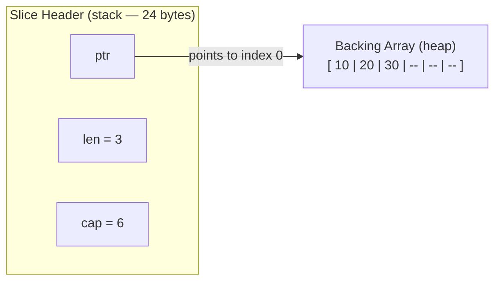
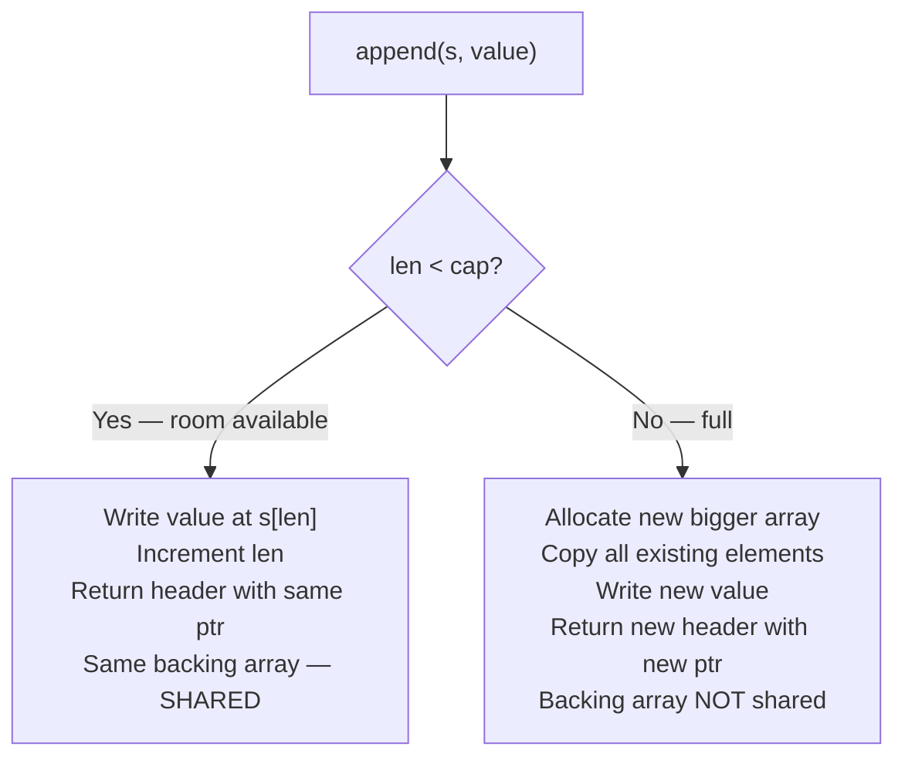
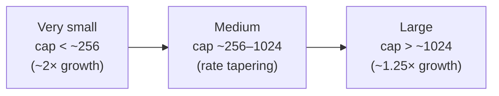
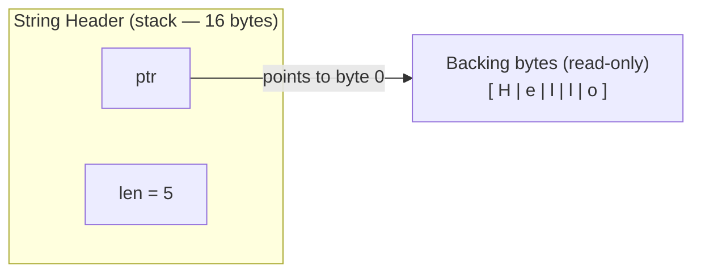
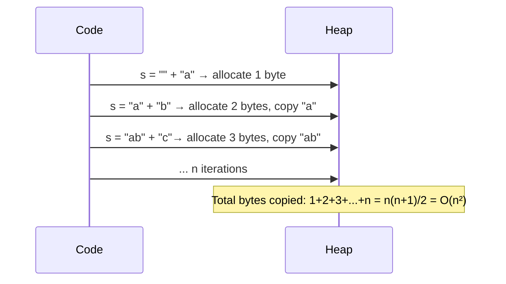
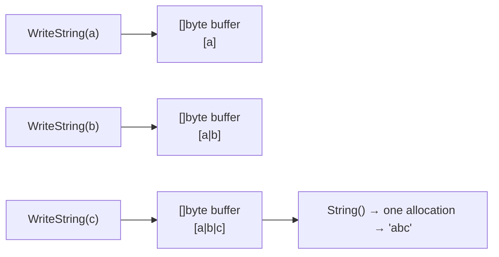
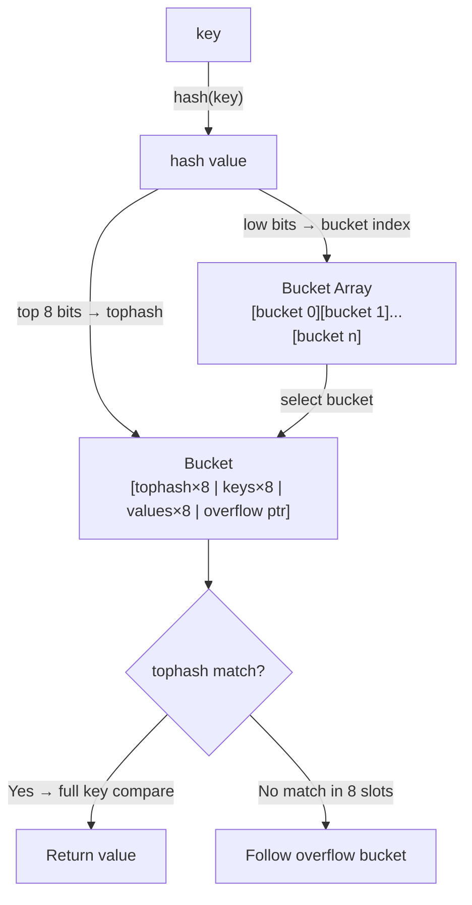
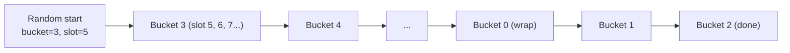
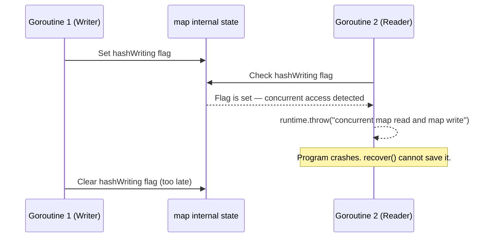

# Phase 1 — Language Data Structures

Topics in this phase:
- 3 on **Slices** (internals, append, growth)
- 2 on **Strings** (internals, performance)
- 4 on **Maps** (internals, growth, iteration, concurrency)

---

## Topic 1 / 9 — Slice Internals: The 3-Word Header

### 1. Motivation — "Why does this exist?"

In C, if you pass an array to a function, you also have to pass its length separately.
The array itself doesn't know how big it is — you're carrying two separate things around.
Go wanted arrays to carry their own metadata, but raw arrays in Go are value types that copy
entirely on assignment, which is expensive for large collections.

**Slices solve this.** A slice is a *lightweight view* over an underlying array.
It knows where to start, how many elements it exposes, and how much room is left before
a new backing array is needed — all packed into a tiny 24-byte header.

---

### 2. Building Blocks — "What are the pieces?"

| Field | Type | What it means |
|-------|------|---------------|
| `ptr` | `unsafe.Pointer` | Points to the first element this slice exposes in the backing array |
| `len` | `int` | How many elements are currently visible through this slice |
| `cap` | `int` | How many elements are available from `ptr` to the end of the backing array |

A slice header is exactly **24 bytes** on 64-bit systems (3 × 8 bytes). That's it.

---

### 3. How It Works — "The mechanics"



*The slice header lives on the stack. The backing array lives on the heap.
When you pass a slice to a function, only the 24-byte header is copied — not the data.*

Step by step for `s := make([]int, 3, 6)`:
1. Runtime allocates a backing array of 6 ints on the heap.
2. A slice header is created on your stack: `ptr` = address of `backing[0]`, `len` = 3, `cap` = 6.
3. Elements at index 3, 4, 5 exist in the backing array but are not visible through `s` yet.

Sub-slicing creates a **new header over the same backing array**:
```go
s := []int{10, 20, 30, 40, 50, 60}
window := s[1:4]
// window.ptr  → points at s[1] (value 20)
// window.len  → 3
// window.cap  → 5  (from index 1 to the end of the original array)
```

---

### 4. A Concrete Scenario — "Walk me through an example"

```go
package main

import "fmt"

func mutateFirst(s []int) {
    // s is a COPY of the header — ptr, len, cap are all copied.
    // But ptr still points to the SAME backing array.
    s[0] = 999
    fmt.Println("inside:", s) // [999 2 3]
}

func main() {
    nums := []int{1, 2, 3}
    mutateFirst(nums)
    fmt.Println("after:", nums) // [999 2 3] ← mutation IS visible!
}
// Output:
// inside: [999 2 3]
// after:  [999 2 3]
```

The header was copied (new `len` and `cap` on the callee's stack), but both headers
point to the **same backing array**. Index mutations through the copy are visible to the caller.

---

### 5. Key Insight

**A slice is a view, not the data itself.**
Passing a slice to a function is cheap (24 bytes copied), but the backing data is shared.
Only `append` that exceeds capacity will break that sharing by allocating a new backing array.

---

### 6. Common Misconceptions

- **"Slices are passed by reference."** — Not exactly. The *header* is passed by value.
  It just happens to contain a pointer. Appending inside a function (which may allocate a new
  backing array) will **not** be visible to the caller — only mutations of existing elements will.

---

### 7. Code Snippet

```go
s := make([]int, 3, 6) // len=3, cap=6
fmt.Println(len(s), cap(s)) // 3 6

t := s[1:3]             // new header, same backing array
fmt.Println(len(t), cap(t)) // 2 5   (cap = 6 - 1, measured from t's ptr)
```

---

## Topic 2 / 9 — How `append` Works and Backing Array Sharing

### 1. Motivation — "Why does this exist?"

You need a growable list. But a backing array has a fixed size.
Go needs a rule: what happens when you run out of room?
The `append` builtin handles this transparently — but the rules have real consequences
for how data is shared between slices. Get this wrong and you get subtle, hard-to-find bugs.

---

### 2. Building Blocks — "What are the pieces?"

| Scenario | What happens |
|----------|-------------|
| Append **within** capacity (`len < cap`) | `len` increases by 1. Same backing array. Both the original and new slice share data. |
| Append **beyond** capacity (`len == cap`) | New, larger backing array is allocated. Elements are copied. Original slice is unaffected. |
| `copy(dst, src)` | Explicit element-by-element copy. No sharing. Always safe. |

---

### 3. How It Works — "The mechanics"



*When there's room, append is O(1) and the backing array is shared.
When there's no room, it's O(n) and a new backing array is born.*

---

### 4. A Concrete Scenario — "Walk me through an example"

```go
package main

import "fmt"

func main() {
    // cap=5, so we have 2 slots of room after the initial 3 elements
    original := make([]int, 3, 5)
    original[0], original[1], original[2] = 1, 2, 3

    // Append within capacity — same backing array
    extended := append(original, 4) // len=4, cap=5 — room used, ptr unchanged
    extended[0] = 999               // mutates the SHARED backing array!

    fmt.Println(original[0])  // 999 ← original is affected! Surprise.
    fmt.Println(extended[0])  // 999

    // Now append beyond capacity — new backing array
    big := append(extended, 5, 6) // cap exceeded → new array allocated
    big[0] = 111

    fmt.Println(extended[0]) // 999 ← NOT affected. big has its own backing array now.
}
```

This is the classic **backing-array-sharing bug**. Two slices point at the same memory
until capacity is exceeded. After that, they diverge silently.

---

### 5. Key Insight

**Never assume two slices are independent just because one was created by appending to the other.**
If the append stayed within the original capacity, they share the same backing array.
Mutations to one will affect the other.

---

### 6. Common Misconceptions

- **"Append always returns a new independent slice."** — It returns a slice, possibly pointing
  to the same backing array with a different header.
- **"Modifying the appended slice can't affect the original."** — It can, until capacity is exceeded.

---

### 7. Code Snippet — Safe Pattern: 3-Index Slice

Use the **full slice expression** `s[low:high:max]` to cap the capacity deliberately.
This forces the next `append` to allocate a new backing array, guaranteeing independence.

```go
s := make([]int, 3, 6)
s[0], s[1], s[2] = 1, 2, 3

// s[0:3:3] — cap is limited to 3-0=3, not 6
isolated := s[0:3:3]
appended := append(isolated, 4) // cap exceeded → new backing array guaranteed
appended[0] = 999

fmt.Println(s[0]) // 1 — completely unaffected
```

---

## Topic 3 / 9 — Slice Growth Factor

### 1. Motivation — "Why does this exist?"

When `append` needs a new backing array, how big should it make it?

- Too small → frequent reallocations → lots of copying → slow.
- Too large → wasted memory for small slices.

Go uses a growth strategy that balances both by starting aggressive and tapering off.

---

### 2. Building Blocks — "What are the pieces?"

| Era | Strategy |
|-----|----------|
| **Before Go 1.18** | 2× doubling until `cap ≥ 1024`, then roughly 1.25× |
| **Go 1.18+** | Smooth continuous curve — growth rate decreases gradually as cap grows. No hard cutoff. |

The key change in 1.18: the old "exactly 1024" cliff was replaced with a formula that
transitions smoothly. Also, the actual new capacity is **rounded up to the nearest memory
class** (aligned to the Go allocator's size classes), so what you observe may differ
slightly from a pure formula.

---

### 3. How It Works — "The mechanics"

**Old behaviour (pre-1.18) — visible cliff at 1024:**
```
cap < 1024:  new_cap = 2 × old_cap
cap ≥ 1024:  new_cap ≈ 1.25 × old_cap
```

**New behaviour (1.18+) — smooth curve:**



The formula blends the two regimes so there's no sudden jump in behaviour at any
specific size. Memory class rounding means the actual observed cap can be higher than
the raw formula predicts.

---

### 4. A Concrete Scenario — "Walk me through an example"

```go
package main

import "fmt"

func main() {
    var s []int
    prev := 0
    for i := 0; i < 2000; i++ {
        s = append(s, i)
        if cap(s) != prev {
            fmt.Printf("len=%-5d cap=%d\n", len(s), cap(s))
            prev = cap(s)
        }
    }
}
```

Run this and you'll see capacity jumping in non-uniform steps — not strict 2× after
small sizes — because of memory class rounding and the smoothed formula.

Sample output (Go 1.21, 64-bit):
```
len=1     cap=1
len=2     cap=2
len=3     cap=4
len=5     cap=8
len=9     cap=16
len=17    cap=32
...
len=257   cap=288    ← growth starts tapering, not 512
len=385   cap=416
...
```

---

### 5. Key Insight

**The growth factor is an implementation detail, not a language contract.**
It changed between Go 1.17 and Go 1.18, and can change again.
Never write code that hardcodes or assumes a specific growth multiplier.

---

### 6. Common Misconceptions

- **"Go always doubles the slice capacity."** — True for small slices approximately,
  but never a language guarantee, and not true for larger slices even before 1.18.
- **"The new capacity is exactly what the formula predicts."** — Memory class rounding
  can make it larger. Always use `cap(s)` to observe the actual value.

---

## Topic 4 / 9 — String Internals: Immutable `ptr + len` Header

### 1. Motivation — "Why does this exist?"

In C, a string is just a pointer to a null-terminated byte array.
To know the length, you scan until you hit `\0` — that's O(n) just to get the size.
It's also error-prone: forget the null terminator and you have a buffer overrun.

Go strings carry their length with them. And they're **immutable**, which means they can be
shared freely across goroutines without copying and without locks. The compiler can even store
string literals in read-only memory in the binary — zero heap allocation for constants.

---

### 2. Building Blocks — "What are the pieces?"

| Field | Type | What it means |
|-------|------|---------------|
| `ptr` | `unsafe.Pointer` | Points to the first byte of the underlying byte array |
| `len` | `int` | Number of **bytes** — not Unicode characters / runes |

A Go string header is **16 bytes** on 64-bit systems (2 × 8 bytes).
Unlike slices, there is **no `cap`** field — strings are immutable, so you can never extend
them in place, so capacity is meaningless.

**No null terminator.** Length is always known from the header. `\0` only appears
when Go passes strings to C via `cgo`.

---

### 3. How It Works — "The mechanics"



*String data is immutable. Multiple strings can point to the same backing bytes safely.
Sub-strings are free — they create a new header pointing into the same byte array.*

```go
s := "Hello, World"
sub := s[7:12]
// sub.ptr → points at s[7] (the 'W')
// sub.len → 5
// No allocation, no copy — same backing bytes.
```

Because strings are immutable, the runtime can store **string literals** in the binary's
read-only data segment (`.rodata`). Declaring `const s = "hello"` costs zero heap allocations.

---

### 4. A Concrete Scenario — "Walk me through an example"

```go
s := "Hello"
t := s[1:4]  // "ell" — same backing bytes, no allocation

// s[0] = 'h'  ← compile error: cannot assign to s[0] (unaddressable)
// This is enforced by the type system at compile time, not a runtime check.

fmt.Println(len("Hello"))   // 5  (5 bytes, 5 ASCII chars — same here)
fmt.Println(len("héllo"))   // 6  (é is 2 bytes in UTF-8 — NOT 5!)
```

The `len` gotcha is one of the most common sources of bugs with non-ASCII strings.

---

### 5. Key Insight

**A Go string is a read-only slice of bytes.** It has a pointer and a length, but no capacity —
because you can never grow it in place. The immutability is what allows safe sharing.

---

### 6. Common Misconceptions

- **"`len(s)` returns the number of characters."** — It returns the number of **bytes**.
  For ASCII they're the same. For UTF-8 strings with multibyte characters (emoji, CJK, accented letters),
  `len(s)` will be greater than the number of visible characters.
  Use `utf8.RuneCountInString(s)` or `len([]rune(s))` for character count.
- **"Strings in Go are null-terminated internally."** — They are not.
  The null terminator only appears when Go marshals strings to C via `cgo`.

---

### 7. Code Snippet

```go
import "unicode/utf8"

s := "héllo" // é is U+00E9, encoded as 2 bytes in UTF-8

fmt.Println(len(s))                        // 6 (bytes)
fmt.Println(utf8.RuneCountInString(s))     // 5 (characters / runes)

// Iterate over bytes (can split multibyte chars):
for i := 0; i < len(s); i++ {
    fmt.Printf("%d: %x\n", i, s[i])
}

// Iterate over runes (correct for Unicode):
for i, r := range s {
    fmt.Printf("%d: %c\n", i, r)
}
```

---

## Topic 5 / 9 — String Performance: `[]byte` Copy, O(n²) Concatenation, `strings.Builder`

### 1. Motivation — "Why does this exist?"

Strings are immutable. That's great for safety. But it creates a performance trap:
every time you "modify" or concatenate a string, Go must allocate new memory and copy.
If you do this in a loop — say, building a large string piece by piece — you're doing
quadratic work without realising it.

This topic is about knowing *when* string operations are cheap and when to switch to
the right tool.

---

### 2. Building Blocks — "What are the pieces?"

| Operation | Cost | Why |
|-----------|------|-----|
| `[]byte(s)` conversion | O(n) — full copy | The resulting byte slice must be mutable; strings are not. |
| `string(b)` conversion | O(n) — full copy | The resulting string must be immutable; a fresh copy is needed. |
| `s = s + t` in a loop | O(n²) total | Each `+` allocates a new string of growing size. |
| `strings.Builder` | O(n) total | Writes into a growing `[]byte` buffer; converts once at the end. |
| `strings.Join(ss, sep)` | O(n) total | Pre-calculates total length, does a single allocation. |

---

### 3. How It Works — "The mechanics"

**Why `+` in a loop is O(n²):**



**Why `strings.Builder` is O(n):**

`strings.Builder` holds a `[]byte` internally.
Each `WriteString` call appends to it using slice append semantics (amortised O(1) per call).
The `String()` call at the end does **one allocation** — just like `string(buf)`.



---

### 4. A Concrete Scenario — "Walk me through an example"

```go
package main

import (
    "strings"
    "fmt"
)

// BAD — O(n²): each += allocates a new string and copies everything so far
func slowBuild(words []string) string {
    result := ""
    for _, w := range words {
        result += w // allocates and copies on every iteration
    }
    return result
}

// GOOD — O(n): single allocation at String()
func fastBuild(words []string) string {
    var b strings.Builder
    b.Grow(64) // optional: hint the expected total size to avoid re-growth
    for _, w := range words {
        b.WriteString(w) // amortised O(1)
    }
    return b.String() // one allocation
}

// Also GOOD for known slices — O(n)
func joinBuild(words []string) string {
    return strings.Join(words, "")
}

func main() {
    words := []string{"Go", " ", "is", " ", "great"}
    fmt.Println(fastBuild(words)) // "Go is great"
}
```

---

### 5. Key Insight

**Use `strings.Builder` whenever you build a string in a loop.**
For single concatenations (`a + b + c`), the compiler can often optimise them into one allocation.
It's repeated concatenation that kills you.

---

### 6. Common Misconceptions

- **"`[]byte(s)` is free because a string is just a byte slice."** — It is NOT free.
  The conversion always allocates and copies. The compiler has a handful of narrow
  escape-analysis-based exceptions (e.g., `[]byte(s)` used only in a `for range`),
  but you should not rely on them.
- **"`fmt.Sprintf` is a good way to build strings."** — For a one-off format it's fine.
  In a tight loop it is very slow: `fmt` uses reflection and allocates. Use `strings.Builder`.

---

## Topic 6 / 9 — Map Internals: Buckets and 8 Key-Value Pairs

### 1. Motivation — "Why does this exist?"

A hash map needs to handle **collisions** — multiple keys that land in the same slot.
Go's map uses **open-addressed chained buckets** (not linked lists like Java's HashMap).
Understanding this structure explains performance characteristics, memory layout, and why
iteration order is not stable.

---

### 2. Building Blocks — "What are the pieces?"

| Component | Meaning |
|-----------|---------|
| **Bucket** | A fixed-size slot holding up to **8** key-value pairs |
| **Hash** | Key is hashed → low bits select which bucket; top 8 bits stored as `tophash` |
| **Bucket array** | The underlying array of buckets. Starts small; grows as map fills. |
| **Overflow bucket** | When a bucket fills all 8 slots, a new overflow bucket is chained to it |
| **Load factor** | Growth triggers at ~6.5 average items per bucket |
| **`tophash`** | 8-byte array at the front of each bucket — enables fast O(1) key-not-present check |

---

### 3. How It Works — "The mechanics"



*The `tophash` array is scanned first (8 byte comparisons). Full key comparison only
happens on a `tophash` hit. This makes "key not present" checks very fast.*

**Memory layout inside one bucket (simplified):**
```
[tophash[0] tophash[1] ... tophash[7]]  ← 8 bytes: fast scan
[key[0]     key[1]     ... key[7]    ]  ← all keys together (cache-friendly)
[value[0]   value[1]   ... value[7]  ]  ← all values together
[overflow pointer]                       ← points to next bucket if this one is full
```

Go stores keys together and values together — **not** interleaved `(k,v)` pairs.
This improves cache line utilisation when scanning tophashes and keys.

---

### 4. A Concrete Scenario — "Walk me through an example"

Inserting key `"foo"` into a map:

1. `hash("foo")` → say `0xABCD1234`
2. Low bits `(0x34 & (numBuckets - 1))` → select bucket, e.g. bucket 4
3. Top 8 bits `0xAB` → this is the `tophash` value
4. Scan bucket 4's 8 `tophash` slots looking for an empty slot
5. Found empty at slot 2 → write `tophash[2] = 0xAB`, store `key[2] = "foo"`, `value[2] = val`
6. If all 8 slots full → allocate overflow bucket, chain it, write there

Looking up `"foo"`:
1. Same hash → same bucket 4
2. Scan `tophash` for `0xAB` — fast 8-byte scan
3. Slot 2 matches → full key comparison: `key[2] == "foo"` → ✓
4. Return `value[2]`

---

### 5. Key Insight

**A Go map is not a simple array of key-value pairs.**
It's an array of cache-friendly buckets, each holding up to 8 pairs with a `tophash`
fast-scan optimisation. The design minimises full key comparisons — the most expensive part.

---

### 6. Common Misconceptions

- **"Map lookup is always O(1)."** — O(1) amortised. With heavy collisions and overflow
  buckets, individual operations can degrade. In practice, this doesn't happen with good
  hash functions, but it's worth knowing.
- **"Go maps are like Java HashMaps."** — Java uses chained linked lists for collision.
  Go uses inline buckets — much more cache-friendly; no pointer chasing for the common case.

---

## Topic 7 / 9 — Map Growth: Incremental Evacuation

### 1. Motivation — "Why does this exist?"

When a map gets too full (load factor exceeds ~6.5 items/bucket), it needs to grow.
The naive approach — allocate a new array and move everything at once — would cause
a sudden, noticeable pause proportional to the map's size.

Go instead **spreads the work** across future map operations — a technique called
**incremental evacuation**. Each write to the map does a little bit of the migration work.

---

### 2. Building Blocks — "What are the pieces?"

| Concept | Meaning |
|---------|---------|
| **Growth trigger** | Load factor > ~6.5 items/bucket, OR too many overflow buckets |
| **Evacuation** | Moving key-value pairs from old bucket array to the new one |
| **Incremental** | Only **2 old buckets** are evacuated per map write operation |
| **Old bucket array** | Kept alive during evacuation; reads fall back to it for un-evacuated buckets |
| **New bucket array** | 2× the size of the old one |

---

### 3. How It Works — "The mechanics"

```mermaid
sequenceDiagram
    participant W as Map Write
    participant Old as Old Buckets (64 buckets)
    participant New as New Buckets (128 buckets)

    W->>Old: Load factor exceeded → allocate New (128 buckets)
    W->>Old: Evacuate bucket 0 → New
    W->>Old: Evacuate bucket 1 → New
    Note over Old,New: Old array stays alive; reads check both
    W->>Old: Next write: Evacuate bucket 2, 3
    W->>Old: Next write: Evacuate bucket 4, 5
    Note over Old: After all 64 buckets evacuated → free Old
```

*During evacuation, every read operation transparently checks whether the target
bucket has been evacuated yet. If not, it reads from the old array.*

---

### 4. A Concrete Scenario — "Walk me through an example"

Imagine a map with 64 buckets hitting the load factor limit:

1. New 128-bucket array is allocated immediately.
2. The **first write** to the map evacuates buckets 0 and 1.
3. The **second write** evacuates buckets 2 and 3.
4. After **32 writes**, all 64 old buckets are evacuated and the old array is freed.

Throughout those 32 writes, every read that targets a not-yet-evacuated bucket reads
from the old array. This is completely transparent to your code.

```go
m := make(map[string]int)
for i := 0; i < 100; i++ {
    // Each write here may be evacuating old buckets behind the scenes.
    // You never see a pause — the work is spread out.
    m[fmt.Sprintf("key%d", i)] = i
}
```

---

### 5. Key Insight

**Go maps never cause a "stop the world" reallocation.**
Growth work is amortised across future writes — 2 buckets per write.
This is different from **slice growth**, which does a full copy upfront the moment capacity is exceeded.

---

### 6. Common Misconceptions

- **"Map growth is like slice growth — all at once."** — Slice growth copies all elements
  immediately in a single O(n) step. Map growth is incremental: O(1) work per write.
- **"After growth, the old array is immediately freed."** — It stays alive until
  all its buckets have been evacuated. This means a growing map temporarily uses
  roughly 3× its normal memory.

---

## Topic 8 / 9 — Map Iteration Order: Non-Deterministic by Design

### 1. Motivation — "Why does this exist?"

Before Go 1, map iteration order was an implementation detail that happened to be
stable on a given run. Developers started relying on it. When the implementation changed,
programs broke silently.

Go 1 deliberately introduced **randomisation** to catch these assumptions at development
time — not after shipping to production.

---

### 2. Building Blocks — "What are the pieces?"

| Fact | Detail |
|------|--------|
| Iteration order | Not guaranteed across runs, or even within a single run |
| Randomisation | Runtime picks a random starting bucket **and** a random offset within it on every `range` |
| Determinism | Two `range` loops over the same unchanged map in the same program can produce different orders |

---

### 3. How It Works — "The mechanics"

When you write `for k, v := range m`, the runtime:

1. Picks a **random bucket index** as the starting point.
2. Picks a **random starting slot** within that bucket.
3. Iterates forward from there, wrapping around to the beginning when it reaches the end.



*Even if the map hasn't changed at all, two consecutive `range` loops will likely
start at different buckets and produce different key orderings.*

---

### 4. A Concrete Scenario — "Walk me through an example"

```go
package main

import (
    "fmt"
    "sort"
)

func main() {
    m := map[string]int{"a": 1, "b": 2, "c": 3}

    // WRONG — iteration order is not guaranteed
    for k := range m {
        fmt.Println(k)
    }
    // Could print: a b c  OR  c a b  OR  b c a  — changes each run

    // CORRECT — sort the keys first if order matters
    keys := make([]string, 0, len(m))
    for k := range m {
        keys = append(keys, k)
    }
    sort.Strings(keys)
    for _, k := range keys {
        fmt.Printf("%s: %d\n", k, m[k])
    }
    // Always prints: a: 1  b: 2  c: 3
}
```

---

### 5. Key Insight

**Map iteration randomness is a deliberate language design choice, not a limitation.**
It forces you to write code that doesn't accidentally depend on insertion or hash order.
If you need ordered output, sort explicitly.

---

### 6. Common Misconceptions

- **"If I insert keys in alphabetical order, they'll iterate in alphabetical order."** — False.
  The hash function determines bucket placement. Insertion order is irrelevant.
- **"The order is random per-run but stable within a single run."** — Also false since Go 1.
  Within a single run, two `range` loops over the same unchanged map can produce different orders.

---

## Topic 9 / 9 — Map Concurrent Read+Write: Runtime Panic, Not Silent Corruption

### 1. Motivation — "Why does this exist?"

When two goroutines access a map simultaneously — one reading, one writing — the map's
internal state (bucket array, evacuation pointers, overflow chains, `tophash` entries)
can be caught mid-update.

Rather than silently return garbage or corrupt memory, Go **detects this and panics**.
A panic surfaces the bug immediately with a stack trace. Silent memory corruption could
go undetected for months.

---

### 2. Building Blocks — "What are the pieces?"

| Concept | Meaning |
|---------|---------|
| **Concurrent reads** | Safe — multiple goroutines can read a map simultaneously with no writer |
| **Concurrent write + anything** | Unsafe — causes a runtime panic |
| **Detection mechanism** | A `hashWriting` flag is set at write start; reads check this flag |
| **Panic type** | `runtime.throw` — **cannot** be caught with `recover()` |
| **`sync.Map`** | Standard library type built for concurrent access |
| **`map + sync.RWMutex`** | Manual pattern; often faster than `sync.Map` for write-heavy workloads |

---

### 3. How It Works — "The mechanics"

Go's `hmap` struct (the internal map header) has a `flags` field.
One bit of that field is `hashWriting`. Every write operation sets it at entry and clears it at exit.
Every read operation checks it.



This is a `runtime.throw`, not a `panic`. **`recover()` cannot intercept it.**
The entire program terminates.

---

### 4. A Concrete Scenario — "Walk me through an example"

**The unsafe pattern — do NOT do this:**
```go
m := map[string]int{}

go func() {
    for {
        m["key"] = 1  // writer goroutine
    }
}()

for {
    _ = m["key"]  // reader goroutine — concurrent with writer
}
// fatal error: concurrent map read and map write
// goroutine stack trace follows...
// (not catchable with recover)
```

---

**Safe pattern 1 — `sync.RWMutex`:**
```go
import "sync"

var (
    mu sync.RWMutex
    m  = map[string]int{}
)

// Writer
func set(k string, v int) {
    mu.Lock()
    defer mu.Unlock()
    m[k] = v
}

// Reader
func get(k string) int {
    mu.RLock()
    defer mu.RUnlock()
    return m[k]
}
```

**Safe pattern 2 — `sync.Map` (for read-heavy, mostly-stable key sets):**
```go
import "sync"

var m sync.Map

// Write
m.Store("key", 42)

// Read
v, ok := m.Load("key")
if ok {
    fmt.Println(v) // 42
}

// Iterate
m.Range(func(k, v any) bool {
    fmt.Println(k, v)
    return true // return false to stop
})
```

---

### 5. Key Insight

**Go chose a hard panic over silent corruption deliberately.**
A panic surfaces the bug immediately and gives you a precise stack trace pointing at the
offending goroutine. Silent data corruption would let a corrupted program run for hours
or days before anyone noticed something was wrong.

---

### 6. Common Misconceptions

- **"Concurrent reads are always safe."** — Only when there is **no concurrent writer**.
  A read during a write panics, even if the reader isn't touching the same key.
- **"I can use `recover()` to handle the concurrent map panic."** — You cannot.
  `runtime.throw` bypasses the panic/recover mechanism entirely.
- **"`sync.Map` is always better than `map + mutex`."** — `sync.Map` is optimised for
  read-heavy workloads with a mostly-stable set of keys. For general use cases with
  frequent writes, `map + sync.RWMutex` is often faster and clearer.

---

Phase 1 complete. **All 9 topics done.**

---

## Phase 1 — Quick Reference Card

| Topic | One-line summary |
|-------|-----------------|
| Slice header | 24-byte `ptr + len + cap`. Copying a slice copies the header, not the data. |
| Slice append | Within capacity → shared backing array. Beyond capacity → new array, no sharing. |
| Slice growth | Smooth curve since Go 1.18. Never a hard 2× — implementation detail, not a contract. |
| String header | 16-byte `ptr + len`. Immutable, no null terminator, `len` = bytes not characters. |
| String performance | `+` in a loop is O(n²). Use `strings.Builder` or `strings.Join`. `[]byte(s)` always copies. |
| Map structure | Array of buckets, 8 key-value pairs per bucket, `tophash` for fast scan. |
| Map growth | Incremental — 2 buckets evacuated per write. Old array stays alive during migration. |
| Map iteration | Randomised every `range`. Never rely on order. Sort explicitly when needed. |
| Map concurrency | Concurrent read+write → `runtime.throw`. Not catchable. Use `sync.RWMutex` or `sync.Map`. |
