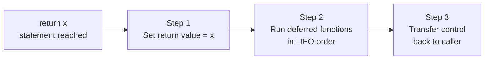
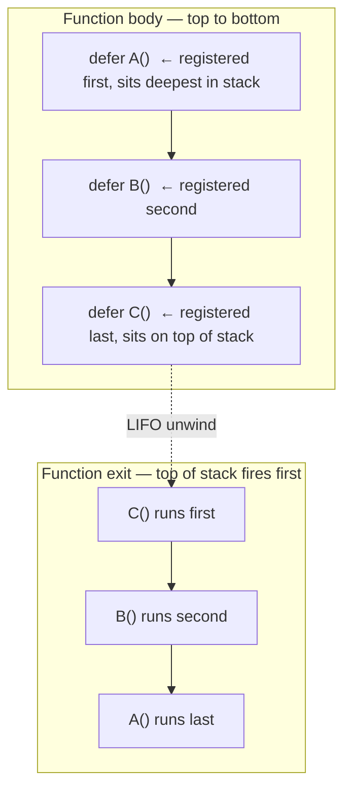
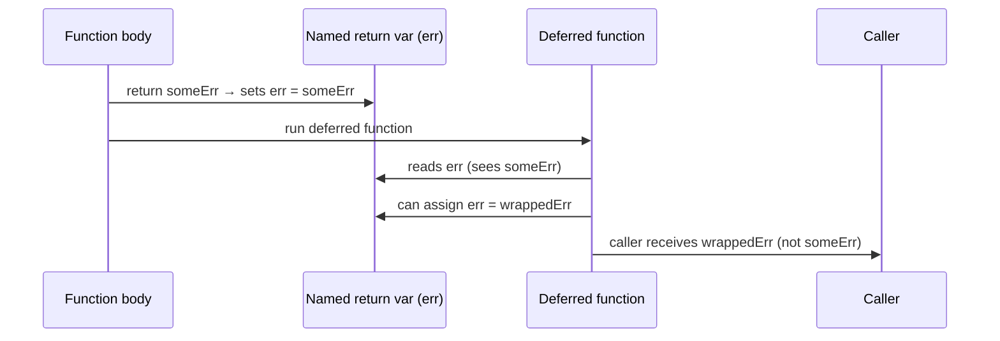
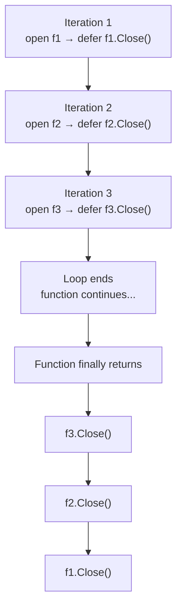
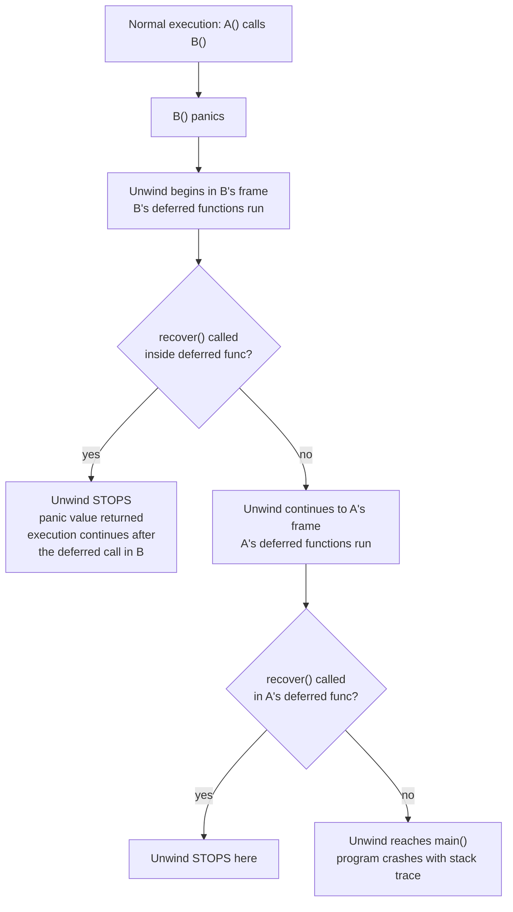
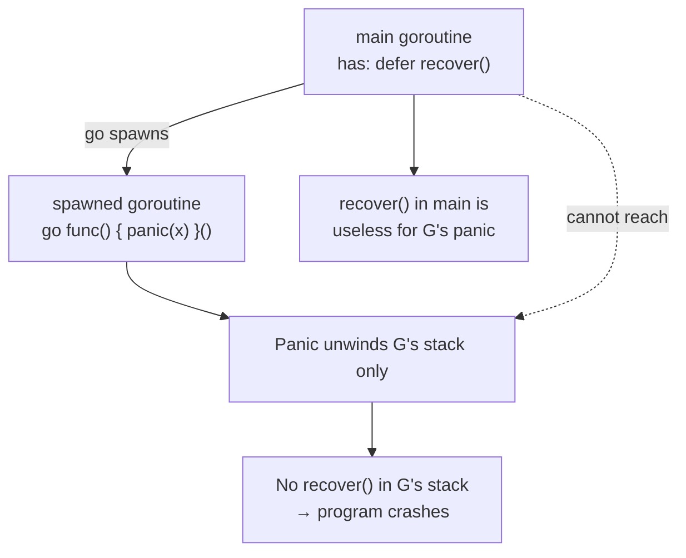
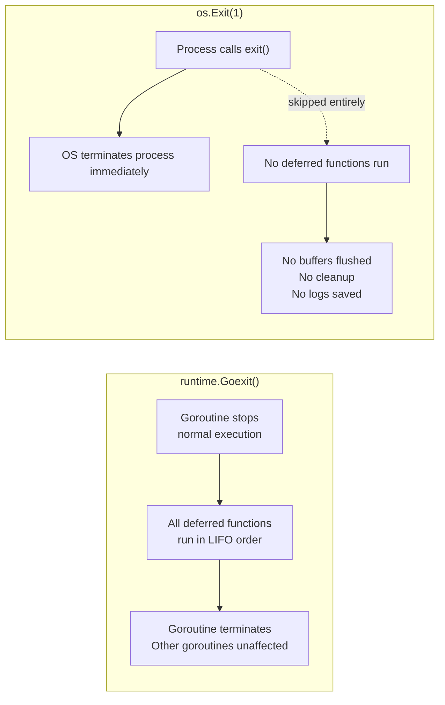
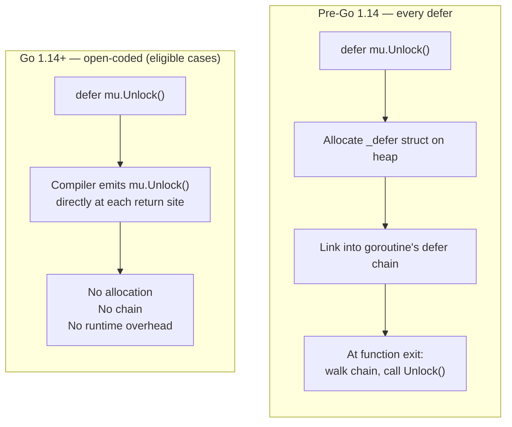

# Phase 4 — defer / panic / recover

Topics in this phase:
- 1 on **defer execution timing** (when it runs relative to `return`)
- 1 on **multiple defers** (LIFO order)
- 1 on **named return values** (deferred func can read and modify them)
- 1 on **defer inside a loop** (anti-pattern: stacks until function exits)
- 1 on **recover()** (must be called inside a deferred function)
- 1 on **panic scope** (cannot recover a panic from another goroutine)
- 1 on **`runtime.Goexit()` vs `os.Exit()`** (defers run vs do not run)
- 1 on **defer overhead** (open-coded since Go 1.14)

---

## Topic 1 / 8 — When does `defer` execute relative to `return`?

### 1. Motivation — "Why does this exist?"

Imagine a function that opens a file, reads it, and returns. It has three return
paths — one for a read error, one for a parse error, one for success. Without
`defer`, you'd have to call `f.Close()` at every single return point. Add a new
return later and forget `Close()` — now you have a file descriptor leak.

`defer` solves this by letting you schedule cleanup **once**, at the point you
acquire the resource, and guaranteeing it runs when the function exits — no
matter which return path is taken.

---

### 2. Building Blocks — "What are the pieces?"

| Concept | What it means |
|---|---|
| **`defer` statement** | Registers a function call to run just before the surrounding function returns |
| **Return sequence** | `return x` is not atomic — it has two steps: set the return value, then transfer control to the caller |
| **Defer window** | Deferred functions run *between* those two steps — after the return value is set but before the caller sees it |
| **Argument evaluation** | The arguments to the deferred call are evaluated **immediately** at the `defer` statement, not when it runs |

---

### 3. How It Works — "The mechanics"

`return x` in Go compiles into three separate steps:

```
1. Assign x to the return slot (anonymous or named variable)
2. Run all deferred functions (LIFO — covered in Topic 2)
3. Jump back to the caller
```



*Deferred functions run after the return value is set, but before the caller receives it.*

**The argument evaluation trap:**

```go
x := 10
defer fmt.Println(x) // argument '10' is captured NOW, not when defer runs
x = 99
// function returns → deferred Println fires → prints "10", not "99"
```

The value of `x` was baked in at the `defer` statement.
To capture the *current* value at runtime, use a closure:

```go
x := 10
defer func() { fmt.Println(x) }() // closure reads x when it runs → prints "99"
x = 99
```

---

### 4. A Concrete Scenario — "Walk me through an example"

```go
func readConfig(name string) ([]byte, error) {
    f, err := os.Open(name)
    if err != nil {
        return nil, err
        // No defer registered yet — nothing to clean up. Fine.
    }

    // Register cleanup ONCE, right after acquiring the resource.
    // Runs when readConfig returns — no matter what happens below.
    defer f.Close()

    data, err := io.ReadAll(f)
    if err != nil {
        return nil, err // defer fires here too → f.Close() called
    }

    return data, nil // defer fires here → f.Close() called
}
```

Even with two distinct return paths below the `defer`, the file is always closed.
You write the cleanup once. The compiler handles the rest.

---

### 5. Key Insight / Mental Model Summary

`defer` is a **scheduling statement**, not a cleanup hook. It says:
*"Whatever happens next, run this before this function's caller gets control back."*

The return value is already set when deferred functions run — which is why (as
you'll see in Topic 3) deferred functions with named return values can still
change what the caller sees.

---

### 6. Common Misconceptions

- **"Defer runs at the end of the block."** No — it runs at the end of the
  **function**. A `defer` inside an `if` or `for` block still waits until the
  whole function exits. This is the root cause of the loop anti-pattern in Topic 4.

- **"Defer arguments are evaluated when the deferred function runs."**
  No — arguments are evaluated immediately at the `defer` statement.
  Only code inside a deferred *closure* sees live values at call time.

---

Topic 1 / 8 done.

---

## Topic 2 / 8 — Multiple defers — LIFO order

### 1. Motivation — "Why does this exist?"

When you acquire resources in sequence — lock a mutex, then open a file, then
grab a database connection — you must release them in **reverse** order.
Release the lock first and someone else grabs it before the file is closed.
Release the DB connection first and the file handle leaks.

LIFO order in `defer` gives you this correctness guarantee automatically, without
you having to think about the release order explicitly.

---

### 2. Building Blocks — "What are the pieces?"

| Concept | What it means |
|---|---|
| **LIFO** | Last In, First Out — the last `defer` registered is the first to execute |
| **Defer stack** | The runtime maintains a per-goroutine linked list of pending deferred calls; each new `defer` prepends to the front |
| **Unwind order** | At function exit, the list is walked front to back — which is reverse registration order |

---

### 3. How It Works — "The mechanics"



*Registration order is top-to-bottom. Execution order is bottom-to-top.*

---

### 4. A Concrete Scenario — "Walk me through an example"

```go
func acquire(mu *sync.Mutex, db *sql.DB) {
    mu.Lock()
    defer mu.Unlock()      // registered 1st → runs LAST

    f, _ := os.Open("data.txt")
    defer f.Close()        // registered 2nd → runs 2nd

    conn, _ := db.Conn(context.Background())
    defer conn.Close()     // registered 3rd → runs FIRST

    // Execution at exit:
    // 1. conn.Close()   → release DB connection
    // 2. f.Close()      → close file
    // 3. mu.Unlock()    → release lock
    // This is reverse acquisition order — exactly correct.
}
```

Acquiring in order A → B → C and releasing in order C → B → A is the universal
rule for avoiding deadlocks and resource corruption. LIFO enforces it for free.

---

### 5. Key Insight / Mental Model Summary

Think of the defer stack as a **literal stack of sticky notes**.
Each `defer` adds a note on top. When the function exits, you peel them off
from the top — which is reverse order. The last resource acquired is always
the first one cleaned up.

---

### 6. Common Misconceptions

- **"I can control the order by reordering defer statements."** Yes — but the
  order you get is *always* the reverse of your `defer` statement order in the code.
  If you want A to clean up last, defer A first.

---

Topic 2 / 8 done.

---

## Topic 3 / 8 — `defer` with named return values

### 1. Motivation — "Why does this exist?"

Sometimes you want a deferred function to be able to **see and modify** what the
function is about to return — for example, to wrap a panic into an error value,
or to annotate an error with additional context unconditionally at exit.

Go's named return values make this possible. They turn the return variables into
ordinary, named variables that live in the function's scope — and deferred
functions share that scope. The deferred function can read them, or even change
them, before the caller sees the result.

---

### 2. Building Blocks — "What are the pieces?"

| Concept | What it means |
|---|---|
| **Named return values** | `func foo() (result int, err error)` — `result` and `err` are ordinary variables in the function body |
| **Anonymous return values** | `func foo() (int, error)` — no names; deferred functions cannot reach these |
| **Return sequence (revisited)** | `return x` assigns `x` into the named variable first — *then* runs defers. Defers see the already-assigned value and can overwrite it. |

---

### 3. How It Works — "The mechanics"



*The deferred function runs after the return value is committed to the named variable — it sees and can rewrite whatever is there.*

---

### 4. A Concrete Scenario — "Walk me through an example"

**Pattern 1 — Wrapping a panic into a returned error:**

```go
// safeDiv converts any panic into a returned error.
// The caller never sees a crash — they see a normal error value.
func safeDiv(a, b int) (result int, err error) {
    defer func() {
        if r := recover(); r != nil {
            // 'err' is the named return variable — we can assign to it here
            err = fmt.Errorf("recovered panic: %v", r)
            result = 0
        }
    }()

    // if b == 0, this line panics → deferred func catches it → err is set
    return a / b, nil
}
```

**Pattern 2 — Annotating an error with context at exit:**

```go
func openAndRead(path string) (data []byte, err error) {
    defer func() {
        if err != nil {
            // Wrap whatever error bubbled up, unconditionally on exit
            err = fmt.Errorf("openAndRead %q: %w", path, err)
        }
    }()

    f, err := os.Open(path)
    if err != nil {
        return // named return: err is already set, defer will wrap it
    }
    defer f.Close()

    data, err = io.ReadAll(f)
    return // defer wraps any read error too
}
```

---

### 5. Key Insight / Mental Model Summary

Named return values are **shared variables** between the function body and its
deferred functions. The deferred function is not an observer — it is a
participant that can change the outcome. This is the only mechanism in Go that
lets a deferred function alter what the caller receives.

---

### 6. Common Misconceptions

- **"This works with any return."** It only works with **named** return values.
  With anonymous returns like `func foo() (int, error)`, the deferred function
  has no name to reference and cannot reach the return variables at all.

- **"The defer modifies the value before `return` sets it."** The opposite —
  `return` sets it first, then defer modifies it. The sequence is always:
  set → defer runs → caller receives result.

---

Topic 3 / 8 done.

---

## Topic 4 / 8 — `defer` inside a loop — the anti-pattern

### 1. Motivation — "Why does this matter?"

This is the most common `defer` mistake in production Go code. A developer
iterates over a list of files, opens each one, and writes `defer f.Close()`
thinking the file will close at the end of each loop iteration. It won't.
`defer` always fires when the **enclosing function** exits — not when the
enclosing block or loop iteration ends.

The result: all files stay open simultaneously until the function returns.
With enough iterations, you hit the OS file descriptor limit and the program
starts failing with `too many open files`.

---

### 2. Building Blocks — "What are the pieces?"

| Concept | What it means |
|---|---|
| **Function scope, not block scope** | `defer` waits for the nearest enclosing *function* to exit, not the nearest `{}` block |
| **Accumulation** | Each loop iteration adds a new entry to the defer stack. 1000 iterations = 1000 deferred calls queued simultaneously |
| **Resource exhaustion** | File descriptors, database connections, mutex holds — all held open until the function returns |

---

### 3. How It Works — "The mechanics"



*f1, f2, and f3 are ALL open simultaneously during the entire loop.
None closes until the function returns.*

---

### 4. A Concrete Scenario — "Walk me through an example"

```go
// BROKEN — accumulates open file descriptors across all iterations
func processAll(paths []string) error {
    for _, p := range paths {
        f, err := os.Open(p)
        if err != nil {
            return err
        }
        defer f.Close() // WRONG: does not close after each iteration
        process(f)
    }
    // All 10,000 files are still open here
    return nil
    // All 10,000 defers fire now → too late
}
```

**Fix 1 — Extract the body into a helper function:**

```go
func processAll(paths []string) error {
    for _, p := range paths {
        if err := processOne(p); err != nil {
            return err
        }
    }
    return nil
}

func processOne(path string) error {
    f, err := os.Open(path)
    if err != nil {
        return err
    }
    defer f.Close() // fires when processOne returns — correct, per iteration
    process(f)
    return nil
}
```

**Fix 2 — Close explicitly inside the loop (no defer):**

```go
func processAll(paths []string) error {
    for _, p := range paths {
        f, err := os.Open(p)
        if err != nil {
            return err
        }
        process(f)
        f.Close() // explicit, immediate — only appropriate for non-error paths
    }
    return nil
}
```

Fix 1 is preferred — it keeps the cleanup guarantee of `defer` (fires even on
early return from `processOne`) while bounding the scope correctly.

---

### 5. Key Insight / Mental Model Summary

`defer` respects **function scope**, not block scope. The loop boundary is
invisible to `defer`. When you need per-iteration cleanup, the boundary must
be a function call — either a named helper or a closure with an immediate call
`func() { ... }()`.

---

### 6. Common Misconceptions

- **"I can use an immediately-invoked closure to fix this."**
  Yes — `func() { defer f.Close(); process(f) }()` works. The closure is
  the new function boundary. But a named helper function is cleaner and testable.

- **"This only matters with files."** Any resource that has a limit or that
  must not be held across an unbounded number of operations: database connections,
  HTTP response bodies, mutexes held during long loops, gRPC streams.

---

Topic 4 / 8 done.

---

## Topic 5 / 8 — `recover()` — must be called inside a deferred function

### 1. Motivation — "Why does this exist?"

A panic is Go's way of saying: *the program has reached a state it cannot
continue from* — a nil pointer dereference, an out-of-bounds slice access, an
explicit `panic("unreachable")`.

Left alone, a panic unwinds the entire call stack of the current goroutine and
crashes the program with a stack trace. That is the correct behaviour for
genuine bugs. But some programs — HTTP servers, plugin hosts, test runners —
need to catch a panic in one isolated unit of work and continue running.
A single bad request handler should not bring down an entire server.

`recover()` is the mechanism to intercept a panic and regain control. But it
comes with one strict rule that trips up everyone at first: **it only works
inside a deferred function**.

---

### 2. Building Blocks — "What are the pieces?"

| Concept | What it means |
|---|---|
| **panic** | Stops normal execution immediately; begins unwinding the goroutine's call stack, running deferred functions along the way |
| **recover()** | A built-in that, when called during unwind *inside a deferred function*, stops the unwind and returns the panic value |
| **Outside a panic** | `recover()` called during normal execution (not during a panic unwind) returns `nil` and does nothing |
| **The deferred function as catch site** | Deferred functions are the only code that runs during the unwind — so they are the only place `recover()` can intercept it |

---

### 3. How It Works — "The mechanics"



*Recovery must happen in a deferred function that is actively running during the unwind.*

**Why calling `recover()` outside a defer doesn't work:**

```go
func bad() {
    r := recover() // called during normal execution — always returns nil
    fmt.Println(r) // prints <nil>. Does nothing useful.
    panic("this still crashes")
}
```

`recover()` only has power during a panic unwind. Outside of that moment,
it is inert.

---

### 4. A Concrete Scenario — "Walk me through an example"

**Production pattern — HTTP middleware that catches handler panics:**

```go
import (
    "log"
    "net/http"
    "runtime/debug"
)

func recoverMiddleware(next http.Handler) http.Handler {
    return http.HandlerFunc(func(w http.ResponseWriter, r *http.Request) {
        defer func() {
            if rec := recover(); rec != nil {
                // rec holds the panic value (could be a string, error, or anything)
                log.Printf("panic in handler: %v\n%s", rec, debug.Stack())
                // Return 500 to the client instead of crashing the server
                http.Error(w, "internal server error", http.StatusInternalServerError)
            }
        }()

        next.ServeHTTP(w, r)
        // If ServeHTTP panics → deferred func above catches it → 500 returned
        // Server continues serving other requests normally
    })
}
```

Without this middleware, a single nil pointer dereference in any handler takes
down the entire server.

---

### 5. Key Insight / Mental Model Summary

`recover()` is not a try/catch wrapper. It is a **signal interceptor** that
is only active during the narrow window when the panic unwind is running and
executing deferred functions. The deferred function IS the catch block.
You cannot put it anywhere else.

---

### 6. Common Misconceptions

- **"I can call `recover()` at the top of the function to catch panics below."**
  Wrong. `recover()` at the top of a normal (non-deferred) function call returns
  `nil` immediately and does nothing. By the time a panic fires below, that
  call to `recover()` is ancient history.

- **"Any deferred function anywhere in the call stack can catch the panic."**
  Almost right — but with a critical constraint from Topic 6: the deferred
  function must be in the **same goroutine** as the panic. Cross-goroutine
  recovery is impossible.

---

Topic 5 / 8 done.

---

## Topic 6 / 8 — Panic scope — cannot `recover` a panic from another goroutine

### 1. Motivation — "Why does this matter?"

A dangerously common assumption: *"I have a `recover()` in my main goroutine,
so panics anywhere in my program are caught."*

This is wrong, and it is one of the most silent ways to crash a Go server.
Each goroutine has its own independent call stack. A panic unwinds **only the
stack of the goroutine in which it occurred**. No other goroutine's deferred
functions can intercept it. If the panicking goroutine has no `recover()` of
its own, the entire program crashes — regardless of what any other goroutine
has set up.

---

### 2. Building Blocks — "What are the pieces?"

| Concept | What it means |
|---|---|
| **Goroutine stack** | Each goroutine owns a completely independent call stack |
| **Panic unwind** | A panic unwinds *only the stack of its own goroutine* |
| **Recovery boundary** | `recover()` can only catch a panic unwinding the **same goroutine's stack** |
| **Cross-goroutine crash** | A panic in goroutine B with no local `recover()` crashes the entire program — even if goroutine A has `recover()` set up |

---

### 3. How It Works — "The mechanics"



*The goroutine boundary is an impenetrable wall for panic propagation.*

---

### 4. A Concrete Scenario — "Walk me through an example"

```go
// This program crashes despite the recover() in main
func main() {
    defer func() {
        if r := recover(); r != nil {
            fmt.Println("caught:", r) // NEVER RUNS for the goroutine panic below
        }
    }()

    go func() {
        panic("oops — this goroutine has no recover") // crashes the whole program
    }()

    time.Sleep(time.Second)
}
```

Output:
```
goroutine 6 [running]:
main.main.func2()
        /tmp/main.go:14 +0x27
...
exit status 2
```

The recover in main's goroutine never fires. The program is dead.

**The correct pattern — every goroutine you spawn owns its recovery:**

```go
func safeGo(fn func()) {
    go func() {
        defer func() {
            if r := recover(); r != nil {
                log.Printf("goroutine panic: %v\n%s", r, debug.Stack())
            }
        }()
        fn()
    }()
}

// Now use safeGo instead of bare go:
safeGo(func() {
    doRiskyWork()
})
```

---

### 5. Key Insight / Mental Model Summary

Each goroutine is a **closed island**. Its panic is its own problem.
There is no global exception handler in Go, by design. Every goroutine you
spawn into the world is fully responsible for its own panic handling.
If you don't put a `recover()` in it, you are opting into crashing the program
on any unexpected panic.

---

### 6. Common Misconceptions

- **"A top-level `recover()` in `main` acts as a global catch-all."**
  It only catches panics in main's own goroutine — not in any goroutine
  spawned with `go`.

- **"You can pass a recover channel between goroutines."**
  You cannot. `recover()` must be called inline during the unwind, inside a
  deferred function in the same goroutine. There is no mechanism to relay an
  active panic across a goroutine boundary.

---

Topic 6 / 8 done.

---

## Topic 7 / 8 — `runtime.Goexit()` vs `os.Exit()`

### 1. Motivation — "Why does the distinction matter?"

Go gives you two ways to terminate execution early — and they look superficially
similar but behave completely differently when it comes to `defer`. Confusing them
causes silent cleanup failures in production, and lost test coverage in test suites.

The classic trap: using `log.Fatal()` (which internally calls `os.Exit(1)`) in a
function that registered cleanup via `defer`. The cleanup never runs, buffers
never flush, and you spend an hour wondering why your shutdown logs are missing.

---

### 2. Building Blocks — "What are the pieces?"

| | `runtime.Goexit()` | `os.Exit(code)` |
|---|---|---|
| **Terminates** | The current goroutine only | The entire program process |
| **Deferred functions** | **All deferred functions run** (LIFO) | **No deferred functions run** |
| **Panic / recover** | Not a panic — `recover()` does not intercept it | N/A |
| **Program continues?** | Yes — other goroutines keep running | No — OS terminates the process immediately |
| **Primary use case** | `t.FailNow()`, graceful goroutine exit | Hard program exit after unrecoverable error |

---

### 3. How It Works — "The mechanics"



---

### 4. A Concrete Scenario — "Walk me through an example"

**`runtime.Goexit()` — used internally by the test package:**

```go
func TestSomething(t *testing.T) {
    defer cleanup()      // WILL run — t.FailNow() uses Goexit internally

    if !setup() {
        t.FailNow()      // stops this test goroutine, defers still run
    }

    result := doWork()
    if result != expected {
        t.Errorf("got %v, want %v", result, expected)
        t.FailNow()      // again — cleanup() still runs
    }
}
```

**`os.Exit()` — defers are silently skipped:**

```go
func main() {
    defer saveShutdownMetrics() // WILL NOT run if os.Exit is called
    defer flushTraceSpans()     // WILL NOT run

    if err := run(); err != nil {
        log.Fatal(err) // log.Fatal internally calls os.Exit(1)
        // saveShutdownMetrics() and flushTraceSpans() are silently lost
    }
}
```

**The fix — call `os.Exit` only after explicit cleanup:**

```go
func main() {
    if err := run(); err != nil {
        log.Println(err)
        saveShutdownMetrics() // call cleanup explicitly before exiting
        flushTraceSpans()
        os.Exit(1)
    }
}
```

---

### 5. Key Insight / Mental Model Summary

`os.Exit` is a **hard process kill**. The OS reclaims everything. Deferred
functions, buffered writers, open files — all abandoned mid-stream.

`runtime.Goexit()` is a **graceful goroutine exit**. It respects the defer
stack. This is why Go's test framework can fail a test midway and still have
test cleanup functions run correctly.

Rule of thumb: if you're not sure, `os.Exit` is probably the wrong choice
for anything that registered cleanup via `defer`.

---

### 6. Common Misconceptions

- **"`log.Fatal` is safe to use inside a function with cleanup defers."**
  It isn't. `log.Fatal` is `log.Println` followed by `os.Exit(1)`. Every `defer`
  in the call stack is silently skipped. This is the most common way teams lose
  shutdown metrics, unsent spans, and unflushed buffers.

- **"`runtime.Goexit()` is like a panic."** It is not. A panic can be intercepted
  with `recover()`. `Goexit()` cannot — it is not a panic, and `recover()` inside
  a deferred function during `Goexit` returns `nil`. The deferred functions still
  run, but `Goexit` cannot be stopped by a `recover()`.

---

Topic 7 / 8 done.

---

## Topic 8 / 8 — `defer` overhead — avoid on hot paths (open-coded since Go 1.14)

### 1. Motivation — "Why does this exist?"

`defer` used to have a measurable runtime cost: every `defer` statement allocated
a struct on the heap and linked it into the goroutine's defer chain. For most code
that doesn't matter — but in hot paths (small functions called millions of times
per second, tight inner loops in high-throughput services), those nanoseconds
accumulate.

Go 1.14 eliminated this cost for the common case by compiling defer differently.
Understanding what changed tells you when `defer` overhead is a real concern and
when avoiding it is pure premature optimization.

---

### 2. Building Blocks — "What are the pieces?"

| Concept | What it means |
|---|---|
| **Pre-Go 1.14 `defer`** | Each `defer` allocated a `_defer` struct on the heap, chained it to the goroutine, and the runtime walked the chain at exit. ~100ns overhead per defer. |
| **Open-coded defer (Go 1.14+)** | For simple cases (not in loops, not with `recover()`), the compiler emits the deferred call as a **direct inline call** at every return site — no struct, no chain, no runtime walk |
| **Bitset flag** | The compiler uses a bitmask to track which defers need to run at each possible exit point. Zero heap allocation for the eligible cases. |
| **Hot path** | A code path that executes millions of times per second — even nanosecond overhead compounds into measurable latency |

---

### 3. How It Works — "The mechanics"



**What makes a defer ineligible for open-coding:**
- `defer` inside a `for` loop (dynamic — number of defers not known at compile time)
- Functions that call `recover()` (require the runtime defer chain machinery)
- More than 8 defers in a single function (practical compiler limit)

---

### 4. A Concrete Scenario — "Walk me through an example"

```go
// Eligible for open-coding — zero allocation in Go 1.14+
// The compiler inserts mu.Unlock() inline at the return statement
func get(mu *sync.Mutex, m map[string]int, key string) int {
    mu.Lock()
    defer mu.Unlock() // → compiled as direct call at return, not a heap struct
    return m[key]
}

// NOT eligible — defer inside a loop, falls back to heap-allocated chain
func drain(mu *sync.Mutex, items []item) {
    for _, it := range items {
        mu.Lock()
        defer mu.Unlock() // loop → dynamic count → cannot be open-coded
        process(it)
    }
}

// Benchmark to confirm if defer is actually your bottleneck:
func BenchmarkGetWithDefer(b *testing.B) {
    var mu sync.Mutex
    m := map[string]int{"key": 1}
    for b.Loop() {
        _ = get(&mu, m, "key")
    }
}
```

The rule: **don't remove `defer` for performance unless a benchmark proves it
is the bottleneck**. Open-coding means the cost is usually gone already.

---

### 5. Key Insight / Mental Model Summary

In Go 1.14+, a straight-line `defer` in a function that doesn't use `recover()`
is compiled away into a direct call at the return site — it costs nothing beyond
the function call itself. The overhead only reappears when `defer` is inside a
loop or in a function that uses `recover()`. Profile before you optimise.

---

### 6. Common Misconceptions

- **"Defer is always slow — I should never use it in production."**
  This was somewhat true before Go 1.14. It is not true now for the common case.
  Most production `defer` usage is open-coded.

- **"If I have a defer, I'm paying for a heap allocation."**
  Not since Go 1.14 for eligible functions. Verify with `go build -gcflags="-m"`
  if you want to confirm no allocation escapes.

- **"Replacing `defer` with explicit calls is always faster."**
  Possibly true before 1.14. Likely irrelevant now — and introduces the risk of
  forgetting cleanup on an early return path. The trade-off is almost never worth
  it without benchmarks to back it up.

---

Topic 8 / 8 done. Phase 4 — defer / panic / recover complete.
